## A visual explanation of the Crypto Platform’s chain adapter, custody boundary, KYT controls, and ledger settlement

Bitcoin integration is not a “send transaction” feature. In an enterprise platform, it is a controlled pipeline that joins five different realities:

1. a customer instruction;
2. a fragmented Bitcoin balance;
3. a protected signing boundary;
4. an asynchronous public network; and
5. an auditable financial ledger with compliance controls.

This article explains how those realities meet in the Crypto Platform, using Bitcoin as the worked example. It is written as an original visual explanation: diagrams carry the structure, and prose explains the decisions that matter. Internal implementation terms appear only where they clarify a concrete platform responsibility; the main narrative is organized around outcomes rather than class names.

---

## Table of contents

- [1. The enterprise view: one payment, five systems](#1-the-enterprise-view-one-payment-five-systems)
  - [1.1 The microservice architecture](#11-the-microservice-architecture)
  - [1.2 The enterprise data plane](#12-the-enterprise-data-plane)
- [2. Bitcoin’s balance is a collection, not a number](#2-bitcoins-balance-is-a-collection-not-a-number)
- [3. The Bitcoin integration contract](#3-the-bitcoin-integration-contract)
- [4. The Bitcoin outbound path](#4-the-bitcoin-outbound-path)
  - [4.1 Request acceptance](#41-request-acceptance)
  - [4.2 Reservation and concurrency control](#42-reservation-and-concurrency-control)
  - [4.3 Withdrawal KYT: screen before broadcast](#43-withdrawal-kyt-screen-before-broadcast)
  - [4.4 Bitcoin input selection](#44-bitcoin-input-selection)
  - [4.5 Fee calculation is a shape problem](#45-fee-calculation-is-a-shape-problem)
  - [4.6 Construct, sign, and broadcast](#46-construct-sign-and-broadcast)
  - [4.7 Confirmation tracking](#47-confirmation-tracking)
  - [4.8 The outbound integration sequence](#48-the-outbound-integration-sequence)
  - [4.9 Integration contracts at each boundary](#49-integration-contracts-at-each-boundary)
- [5. The Bitcoin inbound path](#5-the-bitcoin-inbound-path)
- [6. KYT is part of the money movement, not an attachment](#6-kyt-is-part-of-the-money-movement-not-an-attachment)
- [7. Balance settlement: Bitcoin success is not the last commit](#7-balance-settlement-bitcoin-success-is-not-the-last-commit)
- [8. Observation, restart, and duplicate protection](#8-observation-restart-and-duplicate-protection)
- [9. UTXO consolidation: treasury operations hiding behind payments](#9-utxo-consolidation-treasury-operations-hiding-behind-payments)
- [10. What the Bitcoin integration must expose](#10-what-the-bitcoin-integration-must-expose)
- [11. Operational signals worth watching](#11-operational-signals-worth-watching)
- [12. The enterprise definition of complete](#12-the-enterprise-definition-of-complete)
- [13. Further reading: external articles and technical references](#13-further-reading-external-articles-and-technical-references)

---

## 1. The enterprise view: one payment, five systems

The customer sees one action. The Crypto Platform coordinates a sequence of systems with different guarantees.

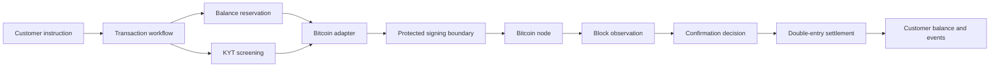

Each box answers a different question:

| Question | Crypto Platform responsibility |
|---|---|
| Is this request valid and authorized? | The digital transaction API validates the request, checks authorization through JWT, and creates a transfer record. |
| Can the customer afford it? | Funds move from `available` to `reserved` under a pessimistic balance lock; insufficient balance fails the request. |
| Is it permissible to send? | Withdrawal screening can register the attempt with a compliance vendor’s KYT service before broadcast. |
| Which Bitcoin value should be spent? | A UTXO selection strategy chooses spendable inputs; the documented default is largest-first. |
| Who may authorize spending? | The chain service sends hashes to the vault service; private keys do not travel over the wire. |
| Did Bitcoin accept the payment? | A Bitcoin node accepts a raw transaction submission, then later block observation tracks detection and confirmation. |
| When is the enterprise transaction complete? | Confirmation clears reserved funds; failure returns them; ledger entries preserve the accounting trail. |

The enterprise design principle is simple: no single system is allowed to imply a stronger guarantee than it actually has.

## 1.1 The microservice architecture

The Bitcoin path is not one large application. It is a set of cooperating Spring Boot services, each with a narrow reason to exist. The transaction workflow owns the business journey; the Bitcoin services own Bitcoin mechanics; the custody boundary owns key operations; KYT owns transaction-risk analysis; and the ledger owns financial truth inside the platform. The diagram is a conceptual enterprise deployment view: service labels identify responsibilities, not a prescribed module layout.

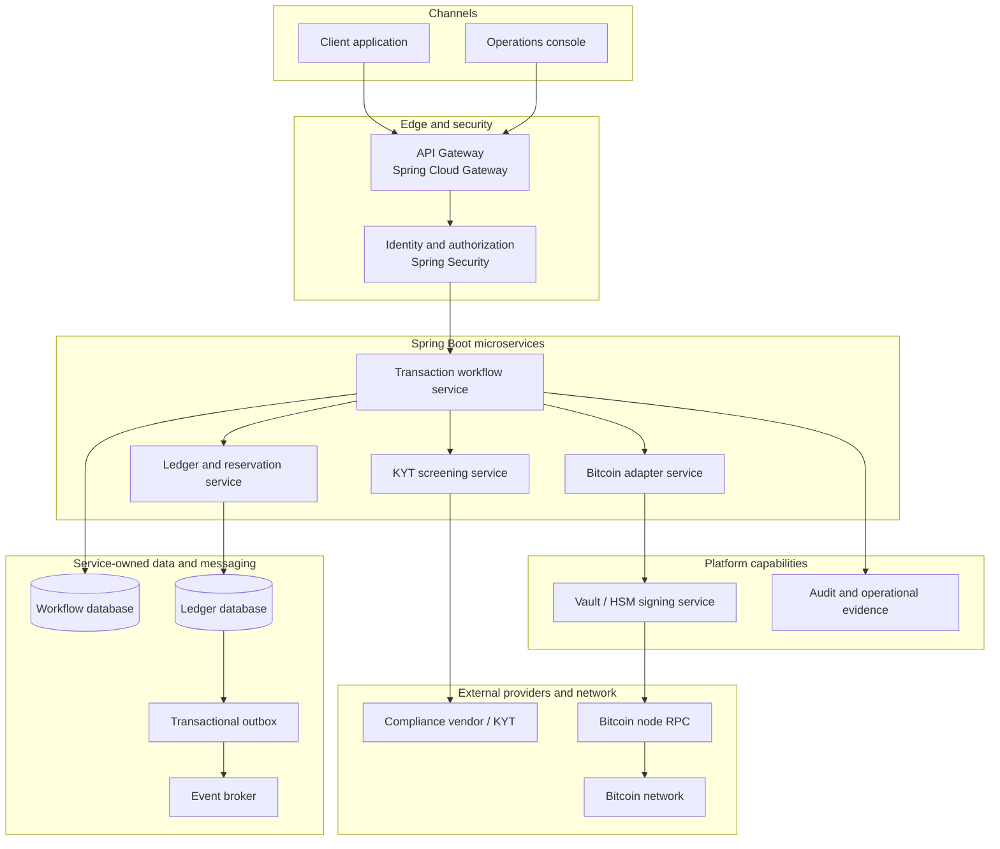

The synchronous request path runs from the client through the gateway to the workflow service, then to the ledger, compliance, and Bitcoin adapter services. Signing is performed before the adapter reaches the node. Confirmation returns asynchronously through the observer and event broker, so it is shown separately:

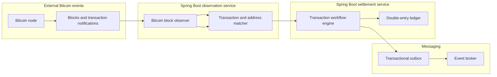

### What each service must never do

| Service | Owns | Must not own |
|---|---|---|
| Digital transaction API | Request shape, authentication boundary, client response | Bitcoin input selection or private-key handling |
| Workflow engine | State transitions, waits, retries, human-review pauses | Direct database mutation that bypasses money controls |
| Balance and reservation store | Spendable, reserved, and observed balances | Deciding whether an address is sanctioned |
| KYT screening service | Risk registration, alerts, exposure, and screening outcomes | Constructing or signing a Bitcoin transaction |
| Bitcoin transaction service | Input selection, fee calculation, serialization, broadcast | Customer-facing compliance decisions |
| Bitcoin block observer | Block progress, transaction detection, confirmation events | Crediting funds without workflow and ledger rules |
| Vault / HSM service | Cryptographic signing | Business approval or customer balance state |
| Double-entry ledger | Journal entries, balance accounting, reconciliation | Treating node submission as final settlement |

This separation is not ceremony. It prevents an operational shortcut—such as “the node accepted it, so mark it complete”—from crossing the wrong boundary.

## 1.2 The enterprise data plane

The data flow has two directions. Commands move toward Bitcoin; evidence moves back from Bitcoin.

```mermaid
flowchart LR
    subgraph COMMAND[Command plane]
        C1[Customer request] --> C2[Validated command]
        C2 --> C3[Reserved balance]
        C3 --> C4[KYT approval]
        C4 --> C5[Selected inputs + outputs]
        C5 --> C6[Signing request]
        C6 --> C7[Signed transaction]
        C7 --> C8[Node submission]
    end
    subgraph EVIDENCE[Evidence plane]
        E1[Node response] --> E2[Transaction ID]
        E2 --> E3[Block observation]
        E3 --> E4[Detected event]
        E4 --> E5[Confirmation evidence]
        E5 --> E6[Ledger settlement]
        E6 --> E7[Customer status + audit record]
    end
    C8 --> E1
```

The two planes must be correlated by stable identifiers:

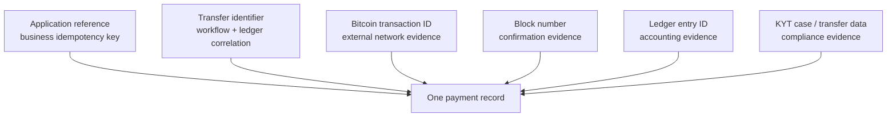

If one of these identifiers is missing, support teams can observe that something happened but cannot reliably prove how the platform arrived at its final state.

---

## 2. Bitcoin’s balance is a collection, not a number

Bitcoin uses the unspent-output model. A useful enterprise mental model is a cash register containing bills of different denominations. The platform’s spendable balance is the sum of those unspent pieces.

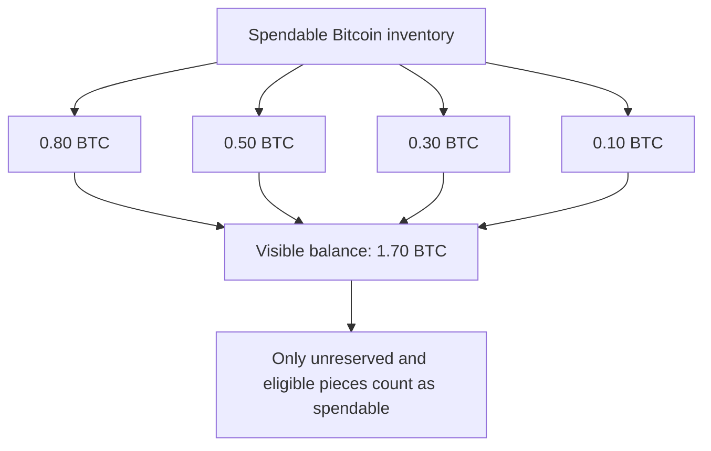

To send 1.20 BTC, the Crypto Platform’s selection path chooses 0.80 + 0.50 = 1.30 BTC, then creates change after accounting for the fee. This is fundamentally different from selecting one account with a 1.20 BTC balance.

That distinction drives four enterprise requirements:

- concurrent spending must not select the same input twice;
- the fee estimate must account for the number and shape of inputs;
- change must not become uneconomically small;
- many small pieces must be consolidated over time to control future fees.

### The three balances that matter operationally

The Crypto Platform exposes a business view of funds that is richer than the raw Bitcoin node view:

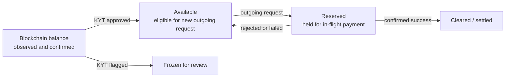

For an inbound payment, the documented flow is:

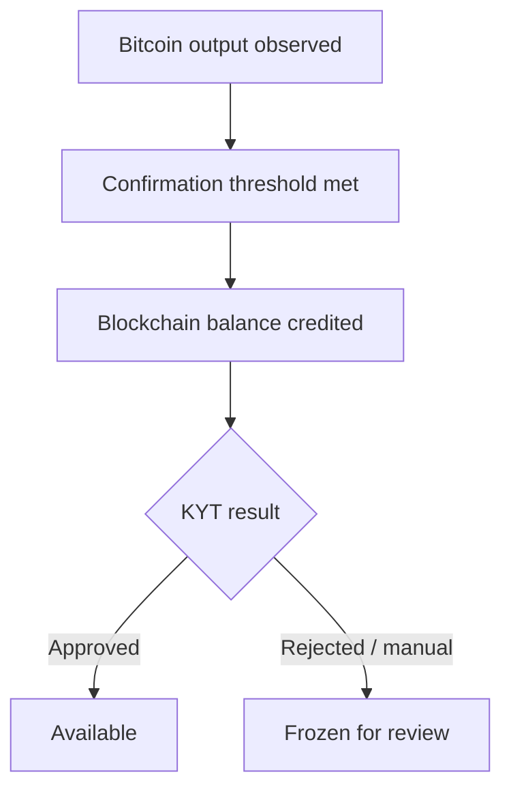

That intermediate `blockchain` balance is an important control: confirmed money is not automatically spendable money.

---

## 3. The Bitcoin integration contract

The Crypto Platform sends a normalized transaction request into the Bitcoin integration boundary. Bitcoin-specific services then supply the mechanics that cannot be safely hidden behind a generic payment request.

The Bitcoin integration uses a three-part pattern:

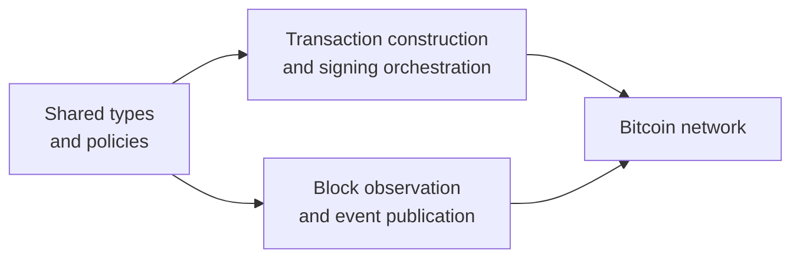

For Bitcoin, these responsibilities are separated between shared transaction policies, transaction construction and signing, and block observation with event publication.

### The Bitcoin integration contract

The Bitcoin integration must answer the following questions before it can be considered complete:

1. How are addresses generated and validated?
2. How are spendable funds represented?
3. How are inputs selected?
4. How is transaction size calculated?
5. How is the network fee estimated?
6. What data must be signed?
7. How is the signed transaction assembled?
8. How is it submitted to the network?
9. How are new blocks or ledgers observed?
10. What constitutes detected, unconfirmed, confirmed, failed, or dropped?
11. How does the platform recover from a watcher restart?
12. What evidence is persisted for reconciliation and compliance?

These questions define the boundary between the Crypto Platform’s business workflow and Bitcoin’s UTXO, transaction, node, and confirmation mechanics.

---

## 4. The Bitcoin outbound path

The outbound path starts in the common workflow and becomes Bitcoin-specific only after the platform has established that the request may proceed.

### 4.1 Request acceptance

The documented API is:

```text
POST /digital/v1/transaction-requests
```

The request carries the destination address, amount, asset, and network. The controller validates the request, checks authorization using JWT, and creates a transfer record with `ACCEPTED` status.

The platform-level idempotency reference must survive every boundary: API, workflow, message, chain adapter, node submission, and ledger entry. The custody boundary also uses an external transaction reference as an idempotency key.

### 4.2 Reservation and concurrency control

Before any Bitcoin construction begins, the workflow reserves funds. The documented implementation uses:

- a pessimistic `SELECT FOR UPDATE` balance lock;
- a five-second lock timeout;
- movement from `available` to `reserved`;
- double-entry ledger entries;
- a spendable-input selector for the UTXO family.

This is the protection against two requests racing for the same Bitcoin pieces.

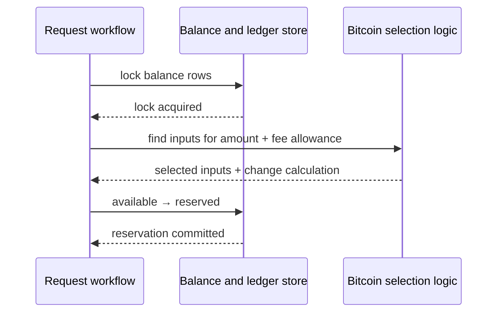

If the balance is insufficient, the workflow stops before the Bitcoin network is touched.

### 4.3 Withdrawal KYT: screen before broadcast

The platform has a dedicated crypto transaction screening service integrated with a compliance vendor’s KYT service. For outbound requests, the workflow:

1. checks whether screening is required for the account or policy scope;
2. registers the withdrawal attempt with the compliance vendor;
3. waits for partial screening results;
4. proceeds only when the result is approved.

The documented outcomes are:

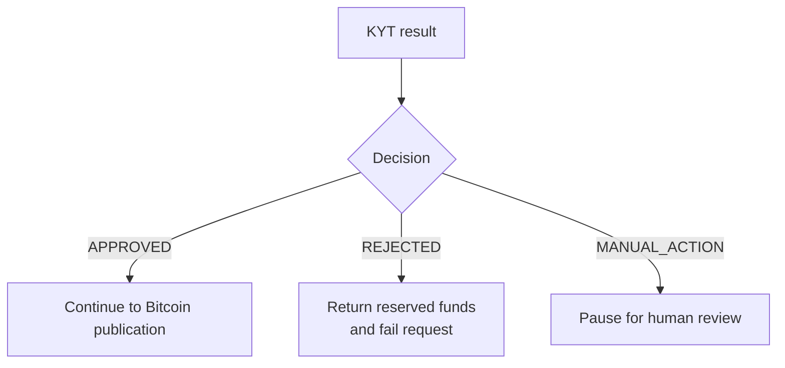

The automatic screening timeout is 20 minutes. Manual review may wait up to seven days through the workflow signal path. Withdrawal screening sends the address, asset, amount, and account context for analysis.

This ordering matters. KYT is not a post-processing report for an already-sent Bitcoin payment; it is a release gate before broadcast.

### 4.4 Bitcoin input selection

The Bitcoin implementation uses `bitcoinj` and a generic UTXO service configured for Bitcoin. Its selection behavior is `AMOUNT_DESCENDING`, which prefers larger inputs first and respects ancestor limits.

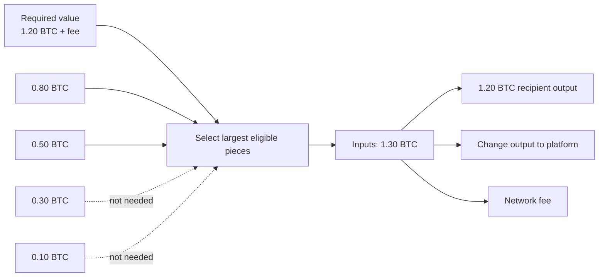

The implementation also documents:

- P2PKH and P2WPKH address formats;
- dual address forms derived per key;
- multi-input signing, with a separate signing hash for each input;
- Replace-By-Fee sequence marking;
- dust detection to prevent uneconomic outputs;
- external UTXO-provider fallbacks for when the node view is unavailable.

### 4.5 Fee calculation is a shape problem

Bitcoin fees are based on transaction weight, not the nominal amount transferred.

```text
fee = fee rate in sat/vB × transaction size in virtual bytes
```

Two representative transaction shapes make the economics clear:

| Shape | Approximate size | Fee at 20 sat/vB |
|---|---:|---:|
| One input, two outputs | 226 vB | 4,520 satoshis |
| Five inputs, two outputs | 818 vB | 16,360 satoshis |

The amount sent can be identical while the fee is several times larger. The adapter therefore needs a worst-case fee-aware selection path, dust protection, and a policy for what happens when change is below the dust threshold.

The documented behavior also marks Bitcoin inputs for Replace-By-Fee, allowing a stuck transaction to be replaced with a higher-fee version where the policy and network conditions permit it.

### 4.6 Construct, sign, and broadcast

The chain-processing pattern is documented as:

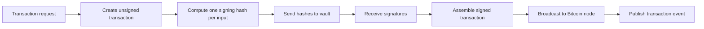

The key security rule is explicit: only the hash travels to the vault, and private keys never travel over the wire.

### 4.7 Confirmation tracking

The common workflow recognizes a transaction as a progression rather than a single boolean:

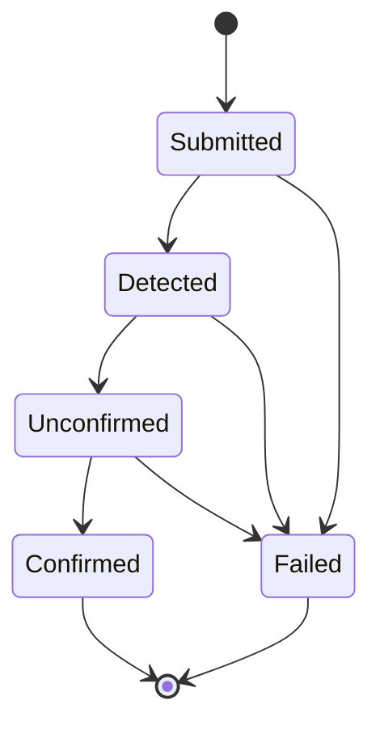

The Bitcoin block observer uses a hybrid observation model:

- ZeroMQ provides near-real-time block notifications;
- RPC polling runs as a 30-second fallback;
- the publisher persists its last fully processed block;
- after restart, it resumes from the next block.

Bitcoin has an approximate ten-minute block interval, a 30-second fallback poll, and a confirmation threshold that varies by configuration rather than being hard-coded in the article.

When the confirmation event reaches the workflow:

- successful completion clears the reserved amount;
- failure returns the reserved amount to available;
- if the receiver is a platform-owned address, the documented flow can start a child deposit workflow for the receiving side.

### 4.8 The outbound integration sequence

The following sequence shows the hand-offs that matter in production. The workflow is intentionally asynchronous: it can wait for compliance, prefunding, a node result, or a later block without losing its place.

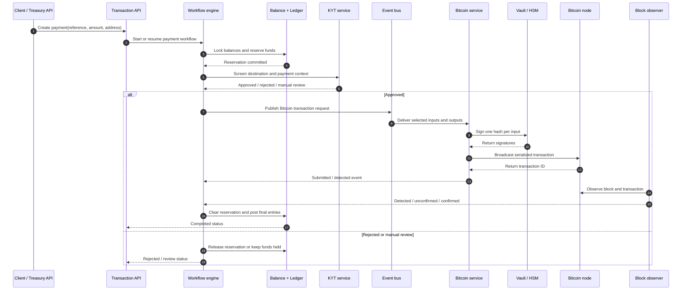

The value of the sequence is not the arrows themselves. It is the separation between a command, an acknowledgment, an external observation, and a final accounting decision.

### 4.9 Integration contracts at each boundary

An enterprise integration is easier to operate when each message has a clear semantic contract.

| Boundary | Command or event | Minimum correlation data |
|---|---|---|
| API → workflow | Create payment | application reference, account, asset, amount, destination, source context |
| Workflow → balance store | Reserve or release | transfer ID, balance IDs, amount, reason, idempotency key |
| Workflow → KYT | Withdrawal or pay-in registration | transfer ID, address, asset, amount, account context, direction |
| Workflow → Bitcoin service | Transaction request | transfer ID, selected inputs, outputs, fee policy, request type |
| Bitcoin service → signing boundary | Input signing request | transfer ID, derivation context, input hash, algorithm metadata |
| Bitcoin service → node | Serialized transaction | raw transaction, application reference, local attempt ID |
| Observer → workflow | Detection or confirmation event | transaction ID, block number, confirmation count, validation status |
| Workflow → ledger | Settlement instruction | transfer ID, journal type, asset, amount, source, destination, external transaction ID |
| Ledger → downstream systems | Balance or journal event | journal ID, event ID, revision, asset, account, resulting state |

The exact transport can vary by deployment, but the semantic distinctions should not. A “submitted” event must not be consumed as a “confirmed” event, and a KYT result must not be confused with a blockchain result.

---

## 5. The Bitcoin inbound path

An outbound payment starts with an API request. An inbound payment starts with Bitcoin itself.

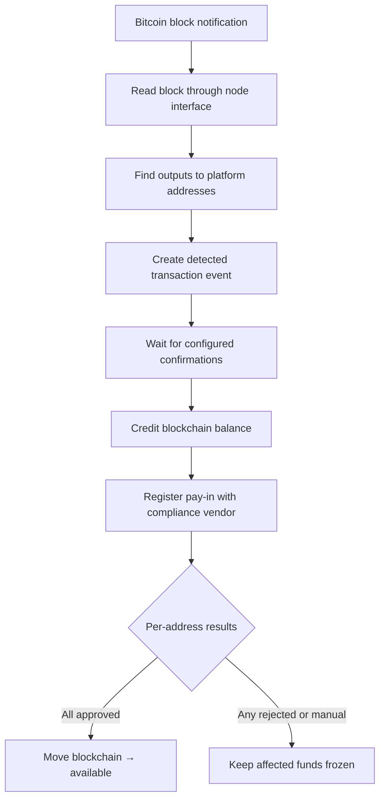

The documented deposit flow is:

1. the Bitcoin observer detects a transaction involving a platform address;
2. the platform maps the address to the correct account or pool;
3. the workflow waits for confirmation, with a documented three-day hard timeout;
4. `CONFIRMED` credits the blockchain balance and creates double-entry entries;
5. the platform registers the pay-in with the compliance vendor’s KYT service;
6. compliance-vendor results are processed per source address;
7. approved amounts move from blockchain to available;
8. rejected or manual-action funds remain frozen for review.

The deposit screening integration uses `registerPayIn`, `getTransferSummary`, `getTransferAlerts`, and `getTransferExposure` to establish the transfer and inspect its exposure.

### Why per-address screening changes the accounting

A single deposit may contain value whose exposure must be considered across multiple source addresses. The documented outcomes are not simply “the transaction passed” or “the transaction failed.” They include:

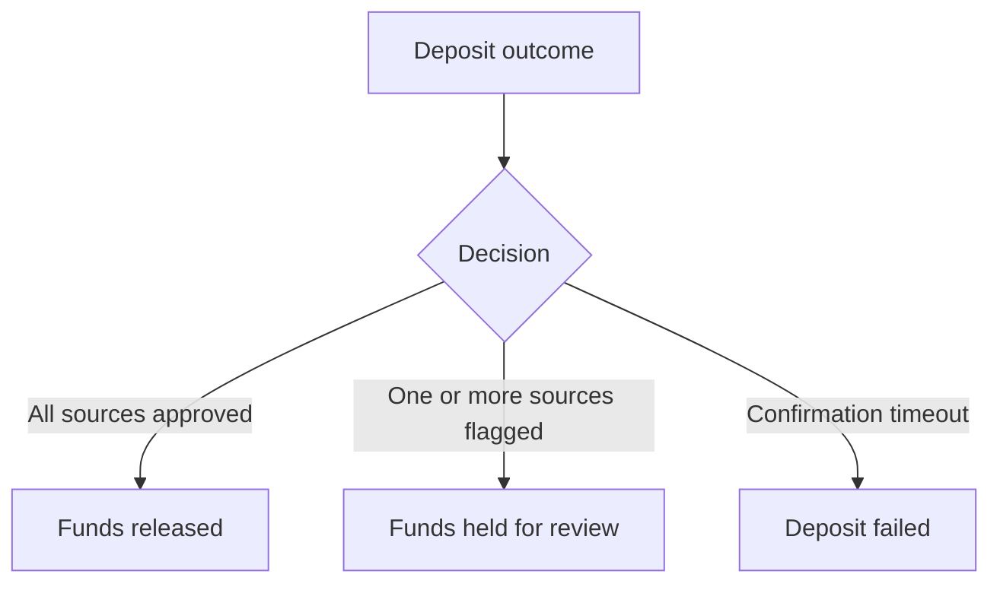

This gives compliance a controlled intermediate state instead of forcing the ledger to choose between premature credit and total rejection.

---

## 6. KYT is part of the money movement, not an attachment

The platform’s compliance documentation places screening at two different points because the risk is directional.

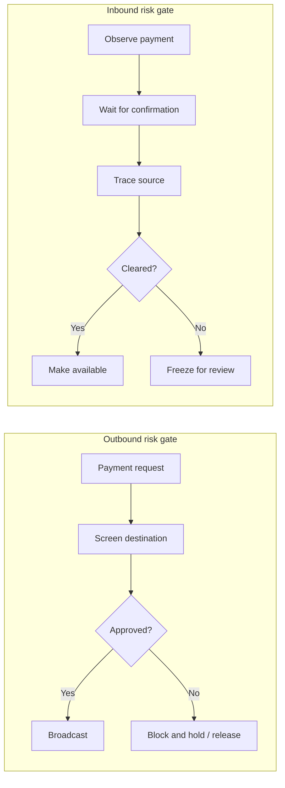

The screening system is connected to workflows by asynchronous signals. That design is important for enterprise operations:

- screening providers can take time;
- a partial result may arrive before the final result;
- a human decision must be durable across restarts;
- a timeout must create a known compliance state, not an accidental release.

The wider compliance platform also covers customer screening, transaction monitoring, sanctions, and high-risk activity checks. The Bitcoin-specific KYT boundary described here is compliance-vendor-based transaction screening for deposits and withdrawals.

### The audit record that should survive every step

The platform keeps enough information to reconstruct a payment’s path:

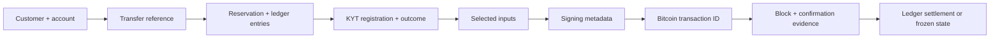

The private key is intentionally absent from this trail. The audit record proves authorization and outcome without exposing signing material.

### 6.1 KYT data flow in more detail

KYT is a second asynchronous system with its own lifecycle. It should be represented as a first-class process rather than as a boolean field on the payment.

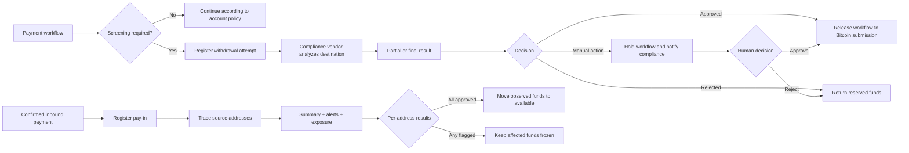

For a withdrawal, the screening question is primarily about the destination and transaction context: should the platform release a payment to this address? For a deposit, the question is about provenance: where did the funds come from, and can the platform make them available without creating a compliance risk?

The platform must preserve the following distinctions:

```mermaid
flowchart LR
    A[Screening requested] --> B[Screening approved]
    B --> C[Bitcoin broadcast]
    C --> D[Bitcoin confirmation]
    D --> E[Funds released]
    A -. not equivalent to .-> B
    B -. not equivalent to .-> C
    C -. not equivalent to .-> D
    D -. not equivalent to .-> E
```

That is why manual review can safely pause a workflow, why a flagged deposit can remain in the blockchain balance, and why the ledger should not receive an “available” entry until the relevant decision has been made.

### 6.2 Compliance failure modes

| Compliance condition | Ledger state | Operational action |
|---|---|---|
| Provider response delayed | Outbound amount remains reserved | Wait until automatic timeout, then route to manual action |
| Destination rejected | Outbound amount returns to available | Record the reason and notify compliance operations |
| Human review pending | Outbound amount remains held | Keep the workflow durable and visible in the review queue |
| Deposit source approved | Observed amount becomes available | Post release journal and emit balance event |
| Deposit source rejected | Observed amount remains frozen | Preserve evidence and prevent spend/withdraw actions |
| Mixed source results | Approved portion may be released; flagged portion remains held | Expose the partial outcome to operations and reconciliation |

This is where compliance, ledger, and workflow design meet. A KYT result must produce a financial control, not just an alert in a separate dashboard.

---

## 7. Balance settlement: Bitcoin success is not the last commit

The Crypto Platform distinguishes operational events from financial journal entries. A Bitcoin confirmation is evidence that the external network committed the payment; it is not, by itself, the complete enterprise accounting event.

For an outbound payment:

```mermaid
stateDiagram-v2
    [*] --> Available
    Available --> Reserved: request accepted
    Reserved --> Cleared: Bitcoin confirmed
    Reserved --> Available: rejected / failed
    Cleared --> [*]
```

For an inbound payment:

```mermaid
stateDiagram-v2
    [*] --> Unseen
    Unseen --> BlockchainBalance: confirmed on Bitcoin
    BlockchainBalance --> Available: KYT approved
    BlockchainBalance --> Frozen: KYT rejected / manual
    Available --> [*]
    Frozen --> [*]
```

The ledger layer uses double-entry accounting and reliable event publication through an outbox pattern. The purpose is to prevent a database update and its downstream event from disagreeing silently.

This creates one critical recovery case:

> Bitcoin confirms successfully, but the platform ledger update fails.

The documented platform patterns imply that this must become a repairable reconciliation item—not a reason to submit another Bitcoin payment. The chain outcome is immutable; the internal settlement must catch up exactly once.

---

## 8. Observation, restart, and duplicate protection

Bitcoin’s slow block cadence makes observation correctness more important than cosmetic latency.

The block observer maintains two positions:

```mermaid
flowchart LR
    A[Bitcoin node] --> B[Latest observed block]
    B --> C[Scan block and publish events]
    C --> D{Completed successfully?}
    D -->|Yes| E[Persist last processed block]
    D -->|No| F[Leave cursor unchanged]
    F --> G[Restart or retry]
    E --> H[Resume from next block]
```

The safe rule is to advance the durable cursor only after the block and its events are complete. A restart can then resume from the next block without creating a gap.

The block observer uses idempotent detection because a crash can cause a block to be scanned again. Replaying observation is acceptable; duplicating a credit is not.

The same principle applies across Kafka and workflow signals:

- events may be delivered more than once;
- a workflow may already have completed when a late signal arrives;
- the application reference and transaction identifier must make reprocessing safe.

---

## 9. UTXO consolidation: treasury operations hiding behind payments

The platform documents consolidation as a separate flow. It combines many small Bitcoin pieces into a smaller number of larger pieces so future outgoing transactions need fewer inputs.

```mermaid
flowchart LR
    A[0.001 BTC] --> X[Consolidation transaction]
    B[0.003 BTC] --> X
    C[0.002 BTC] --> X
    D[0.005 BTC] --> X
    E[0.001 BTC] --> X
    X --> F[One larger piece: 0.0115 BTC after fee]
    F --> G[Future payments use fewer inputs]
```

This is not a customer withdrawal and should not be mixed into the customer payment state machine. It is operational inventory management, with its own request, status, fee, and monitoring concerns.

The enterprise decision is not “always consolidate.” It is when to pay a lower fee now to create a better spend profile later. The documented configuration includes a consolidation threshold and consolidation size; the exact production values are deployment policy rather than a universal Bitcoin rule.

---

## 10. What the Bitcoin integration must expose

The Bitcoin implementation should have a documented matrix like this before production approval:

| Capability | Bitcoin implementation in the Crypto Platform | Enterprise evidence required |
|---|---|---|
| Value model | Unspent outputs | Selected inputs and resulting change are persisted or reconstructable |
| Address model | P2PKH and P2WPKH | Address type, ownership mapping, and validation outcome |
| Fee model | sat/vB × virtual bytes | Estimate, final fee, and fee policy |
| Authorization | Separate signing hash per input | Key-service request metadata without private key material |
| Submission | Raw transaction to Bitcoin node | Node response and application reference |
| Observation | ZeroMQ plus RPC fallback | Durable block cursor and duplicate handling |
| Confirmation | Detected → unconfirmed → confirmed | Configured threshold and evidence block |
| Compliance | KYT before outgoing broadcast; after incoming confirmation | Registration, alerts, exposure, result, reviewer action |
| Balance | Available, reserved, blockchain | Double-entry transitions and reconciliation state |
| Failure | Insufficient funds, dust, node errors, timeout, flagged funds | Retryability, terminal state, and repair procedure |

The matrix makes the Bitcoin-specific mechanics explicit while keeping the surrounding enterprise controls—authorization, compliance, custody, ledgering, reconciliation, and observability—visible as separate responsibilities.

---

## 11. Operational signals worth watching

The platform’s health, dead-letter, observability, and reconciliation controls create the following useful Bitcoin signals:

### Customer-flow signals

- time from request accepted to funds reserved;
- time spent waiting for KYT;
- time from broadcast to first block detection;
- time from detection to confirmation;
- count and age of pending payments;
- count of manual-action screening cases.

### Bitcoin-mechanics signals

- insufficient-input failures;
- dust-output rejections;
- number of selected inputs per payment;
- fee estimate versus final fee;
- stuck or replacement-eligible payments;
- node and external-provider error rates;
- ZeroMQ-to-RPC fallback usage;
- watcher cursor lag.

### Financial-control signals

- available versus reserved versus blockchain balances;
- ledger settlement backlog;
- reconciliation breaks;
- duplicate-event suppression count;
- frozen deposit age;
- KYT alert and exposure outcomes.

Metrics should describe business risk, not just infrastructure health. “Bitcoin node up” is not enough if the watcher is behind by 300 blocks or the ledger has 40 confirmed payments waiting for settlement.

---

## 12. The enterprise definition of complete

A Bitcoin payment is complete only when all of the following are true:

1. The request was authorized and accepted exactly once.
2. Funds were reserved before external submission.
3. KYT approved the outbound destination, when screening was required.
4. The Bitcoin transaction was assembled from valid spendable inputs.
5. Signing occurred without exporting private keys.
6. The node accepted the signed transaction.
7. The transaction was detected and reached the configured confirmation state.
8. The platform ledger cleared or credited the correct balance.
9. The outcome is replayable, auditable, and reconciled.
10. Any KYT hold, node failure, timeout, or ledger failure has a durable operational state.

The network gives the Crypto Platform a transaction. The platform has to turn that transaction into a safe, compliant, recoverable financial event.

---

## 13. Further reading: external articles and technical references

The following reading path expands each topic in this article. The links are intentionally mixed: protocol documentation for Bitcoin mechanics, platform documentation for enterprise distributed systems, and practitioner articles for architecture context.

### Bitcoin transaction model and payment finality

1. **[Transactions — Bitcoin Developer Guide](https://developer.bitcoin.org/devguide/transactions.html)** — inputs, outputs, unspent outputs, change, scripts, and transaction fees.
2. **[Payment Processing — Bitcoin Developer Guide](https://developer.bitcoin.org/devguide/payment_processing.html)** — payment requests, address association, broadcast versus verification, confirmations, and double-spend risk.
3. **[Operating Modes — Bitcoin Developer Guide](https://developer.bitcoin.org/devguide/operating_modes.html)** — full-node validation, SPV trade-offs, block depth, and confidence in the chain view.
4. **[Bitcoin Core transaction reference](https://developer.bitcoin.org/reference/transactions.html)** — raw transaction format, outpoints, inputs, outputs, and serialized transaction structure.

### UTXO selection, fees, change, and treasury operations

5. **[Transactions — fee and change sections](https://developer.bitcoin.org/devguide/transactions.html#transaction-fees-and-change)** — why transaction size and input selection affect cost, and why change is a normal output rather than a refund mechanism.
6. **[Bitcoin Core RPC reference](https://developer.bitcoin.org/reference/rpc/)** — operational interfaces used to inspect blocks, transactions, unspent outputs, and node state.
7. **[Bitcoin Core user interface](https://bitcoin.org/en/bitcoin-core/features/user-interface)** — a practical introduction to fee selection, input selection, address reuse, and wallet operation.

### Bitcoin adapter and enterprise integration boundaries

8. **[Cloud design patterns — AWS Prescriptive Guidance](https://docs.aws.amazon.com/prescriptive-guidance/latest/cloud-design-patterns/introduction.html)** — anti-corruption layers, circuit breakers, publish/subscribe, retries, sagas, and transactional outbox patterns used when a platform integrates Bitcoin infrastructure.
9. **[Saga patterns](https://docs.aws.amazon.com/prescriptive-guidance/latest/cloud-design-patterns/saga-patterns.html)** — orchestration, local transactions, compensating actions, and recovery across service boundaries.
10. **[What do you mean by “Event-Driven”? — Martin Fowler](https://martinfowler.com/articles/201701-event-driven.html)** — event notification, event-carried state transfer, and event sourcing distinctions.
11. **[Event Sourcing — Martin Fowler](https://www.martinfowler.com/eaaDev/EventSourcing.html)** — reconstructing application state from a sequence of state-changing events and retaining historical evidence.

### Custody, identity, and signing

12. **[Bitcoin Developer Guide — transactions and scripts](https://developer.bitcoin.org/devguide/transactions.html)** — the protocol-level reason signing is tied to each input and why the signed transaction must preserve the original spend conditions.
13. **[Bitcoin Core validation features](https://bitcoin.org/en/bitcoin-core/features/validation)** — how a full node validates transactions and why a platform should distinguish node validation from business completion.

### KYT, AML, sanctions, and transaction monitoring

14. **[FATF virtual-asset red-flag indicators](https://www.fatf-gafi.org/en/publications/Methodsandtrends/Virtual-assets-red-flag-indicators.html)** — behavioral and transactional signals that can inform KYT risk rules and investigation queues.
15. **[FATF targeted update on virtual assets and VASPs](https://www.fatf-gafi.org/en/publications/Fatfrecommendations/targeted-update-virtual-assets-vasps-2025.html)** — current supervisory themes and implementation considerations for virtual-asset compliance programs.
16. **[FATF targeted update on the Travel Rule](https://www.fatf-gafi.org/en/publications/Fatfrecommendations/Targeted-update-virtual-assets-vasps.html)** — how originator and beneficiary information requirements affect transfer workflows and integration boundaries.
17. **[OFAC sanctions compliance guidance for the virtual-currency industry](https://ofac.treasury.gov/system/files/126/virtual_currency_guidance_brochure.pdf)** — risk-based sanctions controls, screening, recordkeeping, reporting, and escalation.
18. **[OFAC guidance on virtual-currency transactions](https://ofac.treasury.gov/faqs/560)** — the application of sanctions obligations to firms that facilitate or process digital-currency transactions.

### Ledgering, outbox delivery, and reconciliation

19. **[Transactional outbox pattern — AWS Prescriptive Guidance](https://docs.aws.amazon.com/prescriptive-guidance/latest/cloud-design-patterns/transactional-outbox.html)** — preserving consistency between a local database transaction and the event that informs downstream systems.
20. **[Event Sourcing — Martin Fowler](https://www.martinfowler.com/eaaDev/EventSourcing.html)** — useful background for retaining a durable history of money-state changes and rebuilding projections.
21. **[Cloud design patterns — event sourcing and publish/subscribe](https://docs.aws.amazon.com/prescriptive-guidance/latest/cloud-design-patterns/introduction.html)** — practical guidance for eventual consistency, retries, and service-owned data stores.

### Observability and operational readiness

22. **[OpenTelemetry documentation](https://opentelemetry.io/docs/)** — vendor-neutral instrumentation for traces, metrics, and logs across the API, workflow, KYT, Bitcoin adapter, node, and ledger boundaries.
23. **[OpenTelemetry concepts](https://opentelemetry.io/docs/concepts/)** — how to connect a single business transaction across distributed services using trace context and correlated telemetry.

---
