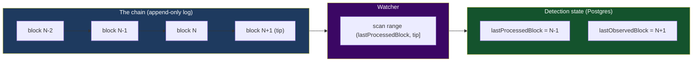
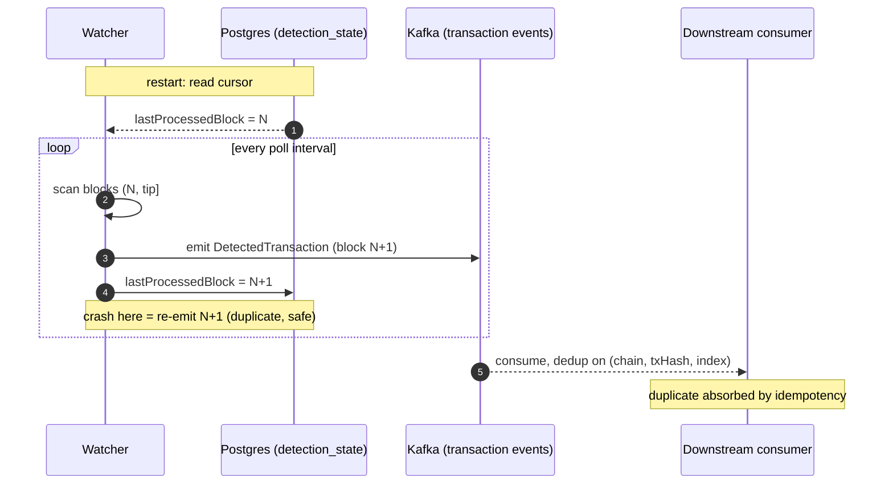
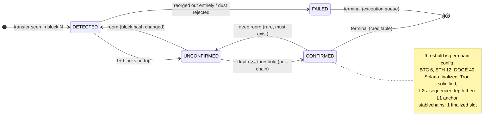

> **TL;DR** — Every stablecoin platform lives or dies on one question: *did money actually move
> on-chain, and how sure are you?* The Watcher from Post 03 answers it by scanning every block,
> remembering exactly where it stopped, and emitting one idempotent event per real transfer. Get
> the cursor wrong and a restart skips blocks. Get confirmations wrong and a reorg un-pays a
> settled deposit. Get dedup wrong and a crash credits a customer twice. This post is the
> detection layer, end to end: how to read every major chain family — EVM L1s and L2s, UTXO,
> Tron, Solana, XRP, Cosmos/IBC, Cardano, Algorand, Stellar, and the Move chains — plus the
> asset models that ride on them. One `DetectionState` cursor makes restarts boring, one event
> contract is trusted by everything downstream, and per-chain confirmation thresholds turn
> "probabilistic finality" from a slogan into a number.
> **Who this is for:** backend engineers building the Watcher half of the chain layer — the part
> of the system that turns a chain's firehose of blocks into a stream of payment facts.

---

## The Deposit That Vanished Twice

A payments platform runs a simple deposit detector for USDC on Ethereum. It's a loop: every
twelve seconds, ask the node for the latest block, pull the ERC-20 `Transfer` logs, match the
`to` address against the customer-address table, insert a deposit row, credit the balance. It
ships in a week. It works.

The first incident comes two months in. A customer deposits 5,000 USDC. The detector sees the
transfer in block 19,441,203, credits the account, the customer converts and withdraws. Nine
minutes later, block 19,441,203 stops being the canonical block — a two-block reorganization
replaces it with a competing block that doesn't contain the deposit. The deposit is gone. The
ledger still shows the credit. The customer has already withdrawn against it. The platform eats
the difference, and the postmortem assigns the obvious fix: *wait for more confirmations before
crediting.*

The second incident comes from the fix. The team adds a confirmation rule — credit only after 12
blocks — and, to be safe, a startup routine that re-scans "recent" blocks in case the service
missed anything while down. Nobody defines "recent" precisely, so it re-scans from a block the
detector already processed. Every deposit from the last hour is detected again. The consumer has
no dedup key, so every one of those deposits credits twice. Forty-one customers wake up with
double balances. It takes two days of manual reconciliation to unwind.

Two incidents, opposite directions. The first treated a *probabilistic* event as final. The
second treated a *replayable* event as unique. Both are the same underlying mistake: the
detector didn't know what it had already seen, and didn't know how sure the chain was. A deposit
detector is not a loop that reads blocks. It is a **cursor with memory** plus a **confidence
model** — and this post builds both.

Post 03 split every chain integration into a Watcher and a Sender, and showed the Watcher as a
single line in a sequence diagram — *"Watcher polls blocks."* This post opens that line. What
does the Watcher actually do between "poll" and "emit," and why is it the layer where
correctness is hardest to retrofit?

---

## Scope & Requirements

Before any design, pin down what "detecting money movement" has to deliver. Steal the Q&A
device: ask the questions, write the answers down, design to them.

**Q: What are we detecting?**
A: Any transfer that touches a platform-managed address — native coin (ETH, BTC, TRX, SOL, XRP,
ATOM, ADA, ALGO, XLM, APT, SUI) and every token standard that carries stablecoins: ERC-20 /
BEP-20 (EVM), TRC-20 (Tron), SPL (Solana), native multi-assets (Cardano), ASAs (Algorand),
Stellar assets (code + issuer), XRP IOUs (currency + issuer), IBC-denominated vouchers (Cosmos),
and Move coin types (Aptos, Sui). Deposits into customer addresses, sweep confirmations out of
them, and withdrawal confirmations for the Sender. One detection layer feeds all three flows.

**Q: How fast?**
A: Block confirmed on-chain → detection event emitted in **under 5 seconds at p95**. Detection
latency is the platform's dial tone — Post 01's "99.999% explainability" bar is unreachable if
the first link in the chain is slow or lossy.

**Q: How correct?**
A: Three numbers, not one. **Block coverage: 100%** — every block scanned, no gaps, ever.
**Confirmation accuracy: 99.99%** — the terminal status the platform believes matches what the
chain eventually settles on. **Zero double-counting** — duplicates are emitted freely
(at-least-once), but no duplicate ever becomes two credits.

**Q: What are we designing around?**
A: Four adversaries. **Reorgs** — the chain can take back recent blocks. **Node failure** — RPC
endpoints stall, lie, and rate-limit. **Restarts** — deploys and crashes are weekly events, and
recovery must be gapless *and* non-duplicating at the ledger. **Chain diversity** — ten chain
families read their chains ten different ways, and the detection contract must hide all of them
from the core.

**Q: What's explicitly out of scope?**
A: The address-matching problem at scale (millions of monitored addresses vs. every block's
transfers) — that's the bloom-filter post in this series. Building a general-purpose indexing
pipeline (fetch/parse/publish stages, worker topologies, RPC provider strategy) — that's the
multichain-indexer post; this post's Watcher sits on top of exactly that machinery. This post
owns the payment-detection contract: the cursor, the events, the confirmation semantics.

---

## The Mental Model: A Cursor With Memory

Strip the problem to its skeleton. A blockchain is an append-only log of blocks. A detector is a
process that walks the log from left to right, keeps a bookmark, and reports interesting entries.
That bookmark — the **detection state** — is the whole game. Everything else in this post is
consequences of getting it right or wrong.



Two cursors, not one. `lastObservedBlock` is the tip the Watcher can see — it tracks how far
behind the chain you are, and it's the input to the lag alert. `lastProcessedBlock` is the
watermark of *work done* — everything at or below it has been scanned and emitted. The gap
between them is your backlog. On a healthy chain the gap is 0–2 blocks. When it grows, the node
is sick or the Watcher is stuck — and you want to know that before customers do.

The mental model earns its keep in three rules, and the rest of the post expands each:

1. **The cursor is the source of truth for progress — not memory, not the chain.** After any
   restart, the Watcher reads its cursor from the database and resumes from
   `lastProcessedBlock + 1`. Never from genesis, never from "an hour ago," never from wherever
   the process happens to wake up.
2. **Advance the cursor only after the work for that block is durable.** Emit events, then move
   the cursor. The failure window (crash between the two) produces a *duplicate*, which
   downstream idempotency absorbs. The reverse order produces a *gap*, which nothing absorbs.
3. **Confidence is separate from detection.** Seeing a transfer and *trusting* a transfer are
   two different events. The first is cheap and immediate; the second is a function of how many
   blocks have been built on top — and that function is per-chain.

Rule 3 is the piece the story's first incident missed. Rule 2 is the piece the second incident
missed. The rest of the post is mechanics.

---

## How to Read the Chain

Ten chain families, ten reading mechanisms — and the same one contract. The Watcher pattern
from Post 03 is what lets this diversity exist without leaking into the core: each chain module
owns its reading mechanism, and all of them emit the same event.

```mermaid
graph TD
    subgraph sgread["Reading mechanisms (per chain module)"]
        EVM["EVM L1s: eth_getLogs over block ranges<br/>+ eth_subscribe newHeads as trigger"]
        L2["EVM L2s / stablechains: same scan<br/>two watermarks: sequencer head vs L1-anchored"]
        UTXO["UTXO family: full-block scan via bitcoinj<br/>(every tx, every output)"]
        TRON["Tron: gRPC block stream<br/>(solidified block API)"]
        SOL["Solana: slot subscription<br/>(skipped slots are normal)"]
        XRP["XRP: validated-ledger polling<br/>(destination tags)"]
        COSMOS["Cosmos/IBC: Tendermint tx events<br/>+ IBC packet events"]
        CARDANO["Cardano: full-block scan<br/>(multi-asset outputs, no contracts)"]
        STELLAR["Stellar: ledger-close polling<br/>operations inside txs + claimable balances"]
        MOVE["Move (Aptos, Sui): event streams<br/>with sequence numbers / object versions"]
    end

    subgraph sgcontract["One detection contract"]
        EVT["DetectedTransaction events<br/>on the shared topic"]
    end

    EVM --> EVT
    L2 --> EVT
    UTXO --> EVT
    TRON --> EVT
    SOL --> EVT
    XRP --> EVT
    COSMOS --> EVT
    CARDANO --> EVT
    STELLAR --> EVT
    MOVE --> EVT

    style sgread fill:#1e3a5f,color:#fff
    style sgcontract fill:#14532d,color:#fff
```



**EVM L1s (Ethereum, BSC, Polygon PoS): log scanning.** Token transfers on EVM chains are not
transactions you can see in the block header — they're `Transfer` events emitted by token
contracts, retrieved with `eth_getLogs` filtered by contract address and topic. The production
shape: subscribe to `newHeads` as a *trigger* (it's cheap and fast), then do the actual work
with `eth_getLogs` over the range `(lastProcessedBlock, newHead]`. Never trust the subscription
alone — websocket subscriptions drop silently, and a missed `newHeads` is a missed block. The
subscription is a hint; the cursor-based range scan is the guarantee. Rate limits are the
practical constraint: `eth_getLogs` over wide ranges against a busy contract is the call RPC
providers throttle hardest, so batch ranges (a few hundred blocks per call) and back off on
429s.

**EVM L2s and the stablechains (Base, Arbitrum, Optimism; Tempo, Arc, Plasma): same scan,
different meaning of "confirmed."** Mechanically these are free — same `eth_getLogs`, same
`Transfer` events; per Post 03's Chain-N+1 test, adding one is an RPC endpoint and a chain ID.
The detection-layer difference is what a "confirmation" *is*. On an L2, block N existing under
the sequencer's signature is not the same as block N being anchored to L1 — a sequencer reorg
can rewrite recent L2 history that L1 never saw. So an L2 watcher tracks two watermarks:
sequencer head (fast, provisional — emit `DETECTED`) and L1-anchored state (slow, final — emit
`CONFIRMED`). The stablechains go the other direction: purpose-built for payments, they
advertise sub-second single-slot finality, so the confirmation question collapses to "was this
block finalized?" — closer to Tron's solidified block than to Ethereum's count-the-depth
heuristic. The cursor, dedup key, and event contract are identical everywhere; only the
confidence function changes.

**UTXO (Bitcoin, Litecoin, Dogecoin): scan everything.** There's no log API on a UTXO chain —
you read every transaction in every block and check every output against your address set. This
is heavier than log scanning but conceptually simpler: the block is self-contained, and a
library like bitcoinj gives you the block stream plus reorganized-block callbacks. The two
UTXO-specific wrinkles: outputs below the **dust threshold** are unspendable-by-design and must
be rejected at detection time (crediting dust creates a balance the platform can never move),
and detection must track **spend status** — a reorg on a UTXO chain shows up as a previously
spent output becoming unspent, or vice versa.

**Tron: gRPC, and a finality concept built in.** Tron's API distinguishes ordinary blocks from
**solidified blocks** — blocks past the confirmation threshold that cannot be reverted.
Detection against solidified blocks is slower but final; detection against head blocks is fast
but provisional. Production systems do both: emit `DETECTED` on the head block, emit `CONFIRMED`
when the block solidifies.

**Solana: slots, not blocks — and missing ones are normal.** Solana's leader schedule means
slots regularly go unfilled; a naive `for (slot = last + 1; ...)` loop will stall forever
waiting for a slot that will never exist. Read by *confirmed/finalized commitment*, skip
skipped slots explicitly, and treat "finalized" (roughly 32 slots deep) as your confirmation
signal. Solana is also where watcher lag bites first — at 400ms slots, a stalled reader falls
behind fast, so the lag metric matters most here.

**XRP: validated ledgers only.** XRP's ledger closes every few seconds and is *validated* by
consensus — once validated, it's final. Detection polls validated ledgers, and the one
payment-specific wrinkle is the **destination tag**: an XRP payment to a platform address
without its tag is detected but unroutable to a customer, and needs its own handling path.

**Cosmos/IBC: events, not logs — and the packet is the money.** A Cosmos zone is Tendermint
underneath: ~6-second blocks that are final once ⅔+ of validators sign them — no reorgs in
practice, no confirmation-depth arithmetic. Detection subscribes to transaction events
(`transfer.recipient` attributes for native and CW20 tokens) and, for cross-chain money, to
**IBC packet events**: an incoming transfer is a `recv_packet` on the destination zone, and the
asset arrives as an `ibc/<hash>` voucher denom, not the source's native denom. The dedup nuance:
one ICS-20 transfer can surface as events on *both* the source and destination zone, so the
dedup key must pin which side of the packet you're detecting.

**Cardano: multi-asset UTXO — tokens live in outputs, not contracts.** Cardano's extended UTXO
model has no token contracts for simple transfers: an output carries a list of
`(policyId, assetName, amount)` pairs, so a single transaction can move a dozen assets to a
platform address and the scanner reads them all from the outputs. Same full-block-scan mechanics
as Bitcoin, plus two wrinkles: **min-UTXO-ADA** (an output below ~1 ADA is unspendable — reject
at detection, the same dust discipline as Bitcoin) and **asset identity** — the dedup key must
include the asset, because one tx can pay in multiple native assets simultaneously. Slots are 20
seconds and the confirmation convention runs deeper than Bitcoin's (10–20 slots).

**Algorand: rounds, and a chain that doesn't reorg.** Algorand's Pure Proof-of-Stake is
fork-free in normal operation — a certified round is final, period. Detection polls the
indexer for new rounds and watches `axfer` transactions for ASA (Algorand Standard Asset)
transfers; the asset is an integer ID, and each ASA carries its own decimals parameter. The
confirmation question mostly evaporates — a handful of rounds is belt-and-braces, not a risk
model.

**Stellar: ledger closes, operations, and money that needs claiming.** Stellar closes a ledger
every ~5 seconds via SCP consensus; validated ledgers are final. Detection polls Horizon for new
ledgers and scans *operations* inside each transaction (a tx can carry several payments).
Three Stellar-specific wrinkles: assets are **(code, issuer)** pairs — the same ticker from a
different issuer is a different asset, so asset identity is two fields, not one; inbound
payments require a **memo** to route to a customer, like an XRP tag; and funds can arrive as
**claimable balances** — a sender creates a balance the platform must *claim* before the money
is spendable, and unclaimed balances expire after a time bound. Detection must watch
`CreateClaimableBalance` operations, not just payments.

**Move chains (Aptos, Sui): events with sequence numbers — the dedup key gets a third shape.**
Aptos and Sui are BFT-finality chains: a block is final at ~1 second, no reorgs to speak of.
Detection reads **event streams** (Aptos event handles; Sui object/checkpoint events) rather
than logs or blocks. The wrinkle that matters for this post: an event's identity is its
**sequence number within its event handle** (Aptos) or an **object version** (Sui), not a
logIndex or vout — so the dedup key for these chains is `(network, eventKey/objectId,
sequence/version)`. Token models differ from everything above: coins are typed
(`0x1::aptos_coin::AptosCoin`), and Sui moves *objects*, so a payment is a versioned coin object
changing hands. Same cursor, same event contract; a different dedup dimension.

| Chain family | Read mechanism | Finality signal | Detection-specific wrinkle |
|---|---|---|---|
| EVM L1 (Ethereum, BSC, Polygon) | `eth_getLogs` range scan | Confirmation depth (e.g. 12 blocks) | Token transfers are logs, not txs |
| EVM L2 (Base, Arbitrum, Optimism) | Same `eth_getLogs` scan | Sequencer depth + L1 anchoring | "Confirmed" ≠ "L1-final"; two watermarks |
| Stablechains (Tempo, Arc, Plasma) | Same `eth_getLogs` scan | Single-slot finality (~sub-second) | Finality is advertised, verify depth semantics per chain |
| UTXO (Bitcoin, Litecoin, Dogecoin) | Full-block scan (bitcoinj) | Confirmation depth (6/12/40) | Dust rejection; spend tracking |
| Tron | gRPC block stream | Solidified block | Head = provisional, solidified = final |
| Solana | Slot subscription | Finalized commitment (~32 slots) | Skipped slots; fast lag accumulation |
| XRP | Validated-ledger polling | Validation (immediate) | Destination-tag extraction |
| Cosmos / IBC | Tendermint tx-event subscription | ⅔+ validator vote (~6s blocks) | IBC packets: source-side vs destination-side events; `ibc/<hash>` voucher denoms |
| Cardano | Full-block scan (EUTXO) | Confirmation depth (10–20 slots) | Multi-asset outputs; min-UTXO-ADA dust; asset in the dedup key |
| Algorand | Indexer round polling | Round certification (no reorgs) | ASAs are integer IDs; per-asset decimals; `axfer` txs |
| Stellar | Horizon ledger-close polling | Validation (immediate) | (code, issuer) asset identity; memos; claimable balances |
| Move (Aptos, Sui) | Event stream subscription | BFT finality (~1s) | Dedup by event sequence / object version, not logIndex |

Whichever mechanism, one cross-cutting rule: **every node call sits behind a per-chain circuit
breaker.** A production config: open the breaker at a 40% failure rate over a ten-call sliding
window, stay open for ten seconds, half-open probe, close. When Ethereum's RPC provider has a
bad
morning, the Ethereum Watcher pauses and alerts — and Tron, Solana, and Bitcoin detection don't
notice. This is Post 02's independent-failure boundary, applied at the node boundary, and Post
03's per-chain error topics (`<chain>-transaction-errors`) are where the failures land for
ops to see.

### Assets: The Other Half of Detection

Reading blocks is half the job; knowing *what money* you saw is the other half. Every asset
model above answers three questions differently — **what identifies the asset, how many
decimals it has, and where its transfers surface** — and a platform that treats "USDC" as one
thing across chains is building a reconciliation bug:

| Asset model | Families | Asset identity | Decimals | Where transfers surface |
|---|---|---|---|---|
| ERC-20 / BEP-20 | EVM L1s, L2s, stablechains | Contract address | Per-contract (USDC: 6, most: 18) | `Transfer` logs |
| TRC-20 | Tron | Contract address | 6 (USDT/USDC convention) | Contract events |
| SPL | Solana | Mint address | Per-mint (9 is common) | Instruction parsing / token accounts |
| Native multi-asset | Cardano | `(policyId, assetName)` | Per-policy (6 convention for stablecoins) | Tx outputs |
| ASA | Algorand | Asset ID (integer) | Per-ASA parameter | `axfer` transactions |
| Stellar asset | Stellar | `(code, issuer)` | 7 default (per-asset override) | Payment / PathPayment operations |
| XRP IOU | XRP Ledger | `(currency, issuer)` | 15 for IOUs, 6 for XRP | Payment operations with currency |
| IBC voucher | Cosmos | `ibc/<hash>` denom | Inherited from source chain | `recv_packet` events |
| Move coin | Aptos, Sui | Coin type / object type | Per-type (`0x1::aptos_coin::AptosCoin`: 8) | Event streams |

Two consequences for the detection layer. First, **asset identity belongs in the event and in
the dedup key** — the Cardano output that carries three native assets, the Stellar payment where
the *same* ticker has two issuers, and the Cosmos voucher whose source denom you can't see are
all cases where `(network, txHash, logIndex)` alone would merge or drop money. Asset-aware
dedup is `(network, txHash, position, asset)` for multi-asset chains, and the asset field
carries the chain-native identity, not a ticker. Second, **decimals are config, not code** —
the difference between 6 and 18 decimals is the difference between $1.00 and $0.0000000001
credited, and every chain module needs its own conversion table (Post 13 opens token support
properly). Detection emits the chain-native integer amount plus the asset; the ledger applies
the conversion — never the other way around.

---

## The Resume Guarantee

The cursor's contract is one sentence: **after any restart, at any moment, the Watcher resumes
from `lastProcessedBlock + 1`, with no gaps and no double-credits.** Everything in this section
is engineering to make that sentence true.

Start with the schema. Detection state is a row per chain in Postgres — the same database that
holds everything else money-adjacent, because it needs the same durability:

```sql
CREATE TABLE detection_state (
    network              TEXT PRIMARY KEY,      -- 'ethereum', 'bitcoin', 'tron', ...
    last_processed_block BIGINT NOT NULL,        -- work-complete watermark
    last_observed_block  BIGINT NOT NULL,        -- chain tip as we see it
    updated_at           TIMESTAMPTZ NOT NULL DEFAULT now()
);
```

Two fields, and the whole resume story is in *when each one moves*. `last_observed_block`
updates freely — it's telemetry. `last_processed_block` moves only in the same breath as the
work it records. The processing loop, per block range:

1. Read range `(last_processed_block, tip]`.
2. Extract matching transfers.
3. **Emit events** for each transfer (to Kafka — durable, ordered, replayable).
4. **Update `last_processed_block` to the top of the range** in the same transaction boundary
   as the emission bookkeeping.
5. Repeat.



Now the failure analysis, because this is where the two orderings diverge. **Emit-then-cursor:**
if the process dies between steps 3 and 4, the restart re-scans block N+1 and re-emits. The
downstream consumer sees a duplicate, checks its dedup key, and drops it. Cost: one extra event.
**Cursor-then-emit:** if the process dies between the reversed steps, the cursor says N+1 is done
and the event never existed. Cost: a permanent gap — a deposit the platform will never see, a
customer asking where their money is, a reconciliation exception three days later. Both orderings
are "at-least-once" vs "at-most-once" in disguise, and for money you choose at-least-once plus
idempotency every single time.

The same reasoning kills the story's second bug: the ad-hoc "re-scan recent blocks on startup"
routine. There is no safe definition of "recent" that isn't the cursor. If you want a startup
sanity check, the check is *"cursor is not absurdly far behind the tip"* — an alert, not a
re-scan.

One more operational number falls out of the two-cursor design: **watcher lag** =
`last_observed_block - last_processed_block`. Alert when it exceeds a small per-chain threshold
(low single digits for fast chains). Lag is the earliest signal of node trouble, rate limiting,
and deploy wedges — in production it's the metric that pages.

---

## Emitting Detection Events

The Watcher's output is the platform's input. Everything downstream — the deposit workflow, the
confirmation tracker, reconciliation — consumes this one event shape, so its design constraints
are trust and idempotency, not richness.

```java
public record DetectedTransaction(
    String network,          // 'ethereum', 'bitcoin', 'cosmos', ...
    String txHash,           // chain-native transaction id
    long blockNumber,        // where we saw it (block / round / ledger / slot)
    String blockHash,        // which fork we saw it on (reorg key)
    String fromAddress,
    String toAddress,
    BigDecimal amount,       // chain-native integer amount, un-converted
    String asset,            // chain-native asset identity ('USDC', 'ibc/<hash>', 'USDC:issuer', ...)
    String dedupKey,         // chain-specific position: logIndex | vout | op index | event seq
    long timestamp
) {}
```

Three fields carry the correctness load, and each exists because of a bug class:

- **`blockHash`, not just `blockNumber`.** Block *numbers* are stable across a reorg; block
  *hashes* are not. When the chain reorganizes, the same transaction reappears at the same
  height on a *different* block hash. Recording the hash is what lets the confirmation tracker
  notice "the block I trusted is gone" — compare hashes, not heights.
- **`logIndex` (or `vout`, or event sequence, or object version).** One transaction can move
  money twice — a native transfer plus a token transfer, two outputs to platform addresses, or a
  Stellar tx with several payment operations. The dedup key is never the tx hash alone; it's
  **`(network, txHash, position)`**, where position is whatever the chain numbers uniquely
  inside a transaction — `logIndex` on EVM, `vout` on UTXO and Cardano, operation index on
  Stellar and XRP, event sequence on Aptos, object version on Sui. On multi-asset chains the
  key gains a fourth component: the asset itself. This is the line that makes "at-least-once
  emission, exactly-once crediting" possible.
- **`network`, explicitly.** Chain IDs colliding across ecosystems is not hypothetical. The
  platform's namespace is the network enum, and every dedup key, cursor row, and Kafka partition
  key carries it.

Events land on a shared `transaction-events` topic, **partition-keyed by tx hash** — all events
for one transfer (DETECTED, then confirmation updates) arrive in order on one partition, and
parallelism scales by hash. Delivery is at-least-once by design (Post 17 opens the event spine
properly); the consumer contract is idempotency on the dedup key. This is the asymmetry from
Post 03's paired diagrams, now with the mechanics filled in: duplicates are cheap, gaps are
fatal, and the dedup key is where the cheapness is enforced.

Confirmation tracking rides the same stream. As new blocks arrive, the Watcher (or a
confirmation tracker consuming block events) updates each in-flight transfer's confirmation
count and re-emits status transitions:

```java
enum DetectionStatus { DETECTED, UNCONFIRMED, CONFIRMED, FAILED }
// happy path:  DETECTED → UNCONFIRMED → CONFIRMED (terminal)
// reorg path:  UNCONFIRMED → DETECTED   (block hash changed, count resets)
// deep reorg:  CONFIRMED → UNCONFIRMED  (rare, catastrophic, must be representable)
```

Note the last transition: **CONFIRMED is not a monotonic sink.** If a reorg deeper than your
threshold ever hits, the status must be able to regress — and Post 19 (resilience) and Post 20
(reconciliation) exist because that row in the table is real. You don't design the happy path
and bolt on regressions later; the state machine has the edge or it doesn't.

---

## Confirmations: Turning Probability Into a Number

Post 01 named probabilistic finality as one of the five properties that break traditional
payment stacks. This section is where it stops being a property and becomes a config table.

A transfer in block N is "confirmed" when enough blocks have been built on top of it that a
reorganization undoing it is economically or practically infeasible. How many is "enough" is a
per-chain risk decision, not a universal constant:

| Chain | Confirmation threshold | Approx. wall-clock | Why |
|---|---|---|---|
| Bitcoin | 6 | ~60 min | The canonical PoW number; deeper reorgs are historical trivia |
| Ethereum | 12 | ~2.4 min | Post-merge finality economics; shallow reorgs are routine |
| BSC / Polygon PoS | 12–20 | ~1 min | Faster blocks, validator-set churn argues for a bit more depth |
| Base / Arbitrum / Optimism | 1 (sequencer) → L1-anchored | seconds → ~10+ min | Two thresholds, not one: provisional credit on sequencer depth, final on L1 anchor |
| Tempo / Arc / Plasma (stablechains) | 1 finalized slot | sub-second–seconds | Finality is the product; confirm the chain's finality gadget, not a count |
| Litecoin | 12 | ~30 min | Faster blocks, same family risk profile |
| Dogecoin | 40 | ~40 min | Low hashpower relative to value moved; deep threshold is cheap insurance |
| Solana | ~32 slots (finalized) | ~13 s | "Finalized" is a consensus state, not a heuristic count |
| Tron | solidified block | ~1 min | Finality is an API concept, not a count |
| XRP | validated ledger | ~5 s | Validation is final; threshold is 1 |
| Cosmos zones | 1 block (⅔+ signed) | ~6 s | Tendermint finality; no reorg arithmetic |
| Cardano | 10–20 slots | ~4–7 min | Deep convention for a chain that has reorged in anger |
| Algorand | 1–5 rounds | ~3–15 s | Fork-free by design; rounds are belt-and-braces |
| Stellar | 1 validated ledger | ~5 s | SCP finality; threshold is 1 |
| Aptos / Sui | 1 block | ~1 s | BFT finality; threshold is 1 |

Two design points matter more than any number in the table. First, **the threshold is config per
network, not code** — the day a chain's risk profile changes (a hashpower drop, a new finality
gadget, a stablechain launching with sub-second finality), you change a row, not a release.
Second, the threshold is a *product* decision wearing an engineering hat: it trades deposit
latency against reorg exposure, and the right value depends on what customers do with a credit
in its first minutes. A platform that lets customers withdraw instantly against fresh deposits
carries more reorg risk than one that enforces a hold, and the threshold should know it.

The countdown itself is mechanics: on each new block, for every in-flight transfer,
`confirmations = currentTip - blockNumber + 1`; transition UNCONFIRMED → CONFIRMED when it
crosses the threshold. Reorg handling inverts the same arithmetic: if the block at
`blockNumber` no longer has the recorded `blockHash`, reset to DETECTED and re-derive the
transfer from the new canonical block — if it still exists there. If it doesn't, the transfer is
gone, and that disappearance must propagate downstream as a first-class event, not a silent
deletion.



---

## What Breaks

A list of failure modes is cheap; each of these has cost someone money. The pattern to notice:
every one is a *missing* something — a missing hash, a missing key, a missing breaker — that only
hurts on the bad day.

| Failure | Mechanism | Cost if missed |
|---|---|---|
| Reorg un-pays a credited deposit | Record `blockHash`; re-evaluate on mismatch; statuses can regress | The story's first incident: settled credit, vanished deposit |
| Crash/restart skips blocks | Cursor-first resume from `last_processed_block` only | Permanent detection gap; found by reconciliation days later |
| Startup re-scan double-credits | No "re-scan recent" path exists; dedup key `(network, txHash, logIndex)` downstream | The story's second incident: 41 double balances |
| Websocket subscription drops silently | `newHeads` is a trigger; the cursor range scan is the guarantee | Missed blocks with zero errors in the logs |
| Node provider rate-limits log queries | Batch ranges; back off on 429; per-chain circuit breaker (40%/10s) | Detection latency blows past the 5s SLO, then a stall |
| One sick chain stalls the platform | Per-chain modules, per-chain breakers, per-chain error topics | Cross-chain outage from one provider's bad morning |
| Solana skipped slots stall the scanner | Read by commitment; skip missing slots explicitly | Watcher "running" but frozen at a dead slot |
| Dust output credited, never spendable | Reject sub-dust outputs at detection | A balance the platform can never move — a permanent liability |
| Deep reorg past the threshold | CONFIRMED → UNCONFIRMED edge exists; exception queue; Post 19/20 machinery | The status model lies exactly when truth matters most |
| One tx, two transfers — one deduped away | Dedup key includes `logIndex`/`vout`, not just hash | Token leg credited, native leg silently dropped |
| IBC packet relayed but never received | Watch source-side AND destination-side events; reconciliation on voucher denoms | Customer's money stranded in a channel timeout |
| Cardano multi-asset output mis-parsed | Asset-aware parsing; `(policyId, assetName)` per output | One tx paying in 3 assets credits only 1 |
| Stellar claimable balance expires unclaimed | Watch `CreateClaimableBalance`; claim before time bound | Customer's deposit reverts to sender silently |
| Same ticker, different issuer merged | Asset identity is `(code, issuer)`, never the ticker | USDC from issuer A credited as issuer B's |

The two works/broken pairs from Post 03 (the reorg-aware vs naive Watcher) are the visual
version of the first three rows; the difference between the diagrams was one arrow, and the
difference in the table is one field. These bugs are all cheap to prevent at design time and
expensive to retrofit after the incident.

---

## How We Measure It

Detection is where Post 01's explainability bar becomes an SLO sheet. The numbers a production
platform is held to:

- **Deposit detection latency:** block confirmed → detection event emitted, **< 5s (p95)**. The
  dial-tone metric for the whole inbound path.
- **Publisher block coverage:** blocks scanned vs. chain height, **100%** — no gaps, enforced by
  the cursor, verified by comparing cursor history against chain height.
- **Watcher lag:** `last_observed_block - last_processed_block`, alert at low single digits
  (per-chain). The earliest warning for everything node-related.
- **Confirmation tracking accuracy:** correct terminal status for all transfers, **99.99%** —
  measured by reconciliation comparing believed status against eventual chain truth.
- **Duplicate emission rate:** non-zero by design (at-least-once), tracked so a spike signals a
  crash-looping Watcher rather than alarming anyone. The metric that must stay at **zero** is
  *duplicate credits downstream* — the dedup key's report card.
- **Detection-to-credit lag:** event emitted → deposit workflow consumes it. Tells you whether
  slowness is in the Watcher or downstream of it.

The pattern across the list: every metric either measures *coverage* (did we see everything),
*confidence* (did we believe the right thing), or *cost of the safety machinery* (duplicates).
There is no fourth thing to measure, and a dashboard with these six numbers describes the
detection layer completely.

---

## Key Takeaways

- **A deposit detector is a cursor with memory, plus a confidence model.** Progress lives in
  `last_processed_block`, trust lives in per-chain confirmation depth, and confusing the two is
  how deposits vanish — or double.
- **Emit first, then move the cursor.** The crash window produces a duplicate (cheap, absorbed
  by idempotency) instead of a gap (permanent, found by an angry customer).
- **The dedup key is `(network, txHash, position)` — never the tx hash alone.** Position is
  `logIndex` on EVM, `vout` on UTXO, operation index on Stellar/XRP, event sequence on Aptos,
  object version on Sui; multi-asset chains add the asset itself. At-least-once delivery plus
  this key gives exactly-once crediting.
- **Record block *hashes*, not just heights.** A reorg keeps the number and changes the hash;
  that comparison is your reorg detector. (Some chains never reorg — Tendermint, Algorand,
  Stellar, BFT Move chains — and for them the threshold collapses to 1.)
- **Asset identity is chain-native, and decimals are config.** `(code, issuer)` on Stellar,
  `(policyId, assetName)` on Cardano, `ibc/<hash>` vouchers on Cosmos, contract/mint/ASA IDs
  elsewhere — detection emits the chain-native identity and integer amount; the ledger converts.
- **Confirmation thresholds are per-chain config tied to reorg risk and product exposure** —
  BTC 6, ETH 12, DOGE 40, Solana "finalized," Tron "solidified," XRP validated. A config row,
  not a code constant.
- **Every node call sits behind a per-chain circuit breaker.** Chains and providers fail
  independently, so detection must fail independently.
- **CONFIRMED can regress.** If the state machine can't represent a deep reorg, it will lie on
  the worst day. Resilience and reconciliation (Posts 19–20) build on this edge existing.

## FAQ

**Why not just use a third-party indexer or webhook service?**
Many platforms do, and for getting started it's reasonable. The trade-offs: you're trusting an
external party's cursor and confirmation semantics with your customers' money, you inherit their
reorg handling (or lack of it), and the Chain-N+1 economics from Post 02 flip — each new chain
is a vendor question, not a module. If you outsource, hold the vendor to the same contract this
post defines: cursor semantics, per-chain thresholds, idempotent delivery, reorg regression
events.

**Why not trust `eth_subscribe` / websockets alone?**
Because subscriptions fail silently. A dropped websocket looks exactly like a quiet chain — no
error, no block, no event. Subscriptions are a fine latency optimization as a *trigger*, but
the guarantee has to come from the cursor: the range `(lastProcessedBlock, tip]` is re-checked
on every poll regardless of what the subscription said.

**How many confirmations is enough?**
There's no universal number — it's a function of the chain's reorg economics and what your
product lets customers do with an unconfirmed credit. The table above is a sane starting set;
the design rule is that the number is per-chain config, revisited when the chain's security
budget changes, and tied to holds on withdrawal-against-fresh-deposit if your exposure is high.

**Should I detect in the mempool for instant deposits?**
Mempool detection is a UX signal, not a creditable event — mempool transactions are trivially
replaceable (that's what RBF is for) and can never anchor a ledger credit. Emit a
"deposit incoming" notification from mempool sightings if the product wants it, but the ledger
moves only on on-chain detection plus confirmations. Post 09 covers the deposit flow's use of
both signals.

**What if the node itself lies or is compromised?**
Then single-source detection is a single point of failure for *truth*, not just availability.
The production answers: verify critical transfers against a second independent endpoint, prefer
finality concepts the chain enforces (solidified, finalized, validated) over raw head blocks,
and let reconciliation (Post 20) be the backstop that catches what detection can't.

**Doesn't the bloom-filter post cover detection already?**
It covers one sub-problem: matching millions of monitored addresses against block contents
cheaply. This post covers everything around that match — the cursor, the events, the
confirmations, the failure modes. The bloom filter is how you find the needle; this post is
what you do once you've found it.

**What about chains that aren't in the "big five" — Cosmos, Cardano, Algorand, Stellar, Move?**
Same contract, different reading mechanism. Tendermint zones read tx events and IBC packet
events; Cardano scans multi-asset UTXO outputs; Algorand polls rounds for `axfer` txs; Stellar
polls ledger closes for operations (plus claimable balances); Aptos/Sui subscribe to event
streams with sequence-number dedup. The cursor, the emit-then-cursor ordering, and the
confirmation config all carry over unchanged — which is the whole point of the Watcher pattern:
chain diversity lives in the module, never in the core.

## Further Reading

- [**Ethereum Execution API specification**](https://ethereum.github.io/execution-apis/) — `eth_getLogs`, `eth_subscribe`, and the semantics of block ranges your EVM scanner lives on.
- [**Bitcoin Developer Guide: Transactions**](https://developer.bitcoin.org/devguide/transactions.html) — the UTXO model, outputs, and why dust thresholds exist.
- [**bitcoinj documentation**](https://bitcoinj.org/) — the block-stream and reorganization-callback mechanics behind the UTXO scanner.
- [**Solana docs: Commitment & Finality**](https://solana.com/docs) — processed/confirmed/finalized, skipped slots, and what ~32 slots of finality actually means.
- [**IBC protocol documentation**](https://ibc.cosmos.network/) — ICS-20 packet semantics, voucher denoms, and why source-side and destination-side events both matter.
- [**Cardano Developer Portal**](https://developers.cardano.org/) — the extended UTXO model, native multi-assets, and min-UTXO-ADA rules.
- [**Algorand Developer Portal**](https://developer.algorand.org/) — rounds, ASAs, and the indexer API your `axfer` detection polls.
- [**Stellar Developers**](https://developers.stellar.org/) — operations, (code, issuer) assets, memos, and claimable balances.
- [**Aptos documentation**](https://aptos.dev/) and [**Sui documentation**](https://docs.sui.io/) — event streams, coin types, and object-version semantics for the Move families.
- [**Tron protocol documentation**](https://developers.tron.network/) — the gRPC block APIs and the solidified-block concept.
- [**XRPL docs: Ledgers & Consensus**](https://xrpl.org/docs.html) — validated ledgers, destination tags, and why XRP detection is the easy case.
- [**"Ledger: tracking & validating money movement"**](https://stripe.dev/blog/ledger-stripe-system-for-tracking-and-validating-money-movement) — Stripe Engineering. What happens to a detection event after it's believed: the ledger as the single source of truth (Post 11 in this series).
