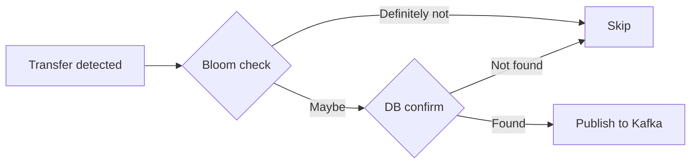

import Callout from '../../components/Callout.astro';

## The Problem

You're building a stablecoin deposit detection system. Every block on Ethereum contains hundreds of token transfers. Your job: figure out which ones belong to your customers' wallets and publish them to Kafka.

The naive approach — query PostgreSQL for every transfer — doesn't scale. At ~1,000 transfers per block and a new block every 12 seconds, you'd hammer your database with 5,000+ queries per minute. Most return nothing.

You need a filter. Something that can tell you "this address is definitely not one of ours" in sub-millisecond time, so you only hit the database for the rare matches.

Enter the Bloom filter.

## What's a Bloom Filter?

A Bloom filter is a probabilistic data structure that answers one question: **"Is this element in the set?"**

It has two possible answers:
- **"Definitely not."** — The element is guaranteed absent. Skip it.
- **"Maybe."** — The element *might* be present. You need to confirm.

The catch: Bloom filters have a configurable **false positive rate**. At 0.1%, roughly 1 in 1,000 "maybe" answers are wrong — the address isn't actually in the set.

For most use cases, that's fine. For financial infrastructure, it's not.

<Callout type="warning">
  Publishing a false transfer event — "wallet X received 50 USDC" when it didn't — is catastrophic for a payments platform. A merchant credits a customer who never paid. Reconciliation breaks. Trust evaporates.
</Callout>

## The Decision: Bloom + DB Confirm

We needed the speed of a Bloom filter with the correctness guarantee of a database query. The solution is a two-tier matching strategy:



**Step 1:** Check the Redis Bloom filter. Sub-millisecond. If it says "definitely not," skip immediately. This eliminates 99.9% of transfers.

**Step 2:** If the Bloom filter says "maybe," confirm against PostgreSQL. This eliminates false positives. Only confirmed matches get published.

### The Math

With a 0.1% false positive rate and ~1,000 transfers per block:

- **~999 transfers** → Bloom says "definitely not" → skipped instantly
- **~1 transfer** → Bloom says "maybe" (false positive) → DB query → not found → skipped
- **0-2 transfers** → Bloom says "maybe" (true match) → DB query → confirmed → published

That's roughly **1 DB query per block** instead of 1,000. The Bloom filter absorbed 99.9% of the load.

## The Domain Contract

The filtering logic is defined as a domain port — a clean interface that hides whether we're using Redis, Guava, or anything else:

```java title="AddressFilter.java — Domain Port"
public interface AddressFilter {

    /**
     * Sub-millisecond probabilistic check. True = "maybe present."
     * False = "definitely absent."
     */
    boolean mightContain(String address, NetworkType networkType);

    /**
     * Database confirmation. Eliminates false positives.
     */
    boolean contains(String address, NetworkType networkType);

    void add(String address, NetworkType networkType);

    void remove(String address, NetworkType networkType);
}
```

Two things to note:

1. **`mightContain` vs `contains`** — The naming makes the contract explicit. `mightContain` is probabilistic. `contains` is authoritative. Callers must use both.
2. **Scoped by `NetworkType`** — One Bloom filter covers all EVM chains (Ethereum, Base, Polygon, Arbitrum). Registering an address as `EVM` watches it across every EVM chain simultaneously.

## The Redis Implementation

Production uses Redis Bloom module commands (`BF.ADD`, `BF.EXISTS`, `BF.RESERVE`) via Lua scripts:

```java title="RedisBloomAddressFilter.java" {3-4,8-9}
static final DefaultRedisScript<Long> BF_EXISTS_SCRIPT =
    new DefaultRedisScript<>(
        "return redis.call('BF.EXISTS', KEYS[1], ARGV[1])",
        Long.class);

@Override
public boolean mightContain(String address, NetworkType networkType) {
    var key = bloomKey(networkType);  // "indexer:bloom:EVM"
    var normalizedAddress = normalizeAddress(address, networkType);
    var result = redisTemplate.execute(
        BF_EXISTS_SCRIPT, List.of(key), normalizedAddress);
    return result != null && result == 1L;
}

@Override
public boolean contains(String address, NetworkType networkType) {
    return walletAddressRepository.existsByAddressAndNetworkType(
        normalizeAddress(address, networkType), networkType);
}
```

<Callout type="insight">
  We use Lua scripts instead of Lettuce's generic `execute()` because Lettuce's `ByteArrayOutput` doesn't handle boolean/integer responses from Redis Bloom module commands. The Lua wrapper normalizes the response to a Long.
</Callout>

### Configuration

```yaml title="application.yml"
indexer:
  bloom:
    backend: redis
    error-rate: 0.001          # 0.1% false positive rate
    expected-insertions: 1000000  # 1M addresses
```

Redis keys per network type:
- `indexer:bloom:EVM` — covers Ethereum, Base, Polygon, Arbitrum, Optimism
- `indexer:bloom:SOLANA` — covers Solana mainnet and devnet
- `indexer:bloom:BITCOIN` — covers Bitcoin mainnet and testnet

## Where It Fits in the Pipeline

The Bloom filter sits in the hot path of every block processed:

```
Blockchain RPC (finalized blocks only)
  → Chain Indexer (parse transfers, whitelist tokens)
  → Worker Engine (Regular / Catchup / Rescan)
  → Bloom Filter (sub-ms) + DB Confirm (zero false positives)
  → Kafka Producer (per-chain topic, key=toAddress)
  → Consumers (payment matching, compliance, webhooks)
```

Here's the actual matching logic from the worker:

```java title="BaseWorker.java — matchTransfers()" {4-6}
protected List<TransferDetectedEvent> matchTransfers(BlockResult blockResult) {
    var networkType = getChainId().networkType();
    var events = new ArrayList<TransferDetectedEvent>();

    for (var transfer : blockResult.transfers()) {
        if (addressFilter.mightContain(transfer.toAddress(), networkType)
                && walletAddressRepository.existsByAddressAndNetworkType(
                        transfer.toAddress(), networkType)) {
            events.add(toTransferDetectedEvent(transfer, INCOMING));
        }
    }

    return List.copyOf(events);
}
```

Line 6 is the critical guard: Bloom check **first**, then DB confirm. Both must pass. The order matters — the Bloom filter is a cheap pre-filter that prevents 99.9% of database queries from ever being executed.

## Bloom Filter Rebuild

Bloom filters don't support element removal. If you deregister a wallet address, it stays in the filter as a phantom entry (increasing false positives slightly). The solution: periodic rebuild.

```java title="WalletCommandHandler.java — rebuildBloom()"
public void rebuildBloom() {
    var totalCount = 0;
    for (NetworkType networkType : NetworkType.values()) {
        var addresses = walletAddressRepository
            .findAllByNetworkType(networkType);
        for (WalletAddress walletAddress : addresses) {
            addressFilter.add(walletAddress.address(), networkType);
        }
        totalCount += addresses.size();
    }
    log.info("Bloom filter rebuild complete — {} total addresses", totalCount);
}
```

This runs on startup and can be triggered via API. With 1M addresses, it completes in seconds — Redis `BF.ADD` is fast.

## Why Not Just Use the Database?

A fair question. PostgreSQL with a proper index on `(address, network_type)` can answer `EXISTS` queries in ~1ms. Why bother with a Bloom filter?

The answer is **volume × frequency**:

| Metric | Value |
|--------|-------|
| Transfers per Ethereum block | ~1,000 |
| Block time | 12 seconds |
| Queries per minute (DB only) | ~5,000 |
| Queries per minute (Bloom + DB) | ~5 |

At 5,000 queries/minute, your database connection pool is saturated by address lookups alone — before you account for writes, other reads, and multiple chains running concurrently. The Bloom filter reduces database load by **1,000x**.

When you're indexing 7 chains simultaneously (Ethereum, Base, Polygon, Arbitrum, Optimism, Solana, Bitcoin), that 1,000x reduction is the difference between a $50/month database and a $2,000/month database.

## Testing the Pattern

The two-tier matching is validated at multiple levels:

```java title="RedisBloomAddressFilterTest.java"
@Test
@DisplayName("returns true when BF.EXISTS returns 1")
void returnsTrueWhenBloomFilterContainsAddress() {
    // given
    given(redisTemplate.execute(
        BF_EXISTS_SCRIPT, List.of(BLOOM_KEY), TEST_ADDRESS_LOWER))
        .willReturn(1L);

    // when
    var result = filter.mightContain(TEST_ADDRESS, TEST_NETWORK);

    // then
    assertThat(result).isTrue();
}

@Test
@DisplayName("delegates to WalletAddressRepository for DB confirm")
void delegatesToRepositoryForConfirmation() {
    // given
    given(walletAddressRepository.existsByAddressAndNetworkType(
        ADDRESS, NETWORK_TYPE)).willReturn(true);

    // when
    var result = filter.contains(ADDRESS, NETWORK_TYPE);

    // then
    assertThat(result).isTrue();
    then(walletAddressRepository).should()
        .existsByAddressAndNetworkType(ADDRESS, NETWORK_TYPE);
}
```

For local development, we provide a Guava-based in-memory implementation that uses the same interface. No Redis needed — the domain port abstracts the backend.

## What I'd Do Differently

**Use a counting Bloom filter.** Standard Bloom filters don't support removal, which means deregistered addresses linger as false positive sources until the next rebuild. A counting Bloom filter (or Cuckoo filter) supports deletion at the cost of ~4x memory. For 1M addresses, that's still under 10MB — trivial for Redis.

**Add Bloom filter metrics.** We track `indexer.transfers.matched` and `indexer.blocks.processed`, but we don't track `indexer.bloom.false_positives` (cases where Bloom says "maybe" but DB says "no"). This metric would tell us when the filter is degrading and needs a rebuild.

## Key Takeaway

Probabilistic data structures are powerful but insufficient alone for financial systems. The Bloom filter handles the speed requirement (sub-millisecond, every transfer in every block). The database handles the correctness requirement (zero false positives). Together, they reduce database load by 1,000x while maintaining the correctness guarantee that a stablecoin payment platform demands.

The pattern is simple:

1. **Bloom check** — fast, eliminates 99.9% of candidates
2. **DB confirm** — authoritative, eliminates false positives
3. **Publish** — only confirmed matches reach Kafka

Three lines of code. 1,000x load reduction. Zero false positives.
