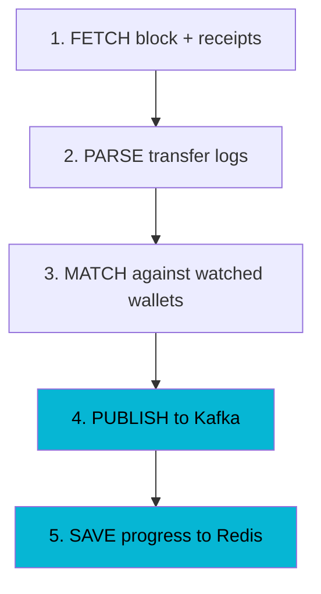

import Callout from '../../components/Callout.astro';

A merchant integrates your stablecoin payment platform. A customer sends 50 USDC to the merchant's wallet on Ethereum. Thirteen minutes later, your system detects the deposit, confirms it's real, and publishes an event so the merchant's service can credit the customer.

That "thirteen minutes later" is the indexer's job. This post covers how I built one that handles 7 chains, 1M+ watched addresses, and zero false positives.

## What the Indexer Does

The indexer watches finalized blocks across multiple blockchains and detects when stablecoins (USDC, USDT, DAI, PYUSD, EURC) land in watched wallets. When it finds a match, it publishes a transfer event to Kafka. Downstream services handle payment crediting, compliance, webhooks, and reconciliation.

```
Blockchain RPCs (finalized blocks only)
  → Chain Indexers (EVM, Solana, Bitcoin)
    → Worker Engine (Regular, Catchup, Rescan)
      → Bloom Filter (Redis) + DB Confirm (PostgreSQL)
        → Kafka Producer (per-chain topics, key=toAddress)
          → Consumer Apps (payment matching, compliance, webhooks)
```

The system processes every transfer in every block, decides which ones belong to our merchants, and streams them downstream — all while handling RPC failures, chain reorgs (by avoiding them entirely), and infrastructure crashes.

## Decision 1: Finalized Blocks Only

The single most impactful architectural decision: **never index unfinalized blocks.**

A chain reorganization means blocks that existed stop existing. If you indexed an unfinalized block and published "merchant X received 50 USDC," then the chain reorgs and that transfer disappears — you've credited a customer who never paid.

<Callout type="insight">
  The entire class of reorg-related bugs — orphan detection, rollback handling, event retraction — vanishes when you only index finalized blocks. You trade latency for correctness.
</Callout>

The latency trade-off varies by chain:

| Chain | Finality Strategy | Latency |
|-------|------------------|---------|
| Ethereum | `eth_getBlockByNumber("finalized")` | ~13 min |
| Base | 10 block confirmations | ~20 sec |
| Solana | `finalized` commitment level | ~400ms |
| Bitcoin | 6 confirmations | ~60 min |

Additional EVM chains (Polygon, Arbitrum, Optimism) can be added with chain-specific confirmation strategies — the architecture supports per-chain configuration.

For a payment system where 13 minutes of latency is acceptable, this works. Coinbase and Circle use similar finality-first approaches for settlement.

### The Trade-off: When Finalized-Only Breaks Down

This is a deliberate simplification for v1. In production infrastructure at scale, finalized-only has real limitations:

- **User experience suffers.** 13 minutes to confirm an Ethereum deposit is painful for a checkout flow. Real payment products show "pending" confirmations within seconds using unfinalized blocks, then promote to "confirmed" after finality.
- **Competitive disadvantage.** Even exchanges wait for finality now — Binance requires ~64 confirmations (~13 min) post-Merge. But payment products like Coinbase Commerce show a "pending" state within seconds and let merchants deliver goods before full finality, accepting the negligible reorg risk for better UX.
- **L2 finality is nuanced.** L2s like Base and Arbitrum provide soft finality in seconds (once the sequencer processes a transaction), but as optimistic rollups, their full settlement finality requires a **7-day challenge window**. The practical middle ground — L1 data availability finality — takes ~13 minutes (Ethereum's finality). Waiting for full settlement finality defeats the purpose of using L2s.
- **Some chains reorg rarely but non-trivially.** Polygon has had reorgs exceeding 100 blocks. Ignoring unfinalized blocks means ignoring the first ~5 minutes of every Polygon block — an eternity for real-time payments.

A production-grade indexer needs reorg handling: index optimistic blocks for fast UX, detect chain reorganizations, retract events for orphaned blocks, and re-emit events for the canonical chain. This is significantly more complex — you need block hash tracking, parent hash validation, and event retraction logic — but it's what separates a learning project from production infrastructure.

For this project, finalized-only was the right call: it let me focus on the harder problems (Bloom filter matching, at-least-once delivery, worker resilience) without getting bogged down in reorg edge cases. The reorg handling is deferred to a future phase.

## Decision 2: The 5-Stage Processing Pipeline

Every block goes through five stages. The order is non-negotiable.



### Stage 1: Fetch

The RPC client fetches a block and all its transaction receipts. An Ethereum block can have hundreds of transactions, so fetching receipts one-by-one would mean hundreds of HTTP calls per block.

JSON-RPC batching solves this — we bundle 50 receipt requests into a single HTTP POST:

```java title="EvmRpcClient.java"
List<EvmReceipt> getTransactionReceipts(List<String> txHashes) {
    return IntStream.iterate(0, i -> i < txHashes.size(), i -> i + batchSize)
            .mapToObj(i -> txHashes.subList(i, Math.min(i + batchSize, txHashes.size())))
            .map(this::sendBatchReceiptRequests)
            .flatMap(List::stream)
            .toList();
}
```

With a batch size of 50, a block with 200 transactions needs just **4 HTTP calls** instead of 200. Some chains like Base support `eth_getBlockReceipts` which returns all receipts in a single call.

The HTTP client uses Virtual Threads for concurrency:

```java title="EvmRpcClient.java" {4}
this.httpClient = HttpClient.newBuilder()
        .version(HttpClient.Version.HTTP_1_1)
        .executor(Executors.newVirtualThreadPerTaskExecutor())
        .connectTimeout(timeout)
        .build();
```

Virtual Threads mean we can have thousands of concurrent RPC calls without managing thread pools. Each call blocks its virtual thread cheaply — the JVM handles the scheduling.

### Stage 2: Parse

The ERC-20 parser scans receipt logs for `Transfer(address,address,uint256)` events, but **only for whitelisted token contracts**:

```yaml title="application.yml — Ethereum Mainnet"
token-contracts:
  - address: "0xA0b86991c6218b36c1d19D4a2e9Eb0cE3606eB48"  # USDC
    symbol: USDC
    decimals: 6
  - address: "0xdAC17F958D2ee523a2206206994597C13D831ec7"  # USDT
    symbol: USDT
    decimals: 6
  - address: "0x6B175474E89094C44Da98b954EedeAC495271d0F"  # DAI
    symbol: DAI
    decimals: 18
  - address: "0x6c3ea9036406852006290770BEdFcAbA0e23A0e8"  # PYUSD
    symbol: PYUSD
    decimals: 6
  - address: "0x1aBaEA1f7C830bD89Acc67eC4af516284b1bC33c"  # EURC
    symbol: EURC
    decimals: 6
```

Unknown tokens are ignored. This prevents spam tokens and irrelevant transfers from entering the pipeline.

### Stage 3: Match (Bloom + DB Confirm)

This is the hot path. Every transfer in every block hits this stage. I covered this in depth in [Part 1](/blog/bloom-filters-blockchain-address-matching), but the core pattern is:

```java title="BaseWorker.java — matchTransfers()" {3-5}
for (var transfer : blockResult.transfers()) {
    if (addressFilter.mightContain(transfer.toAddress(), networkType)
            && walletAddressRepository.existsByAddressAndNetworkType(
                    transfer.toAddress(), networkType)) {
        events.add(toTransferDetectedEvent(transfer, INCOMING));
    }
}
```

Bloom filter (sub-millisecond) eliminates 99.9% of non-matches. Database confirmation eliminates false positives. Zero incorrect events reach Kafka.

### Stage 4 + 5: Publish Then Save (At-Least-Once)

This is where ordering becomes critical:

```java title="BaseWorker.java — processBlock()" {6-7,10-11}
public void processBlock(long blockNumber) {
    var blockResult = chainIndexer.indexBlock(blockNumber);
    var matchedEvents = matchTransfers(blockResult);

    if (!matchedEvents.isEmpty()) {
        // STEP 4: Kafka FIRST
        transferEventPublisher.publishAll(matchedEvents);
    }

    // STEP 5: Redis SECOND
    blockProgressStore.saveLastProcessedBlock(getChainId(), blockNumber);
}
```

<Callout type="warning">
  If you reverse the order — save progress first, then publish — a crash between the two steps means the block is marked as processed but the events were never published. That deposit is silently lost. For a payment system, a missed deposit is catastrophic.
</Callout>

With Kafka-first ordering, a crash between steps 4 and 5 means the block gets reprocessed on restart. The events publish again — a duplicate. Consumers handle this with an idempotency key: **`txHash + toAddress + networkId`**. Duplicates are safe. Missed deposits are not.

## Three Workers Per Chain

Each chain gets three concurrent workers, each on its own Virtual Thread:

| Worker | Purpose | Interval |
|--------|---------|----------|
| **RegularWorker** | Polls the latest finalized block and processes new blocks | 12s (Ethereum), 2s (Base) |
| **CatchupWorker** | Backfills historical block ranges in 100-block chunks | Continuous |
| **RescanWorker** | Retries previously failed blocks with exponential backoff | 5 min |

The orchestrator starts all three for every configured chain:

```java title="IndexerOrchestrator.java"
executor.submit(() -> runWorkerLoop(regularWorker, regularWorker::poll,
    chainProps.pollInterval()));
executor.submit(() -> runWorkerLoop(catchupWorker, catchupWorker::processRanges,
    CATCHUP_INTERVAL));
executor.submit(() -> runWorkerLoop(rescanWorker, rescanWorker::rescan,
    RESCAN_INTERVAL));
```

With 7 chains and 3 workers each, that's 21 concurrent workers — all on Virtual Threads, no thread pool tuning required.

## Self-Healing: The PARKED State Machine

RPC providers go down. When they do, workers don't crash — they park:

```
RUNNING  ──[RPC failures]──>  PARKED  ──[health probe succeeds]──>  RUNNING
                                 |
                            [shutdown]──>  STOPPED
```

The transition is atomic:

```java title="BaseWorker.java"
public void park() {
    if (state.compareAndSet(RUNNING, PARKED)) {
        log.warn("Worker parked — chain={}, workerType={}",
                getChainId(), getWorkerType());
    }
}

public boolean tryResume() {
    try {
        chainIndexer.getLatestFinalizedBlockNumber();
        if (state.compareAndSet(PARKED, RUNNING)) {
            log.info("Worker resumed — chain={}, workerType={}",
                    getChainId(), getWorkerType());
            return true;
        }
        return false;
    } catch (Exception e) {
        log.debug("Health probe failed, staying PARKED");
        return false;
    }
}
```

When a worker parks, the orchestrator spawns a health probe loop that pings the RPC every 60 seconds:

```java title="IndexerOrchestrator.java"
private void runResumeProbe(BaseWorker worker) {
    while (worker.getState() == PARKED) {
        try {
            Thread.sleep(HEALTH_PROBE_INTERVAL);  // 60 seconds
            worker.tryResume();
        } catch (InterruptedException e) {
            Thread.currentThread().interrupt();
            break;
        }
    }
}
```

No manual intervention. No restart required. The RPC comes back, the health probe succeeds, the worker resumes exactly where it left off.

## Three Layers of RPC Resilience

Between the worker and the raw RPC call sit three Resilience4j decorators, stacked in a specific order:

```java title="ResilientEvmRpcClient.java"
private <T> Supplier<T> decorateSupplier(Supplier<T> supplier) {
    var decorated = CircuitBreaker.decorateSupplier(circuitBreaker, supplier);
    decorated = Retry.decorateSupplier(retry, decorated);
    return RateLimiter.decorateSupplier(rateLimiter, decorated);
}
```

The call flows through: **Rate Limiter → Retry → Circuit Breaker → RPC**.

```yaml title="application.yml — Resilience4j Config"
resilience4j:
  circuitbreaker:
    configs:
      default:
        sliding-window-size: 10
        failure-rate-threshold: 50     # 50% failures → OPEN
        wait-duration-in-open-state: 30s
  retry:
    configs:
      default:
        max-attempts: 3
        wait-duration: 1s
        exponential-backoff-multiplier: 2  # 1s → 2s → 4s
  ratelimiter:
    configs:
      default:
        limit-for-period: 25           # 25 req/sec per chain
        limit-refresh-period: 1s
```

**Rate limiter** prevents exceeding provider limits (25 req/s on free tiers). **Retry** handles transient failures (network blips, 503s). **Circuit breaker** prevents cascading failures when an RPC is truly down — once it opens, the worker parks instead of burning through retry budgets.

## Per-Chain Kafka Topics

Each chain gets its own Kafka topic:

```
transfer.events.ethereum_mainnet
transfer.events.base_mainnet
transfer.events.polygon_mainnet
transfer.events.arbitrum_mainnet
transfer.events.optimism_mainnet
```

The partition key is `toAddress`, which guarantees **per-wallet ordering**. All transfers to the same wallet arrive in order — critical for balance crediting.

Per-chain topics provide **fault isolation**. If Ethereum's RPC goes down and the topic stops receiving events, Base and Polygon topics continue unaffected. Consumers can independently process each chain.

## One Bloom Filter Per Network Type

A subtle but important design choice: Bloom filters are scoped by `NetworkType`, not by chain.

```
indexer:bloom:EVM     → covers Ethereum, Base, Polygon, Arbitrum, Optimism
indexer:bloom:SOLANA  → covers Solana mainnet and devnet
indexer:bloom:BITCOIN → covers Bitcoin mainnet and testnet
```

When a merchant registers wallet `0xABC123` as `EVM`, that single registration watches the address across **all five EVM chains** through a single Bloom filter entry. One write, five chains covered.

## Hexagonal Architecture with ArchUnit Enforcement

The codebase follows hexagonal architecture with **10 ArchUnit rules** enforced at build time. The critical ones:

1. Domain must NOT depend on infrastructure
2. Domain must NOT depend on application
3. Infrastructure must NOT depend on application
4. Domain must NOT import Spring (except `@Service`, `@Transactional`)
5. Domain must NOT import JPA
6. Infrastructure must NOT depend on controllers
7. No `web/` package allowed (controllers live in `application.controller`)
8. Domain model classes must be records
9. Domain event classes must be records
10. Domain ports must be interfaces

This means the domain layer — where the matching logic, worker state machine, and event publishing contracts live — has zero framework dependencies. You can test the entire pipeline with in-memory implementations. Swapping Redis for Guava, PostgreSQL for H2, or Kafka for an in-memory queue requires zero domain changes.

## The Numbers

| Metric | Value |
|--------|-------|
| Chains configured | 4 (Ethereum, Base, Solana, Bitcoin) |
| Stablecoins tracked | 5 (USDC, USDT, DAI, PYUSD, EURC) |
| Watched addresses capacity | 1,000,000 |
| Bloom false positive rate | 0.1% |
| DB queries per block (from Bloom) | ~1 |
| JSON-RPC batch size | 50 calls per HTTP request |
| Workers per chain | 3 (Regular, Catchup, Rescan) |
| Health probe interval | 60 seconds |
| Rate limit per chain | 25 req/sec |
| Delivery guarantee | At-least-once |

## What I'd Do Differently

**Add Prometheus alerts for chain lag.** The workers track `blocksProcessedCounter` and `blocksFailedCounter`, but there's no alert for "Ethereum is 50 blocks behind finalized head for 5 minutes." That's a P1 signal that should page someone.

**Use Cuckoo filters instead of Bloom filters.** Bloom filters don't support removal. When a merchant deregisters a wallet, it stays in the filter as a phantom until the next rebuild. Cuckoo filters support deletion at ~4x memory cost — still under 10MB for 1M addresses.

**Stream processing for catchup.** The CatchupWorker processes historical blocks sequentially in 100-block chunks. For initial catchup on Ethereum (millions of blocks), a stream-processing approach with parallelized block ranges would be significantly faster.

## Key Takeaway

A production blockchain indexer isn't about reading blocks — it's about the guarantees around reading blocks. **Finalized-only** eliminates reorg bugs. **Bloom + DB confirm** eliminates false positives. **Kafka-before-Redis** eliminates missed deposits. **PARKED workers** eliminate manual recovery.

Every design decision trades something for correctness. The system is slower than it could be (13-minute Ethereum lag), uses more infrastructure than it needs to (Redis + PostgreSQL + Kafka), and has redundant safety checks (Bloom + DB). But for a system that handles other people's money, redundancy isn't overhead — it's the product.

The full source is on [GitHub](https://github.com/Puneethkumarck/stablebridge-indexer).
