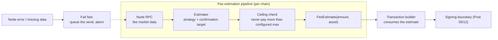
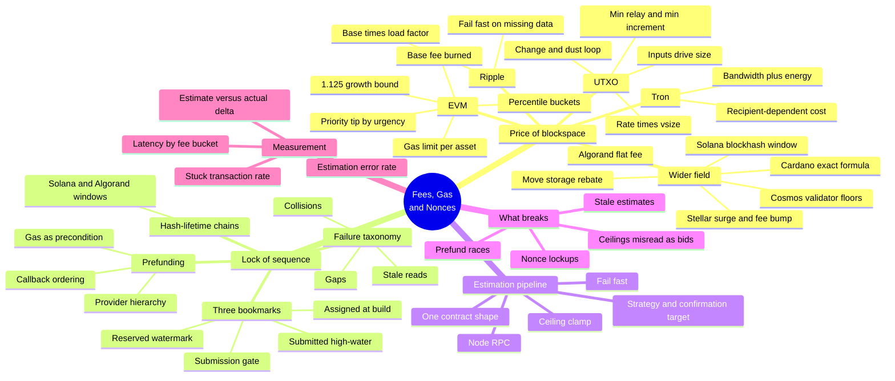
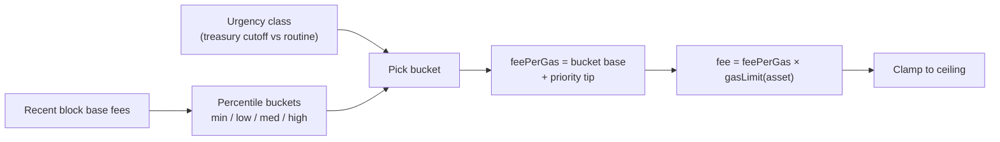
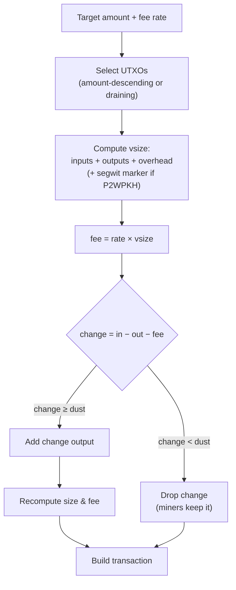
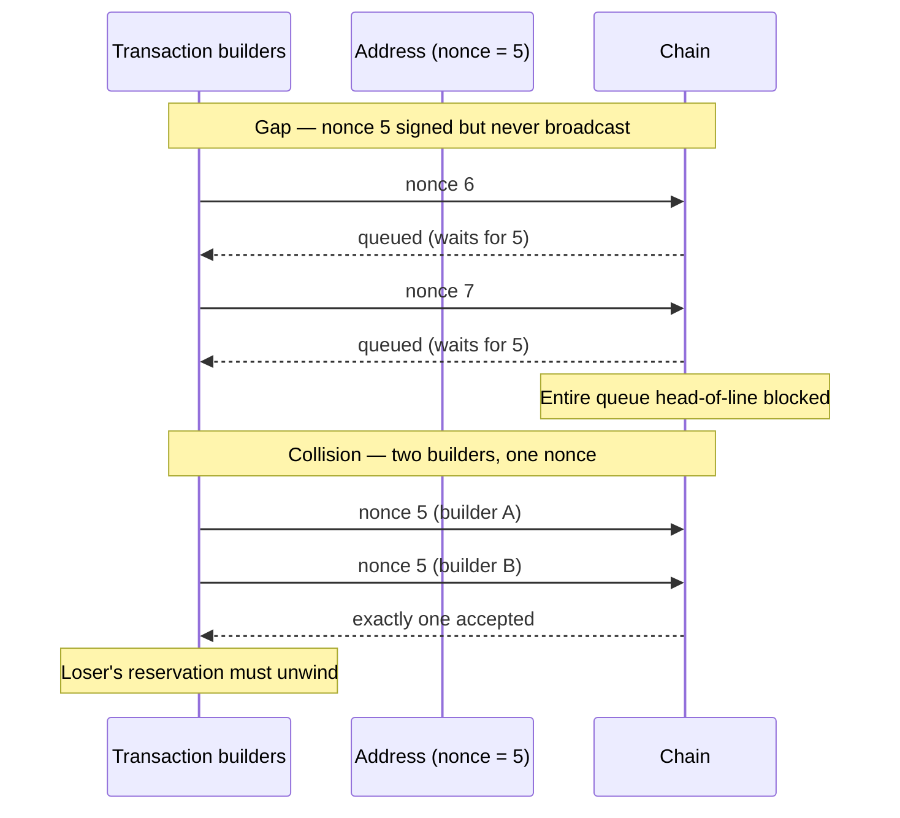
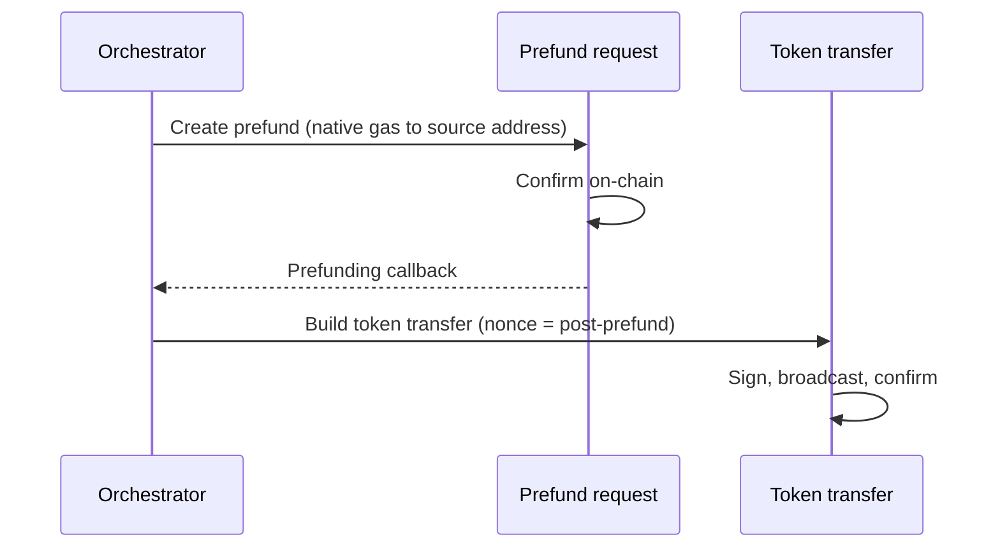

> **TL;DR** — Every outbound transaction answers two questions the chain asks: *what does
> inclusion cost right now?* and *in what order?* Fees answer the first, nonces (or sequence
> numbers, or input sets) answer the second — and every chain family implements both with
> different physics. EVM burns a protocol-set base fee and auctions priority on top. UTXO chains
> price blockspace by weight, so your fee depends on which coins you choose to spend. Tron prices
> bandwidth and energy as resources, with costs that depend on the *recipient's* state. Ripple
> prices anti-spam fees as base fee times network load. The engineering answer is the same for
> all four: an **estimation pipeline** — node RPC, strategy-based estimate, ceiling check,
> fail-fast on errors — that produces one contract shape (`amount + asset`) the transaction
> builder consumes. Nonces need their own discipline: one writer per address, contiguity
> tracking, and a prefunding mechanism for the classic stranded-tokens problem. Get estimation
> right and money moves at the price you intended. Get it wrong and it either doesn't move at
> all or moves at ten times the cost — and you won't find out from an error message, because
> nothing failed.
> **Who this is for:** backend engineers building the Sender half of a chain layer who want
> withdrawals to land at the price they intended — and anyone who has ever hardcoded a gas price
> "just to get it working" and then inherited the incident months later.

---

## The Hardcoded Fee That Waited Three Days

A payments platform launches stablecoin withdrawals on an EVM chain. The fee logic is two lines:
a fixed gas limit for the token transfer, and a gas price constant picked during testing —
comfortably above the network's going rate, because at launch the network was quiet and the
team wanted withdrawals to land fast. It works beautifully. Withdrawals confirm in the next
block, every time. The fee constant gets a comment: `// safe gas price`.

Four months later, a token airdrop on the same chain starts. Demand for blockspace jumps
overnight; the protocol's base fee — the part of the fee set by the network, not the sender —
climbs to eight times launch-week levels. The platform's transactions still build, still sign,
still broadcast. And then they sit. Every one of them carries a maximum fee below the current
base fee, which means no block will include them. Not ever, at this price — the rule is
mechanical, not a judgment call.

The operations dashboard shows green: builds succeed, broadcasts return 200, confirmations are
"pending." The support queue fills with "my withdrawal has been processing for two days." The
treasury can see the funds. The customers can't move them. The fix, when it finally lands, is
not a bigger constant — the team ships an estimation pipeline: query the node, pick a fee
strategy by urgency, clamp to a ceiling, rebuild anything stuck. Withdrawals start flowing
within the hour, at roughly the price they should have cost all along.

The postmortem's sharpest line: *the fee was never wrong; the assumption that the fee would
stay right was wrong.* Blockspace is a market. A hardcoded price is a bet that the market won't
move, and markets move.

Post 05 drew the Sender pipeline — build, sign, broadcast, confirm — and explicitly deferred
"fee strategy and gas economics" to this post. Here they are: the four fee physics a multi-chain
platform actually meets, the estimation pipeline that turns them into one contract, and the
nonce discipline that keeps account-model chains from deadlocking when the pipeline retries.

---

## Scope & Requirements

**Q: What does fee management cover?**
A: Everything between "we want to send X" and "the transaction carries a fee that gets it
included at the price we intended." That's fee *estimation* (what does inclusion cost now?),
fee *construction* (how the estimate becomes fields in the transaction), fee *bounds* (what we
will never pay), and fee *failure handling* (what we do when we can't estimate). On
account-model chains it also covers the sequencing dimension — nonces — because a wrong fee and
a wrong nonce produce the same symptom: money that doesn't move.

**Q: Which chains?**
A: The fee physics this series covers, across ten chain families: EVM chains (Ethereum, its
L2s, and every EVM-equivalent network — same gas model everywhere), UTXO chains (Bitcoin and
its family), Tron, Ripple, Solana, Cosmos SDK chains, Cardano, Stellar, Algorand, and the Move
chains (Aptos, Sui). Four of them — EVM, UTXO, Tron, Ripple — get full treatment because
that's where the engineering depth lives; the wider field gets one tight subsection each,
because their mechanics are simpler or their fee logic is a variant of something already
covered. The estimation-pipeline shape applies to all of them unchanged.

**Q: What are the non-negotiables?**
A: Five.
1. **Estimate at build time.** Fees are fetched when the transaction is built, from a live node
   call with a confirmation target — never from a constant, a cache older than a few blocks, or
   a guess.
2. **Ceilings on everything.** Every estimate is clamped to a configured maximum. A fee spike
   should slow the platform down, not silently multiply its fee bill.
3. **Fail fast on estimation errors.** If the node can't produce an estimate, the send queues —
   it does not proceed with a default fee. Guessing either strands money (too low) or burns
   treasury (too high); both are worse than waiting.
4. **Nonce contiguity is an invariant.** One writer assigns nonces per address; gaps and
   collisions are treated as incidents, not retries.
5. **Native gas availability is a precondition.** Token transfers pay fees in the native coin;
   an address without gas cannot move tokens, full stop. The platform maintains gas proactively.

**Q: What's out of scope?**
A: Recovery of transactions already stuck — replacement, cancellation, and the stuck-transaction
state machine are Post 07. This post covers getting the fee right the first time and detecting
when you didn't. MEV and fee-market trading strategies are out too; this is infrastructure
engineering, not arbitrage.

---

## Mental Model: Price of Blockspace, Lock of Sequence

The whole post hangs on two sentences:

1. **Fees answer "how much does inclusion cost right now?"** — a market price for blockspace,
   set by protocol rules and sender bids, changing every block.
2. **Nonces answer "in what order?"** — a per-address sequence lock that forces transactions
   to land in the order the chain expects.

Every chain family implements both, under different names and different physics:

| Chain family | Price of blockspace | Lock of sequence |
|---|---|---|
| EVM | gas × (base fee + priority fee) | nonce (contiguous per address) |
| UTXO | fee rate × virtual size | the input set itself (each coin spends once) |
| Tron | bandwidth + energy (resources or burn) | transaction reference/expiration |
| Ripple | base fee × load factor | account sequence number |
| Solana | flat base fee + priority-fee bid | recent blockhash validity window |
| Cosmos SDK | gas units × gas price (validator min-gas-prices) | account sequence number |
| Cardano | deterministic `a × txSize + b` — no bidding | input set (UTXO) |
| Stellar | base fee per op, surge-priced auction when full | account sequence number + fee bump |
| Algorand | flat minimum fee — no auction | transaction id / first-valid window |
| Move (Aptos, Sui) | gas unit price × units + storage fee | sequence number (+ object versions on Sui) |

And every one of them collapses into the same platform contract once estimated:



The contract is deliberately dumb — an amount and an asset. All chain physics live behind the
estimator; the builder and everything downstream see one shape. That boundary is what lets a
platform add a chain without touching the withdrawal orchestration: the Chain-N+1 test from
Post 02 applies to fees exactly as it applies to detection.

The rest of the post, in one glance — everything hangs off the two questions:



---

## The Four Fee Physics

### EVM: a protocol floor and a priority auction

Since EIP-1559, an EVM transaction's fee has two parts. The **base fee** is set by the protocol
from block utilization and burned — no sender sets it, no miner receives it. It adjusts every
block, but it adjusts *boundedly*: a full block raises it by at most 12.5%, an empty block cuts
it by the same ratio. That bound is load-bearing for engineering: the worst-case base fee N
blocks out is `current × 1.125^N`, a number you can compute and budget against instead of
predicting. Production platforms hardcode exactly that growth constant for worst-case
projection.

The **priority fee** is the sender's bid for inclusion when blocks are full. Together with a
**gas limit** (units of computation the transaction may consume), the transaction carries a
`maxFeePerGas` — a *cap*, not a bid — and pays `base fee + priority fee` per unit of gas
actually used.

The estimation pattern that works: observe recent blocks' base fees, bucket them into
percentiles (minimum / low / medium / high), and map withdrawal urgency to a bucket:



Gas limits are per-asset configuration (native transfer vs token transfer have different
costs); fee per gas is per-strategy. The tiering buys you something subtle: routine payouts can
ride the low bucket and save real money at scale, while treasury-cutoff transfers pay for the
high bucket — and you have *data* (see measurement below) to prove the tiering works.

The trap this design avoids: predicting the base fee. You don't. You bound it with the 1.125
growth rule and price the priority fee by urgency. Prediction loses to markets; bounding
coexists with them.

### UTXO: your fee depends on the coins you choose

Bitcoin-family chains price blockspace by *weight*: the fee is a rate (per virtual byte) times
the transaction's virtual size. Two consequences make UTXO fee engineering different in kind.

**First, size depends on inputs.** A transaction spends whole coins (UTXOs) and returns change,
so the number of inputs — chosen during input selection — determines the size, and the size
determines the fee. Fee and selection are one loop, not two steps:



The production calculators track this exactly: per-address-format input/output virtual-byte
weights, segwit marker accounting, and a change loop that recomputes when adding the change
output changes the size. The maximum sendable amount is simply `totalIn − fee` — which is why
UTXO "send max" is computed *after* selection, never before.

**Second, dust is a hard floor.** An output smaller than the relay dust threshold is
unspendable — it costs more to spend than it's worth, so nodes refuse to relay it. The
reference formula is `(outputVBytes + inputVBytes) × dustRelayFee`, taking the maximum against
an absolute floor — and here's a lovely cross-chain detail: Bitcoin computes dust relatively,
but Litecoin and Dogecoin use absolute dust amounts. Same concept, different constant per
chain, which is exactly the kind of thing that lives in per-chain network configuration rather
than shared code.

Two more constants matter later: the **minimum relay fee** (below it, nodes won't even gossip
your transaction) and the **minimum fee increment** (a replacement must beat the original by at
least this much). That increment is the seed of everything Post 07 builds on.

Also: fee *rates* come from the node's own smart-fee estimator — queried with a confirmation
target in blocks ("land within 2 blocks" costs more than "land within 12"). Confirmation target
is the UTXO world's version of the EVM urgency class.

### Tron: resources, not auctions

Tron replaces the fee auction with two resources: **bandwidth** (transaction bytes) and
**energy** (smart-contract computation). Native TRX transfers consume bandwidth only; TRC-20
token transfers consume both. Resources can be staked-for (delegated bandwidth/energy) or
burned as fees — so the "fee" is really a resource bill, computed as `units × unitPrice`.

The trap is in the energy units. A TRC-20 transfer to an address that already holds the token
costs *less energy* than a transfer to a fresh address — the contract skips initialization
work. Production platforms encode both numbers:
`energyUnits(existingRecipient)` vs `energyUnits(newRecipient)`, chosen by checking the
recipient's balance before estimating. An estimator that uses one flat number will underprice
every first-time payout — and "underprice" on Tron means the transaction fails outright, not
just lands slowly.

The engineering lesson generalizes: **fee inputs include world state beyond your own address.**
EVM's base fee is chain state; UTXO's vsize is your own input choice; Tron's energy is the
*recipient's* state. Each chain asks you to model a different slice of the world.

### Ripple: tiny fees, load-priced, fail-fast

Ripple's fee is anti-spam pricing, not blockspace auction: a base fee multiplied by the server's
current **load factor**, read straight from server info. Fees are tiny (drops, millionths of
XRP); the design goal is deterring spam, not allocating scarce space. Sequence numbers provide
the ordering dimension, exactly like EVM nonces.

The reference implementation is six lines of arithmetic — and its most interesting line is the
guard: if the node returns no base fee or no load factor, the estimator throws. No default, no
fallback constant. This is the fail-fast non-negotiable in its purest form: an estimator that
can't see the market must say so, because any number it invents is a lie with money attached.

### The Wider Field: Six More Families, Same Two Questions

The four physics above earn their depth. The rest of the field answers the same two questions
with less machinery — which is itself the lesson. Each family below: price of blockspace, then
lock of sequence.

**Solana — flat base, bid for priority, blockhash as clock.** The price of inclusion is a small
flat base fee per signature plus an optional **priority fee** bid (in micro-lamports per
compute unit) — under load, the bid decides whether your transaction makes the leader's
schedule. The sequence lock is the surprising part: Solana transactions don't carry a nonce
counter; they embed a **recent blockhash** and are only valid for roughly two minutes of slots.
A transaction that doesn't land before its blockhash expires simply *stops being a
transaction* — Solana's version of the stale-estimate failure, with expiry built into validity.
For accounts that need offline or long-lived sequencing, durable nonces exist as an opt-in
substitute. Estimation here means pricing the priority bid, and monitoring means watching for
expired-blockhash failures masquerading as "dropped" sends.

**Cosmos SDK — gas price is a validator floor, not a market.** The price is gas units times a
gas price in a fee denomination (often the staking token; some zones accept several). There is
no global fee auction: each validator publishes a **minimum gas price**, so estimation reduces
to choosing a price above the validators you expect to include you — usually a configured
constant plus a safety margin. Sequence numbers per account behave exactly like EVM nonces:
contiguous, gap-blocked, one-writer-required. If you built the EVM nonce discipline, you
already built the Cosmos one.

**Cardano — the fee is a formula, not a market.** Inclusion costs `a × txSize + b`, where `a`
and `b` are protocol parameters: the fee is **computable exactly before signing**, with no
bidding in the base layer. It's UTXO like Bitcoin — inputs drive size — but where Bitcoin
prices by market rate, Cardano prices by protocol constant. For a platform this is the
degenerate case of the estimation pipeline: the right "estimate" is an exact computation, and
the pipeline's first job is knowing *when not to estimate*.

**Stellar — a real auction hiding behind a base fee.** Each operation costs a base fee, and
when a ledger is full, inclusion becomes **surge pricing**: a genuine auction where the
highest fee bids win the ledger's slots. So Stellar estimation is load-dependent like
Ripple's, but the mechanism is a market rather than a multiplier. Sequencing uses account
sequence numbers, with one tool EVM lacks: a **fee bump** transaction that raises the fee of a
transaction already in flight — recovery without replacement, worth knowing when you design
Post 07's recovery machinery.

**Algorand — the simplest fee model in the field.** A flat minimum fee per transaction, no
auction at the base layer. Estimation is a constant; the only real fee engineering appears in
application calls, where fees can attach to inner transactions. Sequencing uses validity
windows (first-valid/last-valid rounds) rather than counters — another hash-lifetime family
member alongside Solana, with the same expired-window failure mode.

**Move (Aptos, Sui) — gas units plus a storage economy.** The price is gas unit price times
units used, plus a **storage fee** component — and on Sui, a storage *rebate*: you pay for the
state your objects occupy and get refunded when they're deleted, which makes long-lived state
a real cost line for consolidation-heavy platforms. Sequencing is per-account sequence
numbers; Sui adds object versions as a second dimension, which is what lets it execute
non-conflicting transactions in parallel. For fee engineering, the takeaway: watch the storage
component on workloads that create and delete many objects — sweeps, precisely.

Two patterns unify all six: **hash-lifetime chains** (Solana, Algorand) replace counter-based
sequencing with validity windows, so "the transaction expired" is a first-class failure to
detect; and **deterministic-fee chains** (Cardano, Algorand base layer) collapse estimation
into computation. Your pipeline needs to know which family it's talking to — that's the whole
job of the per-chain configuration the contract hides.

---

## Nonce Management: The Ordering Dimension

Fees decide *whether* a transaction lands. Nonces decide *which one* lands, and in account-model
chains (EVM, Ripple, Solana), getting nonces wrong produces the same customer-visible symptom
as getting fees wrong: money that sits.

The invariant: each address has a sequence counter; the chain accepts nonce N only after N−1
has landed. From that one rule comes the entire failure taxonomy:



**Gaps** happen when a transaction is built and signed but never broadcast (Post 05's exact
failure class — the build that succeeded and the broadcast that timed out), or when two
builders race the same address. Everything after the gap queues behind it: one missing
transaction freezes an address's entire outbound flow.

**Collisions** happen when two concurrent builders both read nonce N and both sign. The chain
accepts exactly one; the loser's transaction is dead but its *funds reservation* is still
alive somewhere in the orchestrator, and someone has to unwind it.

**Stale reads** are the subtle one: the nonce comes from a node that's a block behind, or from
a read replica, and the builder sees N−1 while the chain expects N. The transaction fails or
queues for reasons no log line explains.

The design answers, in order of importance. The strongest version of them tracks **three nonce
bookmarks** instead of one — a pattern worth copying wholesale:

- **Assigned** — the nonce handed to a specific transaction at build time.
- **Reserved** — a per-address watermark: the highest nonce any in-flight request has claimed.
  The reserved nonce is, in effect, the platform's statement of everything it *intends* to send
  from that address.
- **Submitted** — a per-address high-water mark: the highest nonce actually broadcast to the
  network so far.

With all three bookmarks, every gap gets a forensic signature *before* it becomes a chain
symptom. An **out-of-order submission** — the assigned nonce is not exactly `submitted + 1` —
means the platform is about to broadcast ahead of itself; the correct behavior is to hold and
await the correctly sequenced transaction rather than push the queue further into disorder. A
**blocked-by-failed-predecessor** check — an assigned nonce beyond the reserved watermark —
means an earlier request died and took the sequence with it, so the gap is explained and
recoverable instead of mysterious. And the submission queue itself releases signed transactions
in strict nonce order, never in build order: signing and submitting are two queues, and only
the second one is allowed to reorder nothing.

From the bookmarks, the operational rules follow:

1. **One writer per address.** Nonce assignment is serialized — a single component hands out
   nonces under a lock (or a single-threaded queue). Concurrent builders don't share an
   address; addresses that need throughput get sharded across pools (which is one reason the
   wallet layer in these platforms is hierarchical).
2. **Reservations hold the nonce.** The funds reservation created at build time stays locked
   until the transaction with that nonce confirms or is explicitly replaced, and the reserved
   watermark only advances when a request commits to a nonce. A gap is thus always
   *explainable*: some reservation holds the missing nonce.
3. **Detection over hope.** A transaction waiting longer than its confirmation target with no
   block inclusion is a *suspected gap or underprice* — surfaced to the stuck-transaction
   machinery (Post 07), not retried blindly. Retrying a nonce problem by building fresh makes
   it worse: you've now got two transactions claiming the future.

### Prefunding: the stranded-tokens problem

One more fee/nonce intersection deserves its own story, because every token platform meets it:
**token transfers pay their fee in the native coin.** An address loaded with a million USDC
and zero native gas cannot send a single token. On EVM chains this strands customer payouts;
on Tron it fails them outright.

The naive fix — send gas manually when someone notices — doesn't scale. The production answer
is to make gas a *workflow precondition*: before the token transfer is built, the orchestrator
creates a linked **native-asset prefund request** — a small native transfer to the source
address — records it as a relationship on the token request, and proceeds only when the prefund
confirms:



Two details make it correct: the callback ordering (the token transfer's nonce must be read
*after* the prefund lands, or it races), and the relationship record (auditors can see why the
small native transfer exists — it's not treasury leakage, it's the fee precondition for the
transfer it's linked to).

And the question every reader asks next — *where does the prefund come from?* — has a real
production answer, not "a treasury wallet." Mature platforms select the funding source through
a small provider hierarchy: a **master** prefunding address as the default source, candidates
like *the smallest address with zero contract balance* when consolidating token dust (funding
the consolidation from within the set being swept), **composite** providers that chain several
strategies with conditional enablement, and a completion **callback** that releases the
dependent transfer only when the prefund confirms. The prefund is itself a managed mini-flow —
source selection, amount sizing, confirmation wait — because it is one. Treat it as plumbing
and your consolidations stall on empty gas addresses; treat it as a workflow and stranded
tokens stop being a support category.

---

## Deep Dive: Three Functions That Carry the Weight

Fee estimation pipelines are mostly plumbing; these three functions are where the physics live.
Illustrative pseudocode, chain-flavored but stack-agnostic.

**UTXO change-and-dust loop** — the fee is an output of selection, not an input:

```java
// Inputs already selected; what does the transaction cost?
FeeChange priceTransaction(List<Utxo> inputs, Amount target, FeeRate rate) {
    var vsize = sizeOf(inputs, outputs = [target]);        // + overhead, segwit marker
    var fee   = rate.multiply(vsize);
    var change = sum(inputs) - target - fee;

    if (change.compareTo(dustThreshold(addressFormat)) < 0) {
        return new FeeChange(fee, change = ZERO, vsize);   // miners keep the dust
    }
    // Adding change changes the size — recompute once
    vsize = sizeOf(inputs, outputs = [target, change]);
    fee   = rate.multiply(vsize);
    return new FeeChange(fee, sum(inputs) - target - fee, vsize);
}

// Dust itself: relay-relative on BTC, absolute on LTC/DOGE
Amount dustThreshold(AddressFormat fmt) {
    var relative = fmt.outputVBytes().add(fmt.inputVBytes())
                       .multiply(dustRelayFeePerVByte());
    return max(relative, absoluteDustLimit());
}
```

**EVM tiered estimate** — bucket the market, pick by urgency, clamp:

```java
FeeEstimate estimate(Asset asset, Urgency urgency) {
    var baseFeeBuckets = percentiles(recentBaseFees());    // min/low/med/high from observed blocks
    var feePerGas = baseFeeBuckets.get(urgency.bucket())
                                  .add(priorityTip(urgency));
    var fee = feePerGas.multiply(gasLimit(asset));         // gas limit is per-asset config
    return clamp(fee, ceiling(asset));                     // never pay more than the configured max
}
```

**The replacement guard, teased** — why Post 07 can build on this post:

```java
// A replacement must beat the original by at least the chain's minimum increment —
// otherwise nodes keep the first transaction and ignore the second.
boolean replacementEligible(Tx original, Fee newMaxFee) {
    return newMaxFee.compareTo(original.maxFee().add(minFeeIncrement())) >= 0
        && stillInMempool(original.hash());
}
```

That predicate — plus the whole "the estimate was wrong, now what" machinery — is the next
post's opening scene.

---

## What Breaks

**Stale estimates.** A fee rate cached across a spike prices every transaction wrong in the
same direction. Mitigation is structural, not operational: estimate at build time, keep any
cache TTL measured in blocks not minutes, and treat confirmation target as a first-class
parameter of every estimate. The moment an estimate and its use can be separated by time,
they will be separated by an incident.

**Guessing on estimation failure.** When the node errors, the tempting default is "use last
known fee" — which strands money if the market moved up and burns treasury if it moved down.
The correct behavior is boring: queue the send, alarm on the estimation error rate, and let a
human or a circuit breaker decide. Ripple's six-line estimator throwing instead of defaulting
is the pattern, not an edge case.

**Ceilings misread as bids.** `maxFeePerGas` is a cap; the transaction pays base + priority.
Teams that set the cap to "whatever makes it land" discover during spikes that they've 10×'d
their fee bill *without landing any faster* — inclusion is decided by the priority fee, and
the cap only decided the invoice. Ceiling configuration is a treasury decision, not a tuning
knob.

**Nonce lockups at scale.** One underpriced transaction blocks its address's whole queue, and
the queue grows while the blockage lasts. Prevention is the one-writer rule and reservation
holds above; *recovery* — replacing the blocking transaction at the same nonce with a higher
fee — is Post 07. The metric to watch is queue depth per address; alert on depth, not on the
individual stuck transaction, because depth is what customers feel.

**Prefund races.** If the token transfer's nonce is read before the prefund confirms, the two
transactions race and one of them is dead on arrival — usually the token transfer, because it
was built against the pre-prefund nonce. The callback ordering in the diagram is the fix, and
the relationship record is the audit trail that proves the prefund was intentional.

---

## How We Measure It

Fee management metrics are the estimator's report card:

- **Estimate-vs-actual delta**, per chain and per strategy. The estimator says 0.40, the chain
  charged 0.31 — systematically? That's margin you're giving away (or overpaying). This is the
  single most honest number in the pipeline.
- **Confirmation latency by fee bucket.** Is MEDIUM actually slower than HIGH? The tiering
  design is only justified if this chart shows a real trade-off; if it doesn't, collapse the
  tiers and stop pretending.
- **Estimation error rate and queue depth.** How often the estimator fails, and how many sends
  are waiting because of it. Both should be near zero; both alarm immediately when they're not.
- **Ceiling breaches.** How often an unclamped estimate would have exceeded the ceiling — the
  counterfactual cost of the guard. A ceiling that never bites may be set too high to matter.
- **Prefund success ratio per token.** The stranded-tokens defense, quantified; a dropping
  ratio is an early warning for gas-management decay on that chain.
- **Stuck-transaction rate.** The handoff metric: every stuck transaction is an estimate that
  met reality and lost. Post 07 starts from this number.

---

## Checklist

- [ ] Fees estimated at build time from a live node call, with a confirmation target
- [ ] Every estimate clamped to a configured ceiling; ceilings reviewed as treasury decisions
- [ ] Estimation failures queue the send and alarm — no default fees, ever
- [ ] EVM: base fee bounded with the 1.125 growth rule, priority fee tiered by urgency
- [ ] UTXO: fee computed from selected inputs' vsize; change dropped below dust threshold
- [ ] Tron: energy units differ for existing vs fresh recipients — estimator checks both
- [ ] Ripple: base fee × load factor from server info; missing values throw
- [ ] Hash-lifetime chains (Solana, Algorand): expired-validity-window is a detected failure, not a silent drop
- [ ] Deterministic-fee chains (Cardano, Algorand base): fee computed exactly — the pipeline knows when NOT to estimate
- [ ] One writer assigns nonces per address; reservations hold nonces until confirm/replace
- [ ] Token transfers preceded by a linked, callback-ordered native prefund (source picked by provider hierarchy)
- [ ] Estimate-vs-actual delta tracked per chain — the estimator's report card

---

*Next: Post 07 — Stuck Transactions & Recovery. Estimates meet reality and lose: detection,
replacement-by-fee, cancellation, and the state machine that gets money unstuck without
double-spending.*
