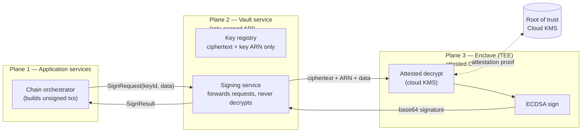
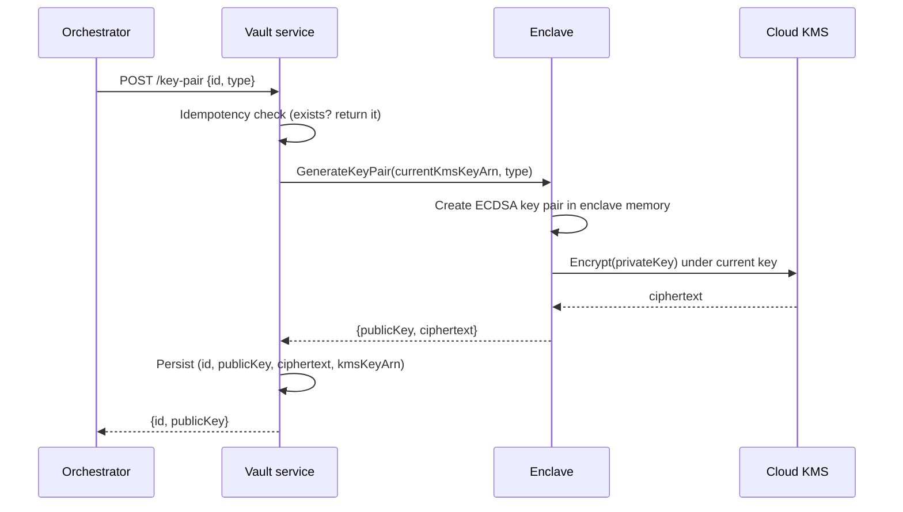
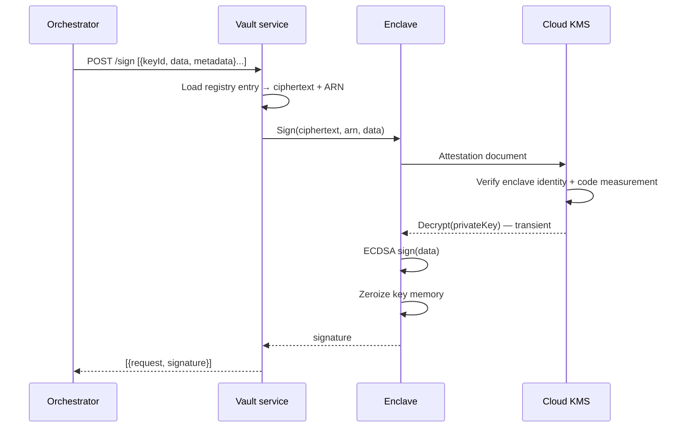

> **TL;DR** — Custody is not a feature you bolt onto a payment platform; it is the property that
> makes every other feature trustworthy. The design in this post holds private keys in exactly one
> form outside a hardware-isolated enclave: **ciphertext**. Keys are generated inside the enclave,
> stored encrypted under a root key held by a cloud key-management service, and signed with only
> inside the enclave, for the duration of a single sign call, under attestation. Application
> servers never see key material — they send data to sign and receive signatures. An engineer with
> full database access gets ciphertext that is useless without the enclave. An attacker on the
> network gets TLS and role checks. A compromised application server gets nothing at all, because
> nothing is stored there. The spine of the post is a threat model: every design decision answers
> one question — *how would keys be stolen here, and why does this stop it?*
> **Who this is for:** backend engineers responsible for the signing boundary of a stablecoin
> platform — the service between "transaction built" and "transaction broadcast" — and for anyone
> who has ever shipped a private key in an environment variable and slept fine, which is the
> problem.

---

## The Key That Lived in a Config File

A stablecoin payments platform launches its withdrawal pipeline. The signing code is clean: a
`SigningService` loads the hot-wallet key, signs the transaction hash with ECDSA, returns the
signature. The key itself lives where keys live in week one of every startup — in the deployment
config. An environment variable, injected from the secrets manager into the container at boot,
mounted into the application memory for the lifetime of the process.

It works. Withdrawals flow. The platform scales to six chains, each with its own key, all managed
the same way. Then the security review asks a question nobody had asked: *who can read the keys?*

The answer is uncomfortable. Anyone who can read the cluster configuration. Anyone who can
`kubectl exec` into a pod and dump the environment. Anyone with access to the CI logs from the
six months ago when the deploy script accidentally printed them. Anyone who restores last night's
database backup — wait, the keys aren't in the database. They're somewhere better and worse: in
*everywhere*, replicated across every environment, every developer laptop that ever ran the app
locally with a `.env` file, every log aggregation pipeline that ever captured a stack trace near
the signer. No single breach exposed the keys. The keys simply had no boundary. There was no
moment you could point to and say "the key exists here, and only here."

The uncomfortable part is that nobody did anything wrong by the conventions the platform started
with. Environment-variable secrets are industry-default practice for ordinary credentials —
database passwords, API tokens. The failure is treating *signing keys* as ordinary credentials.
A leaked database password gets rotated in ten minutes. A leaked hot-wallet key drains the
hot wallet in ten seconds, and blockchain transactions do not roll back.

This post builds the other end of that spectrum: a custody architecture where the private key has
exactly one home — a hardware-isolated enclave whose CPU is the trust root — and exactly one
moment of plaintext existence: the instant it is signing. The platform this describes is modeled
on a production design: cloud KMS as the root of trust, an attested enclave as the only place
decryption happens, ciphertext as the only persisted form, and role-scoped, idempotent APIs as
the only doors in.

Post 05 drew a pipeline with one signing boundary and said the signature comes "from a service
that never exposes keys," then left that service as a black box. This post opens the box.

---

## Scope & Requirements

Before the design, pin down what key custody has to deliver — same Q&A device as the last two posts.

**Q: What keys are we talking about?**
A: The platform's signing keys — the ECDSA key pairs that authorize outbound transactions on
EVM chains, Tron, and UTXO chains, plus any key that signs webhook payloads or internal
credentials. Deposit addresses are *derived* from these keys (public key → address); the
platform never needs private keys to receive, only to send. One key pair typically serves many
addresses through derivation paths, so the blast radius of a single key is large — which is
precisely why custody cannot be casual.

**Q: Who are the attackers?**
A: The threat model that drives every decision below, in ascending order of sophistication:

| # | Attacker | What they have | What they get | Why it's useless |
|---|----------|----------------|---------------|------------------|
| 1 | Malicious/compromised insider with DB access | Full read on the key store | Ciphertext blobs + KMS key ARNs | Decryption requires enclave attestation to the KMS; the blob is inert outside one CPU class |
| 2 | Compromised application server | Process memory, env vars, disk of the calling service | Nothing — no key material exists there | The caller only ever held `keyId` references and signatures |
| 3 | Network attacker between services | Traffic capture/injection | TLS-protected sign requests; ciphertext in transit | Role-scoped auth rejects unauthorized callers; responses contain signatures, never keys |
| 4 | Host/infra admin of the enclave machine | Root on the physical host | The enclave's encrypted memory only | TEE memory encryption + attestation: the host cannot read or modify enclave state without breaking attestation |
| 5 | Attacker who compromises the KMS control plane | Key admin APIs | Ciphertext decrypt capability | Requires breaking the cloud provider's KMS controls — the residual trust root, mitigated by key policy + audit alarms |

Two properties make this table work. First, each layer degrades gracefully: compromising layer N
does not compromise layer N+1. Second, the *most likely* real-world attacker — #1, the insider
with legitimate access — gets the weakest possible prize.

**Q: What are the non-negotiables?**
A: Five.
1. **No plaintext keys outside the enclave.** Not in the database, not in the vault application
   memory, not in API responses, not in logs. Ciphertext or nothing.
2. **Attested signing.** The enclave must prove *what code is running* before the KMS will
   decrypt anything into it. Attestation is what turns "the key is in the enclave" from a claim
   into a check.
3. **Idempotent key operations.** Key creation and signing are called by orchestrators that
   retry. A retry must never create a second key or produce an ambiguous result — the Post 05
   retry lesson applies to custody exactly as it applies to broadcasting.
4. **Key rotation without re-encryption.** Rotating the root encryption key must not require
   touching every stored key. The design below gets this from storing the encrypting key's
   identifier *with* each ciphertext.
5. **Full audit trail.** Every key creation, import, and sign call is logged with caller
   identity and request metadata. Custody without audit is just secrecy.

**Q: What is explicitly out of scope?**
A: Transaction authorization policy (which withdrawals *should* be signed — velocity limits,
multi-party approval rules) is a policy engine and belongs above the vault, not inside it.
Threshold signing (MPC) is covered briefly as an alternative architecture, not implemented here.
And this post stays stack-agnostic in concept: the reference implementation is Java/Spring on a
cloud KMS with a TEE, but the architecture ports to any cloud and any enclave technology.

---

## Mental Model: Three Concentric Trust Boundaries

The whole design is one picture — three zones of decreasing trust, with the key's plaintext
existence restricted to the innermost one:



Read the arrows carefully:

- **Plane 1** (application services) holds *references* — key ids — and receives *outputs* —
  signatures. It cannot ask for the key itself; no API exists to return one.
- **Plane 2** (the vault service) holds the registry: which keys exist, their ciphertext, which
  KMS key encrypted each one. It routes sign requests. It *also* never sees plaintext — it
  forwards ciphertext into the enclave and receives signatures out. This is worth pausing on:
  the service that "owns" the keys cannot read them either.
- **Plane 3** (the enclave) is the only place decryption happens, and only after the KMS
  verifies an attestation document proving the enclave is running the expected code. The
  plaintext key lives for one sign operation, then the memory is reclaimed.

The root of trust sits outside all three planes: the cloud KMS master key, managed by the
provider in hardware of their own. Your architecture's honesty ends with a trust root you don't
operate — the design question is never "trust nothing," it is "how much do I concentrate, and
where." This design concentrates exactly one secret (the KMS master key) into the provider's
hands, and makes everything else derivable-but-useless without attested hardware.

---

## The Key's Journey

Following one key from birth to daily use makes the machinery concrete.

### Generate: keys are born encrypted

Key creation never produces a plaintext key outside the enclave:



The caller receives an id and a public key. The private key's only persistent form is the
ciphertext in the registry, tagged with the ARN of the KMS key that encrypted it. That tag is
what makes rotation cheap later.

### Import: the same protections for outside keys

Sometimes a key arrives from elsewhere — a migrated wallet, a partner's existing material. The
import path accepts base64 key material *into the enclave*, which encrypts it under the current
KMS key before anything is persisted. Import is still the trust-weakest moment (the material was
plaintext somewhere upstream), and the design says so loudly: import endpoints are separately
role-scoped and noisily audited.

### Sign: the only moment of plaintext



Note what metadata does and doesn't do: the sign request carries transaction context (inputs,
outputs, asset) for the audit trail, but metadata never touches the cryptographic operation. The
vault signs *data*; whether that data *should* be signed is decided upstream by the orchestrator,
screening, and policy layers. Separating the authorization context from the cryptographic act is
what keeps the vault simple enough to trust.

### Rotate: new root key, old ciphertexts untouched

When the KMS key is rotated (policy or incident), nothing is re-encrypted. New keys use the new
ARN; old ciphertexts keep decrypting under their recorded ARN. Rotation becomes a config change
plus alarms on the old key's usage, instead of a risky fleet-wide re-encryption job. The
trade-off is explicit: old ciphertexts remain protected only as long as old KMS keys exist, so
decommissioning an old KMS key is a deliberate, audited act — effectively key destruction.

---

## Deep Dive

### Idempotent key creation — retries must not multiply keys

Key creation is called by workflow orchestrators that retry on timeout. If a create request
succeeds at the vault but the response is lost, the orchestrator retries — and a naive
implementation creates a *second* key pair under a new identity, orphaning the first. The fix is
create-by-id with conflict recovery:

```java
// Illustrative — create is idempotent on the caller-chosen id
public KeyPairCreateResult createKeyPair(KeyPairCreateRequest request) {
    return keyPairRepository.findById(request.getId())
        .map(this::toResult)              // exists → return it, no second key
        .orElseGet(() -> {
            var kmsKey = kmsKeyManagement.getCurrentKey();
            var generated = enclave.generateKeyPair(kmsKey.getArn(), request.getType());
            return save(kmsKey, generated, request.getId());
        });
}

// And at the API edge, even a concurrent-insert race resolves to "return existing":
catch (DataIntegrityViolationException e) {
    return toResult(keyPairService.getKeyPair(request.getId()));
}
```

Two layers of idempotency — pre-check and conflict recovery — because a unique constraint is
the only race-safe idempotency there is. The same shape as Post 05's broadcast idempotency:
*deterministic outcome under retry*, enforced by a constraint, not by hoping the network behaves.

### The attested round-trip — attestation is the whole point

Strip away the plumbing and the security model is one statement: **the KMS will only decrypt a
key's ciphertext into an enclave that proves what code it runs.** The enclave produces an
attestation document — a provider-signed statement containing a measurement (hash) of the enclave
image and the requesting context — and the KMS key policy names which measurements may use the
key. Change the enclave binary and the measurement changes; the measurement changes and
decryption fails. "The key lives in the enclave" stops being an architectural claim and becomes
a check the KMS performs on every decrypt.

This is the property env-var keys can never have. The config-file platform from the opener had
no mechanism by which the *environment* could refuse to hand over a secret. Here, the holder of
the root secret (the KMS) verifies the requester's identity at the hardware level on every use.

### Signing metadata — context rides along, never in the math

```java
public class SignRequest {
    String keyId;
    String data;                    // what gets signed — and nothing else matters to the crypto
    Map<String, Object> parameters; // routing hints, correlation ids
    TransactionDetails metadata;    // inputs/outputs/asset — audit trail only
}
```

Keeping metadata structurally unable to influence the signature matters for auditability: a
reviewer can reconstruct *why* a signature existed (metadata) independently of *what was signed*
(data). It also means a metadata injection attack can't alter signatures — at worst it corrupts
your logs, which alarms catch.

### Role-scoped doors — two verbs, two roles

The entire API surface is two endpoints with two roles: `ROLE_KEY_CREATE` on key
creation/import, `ROLE_KEY_SIGN` on signing. Service-to-service authentication is basic auth
over an internal network — deliberately boring, because the interesting security is in the
planes, not the door. The upgrade path is mutual TLS; the point is that even the door's
compromise yields only *ciphertext reads* or *signature requests*, and signature requests are
the platform's own operation anyway — an attacker who can call sign can do what the platform does,
which is a policy-layer problem, not a custody failure.

---

## What Breaks

Honest custody engineering is mostly deciding which failures you'll accept.

**The enclave is a hard availability dependency.** When the signing enclave is down, nothing
moves — no withdrawals, no sweeps, no consolidations. You've traded confidentiality risk for an
availability choke point. Mitigations: redundant enclave instances across zones, health-checked
from the vault, and a runbook that treats "signing unavailable" as the platform-level incident
it is. Note what you *don't* do: keep a fallback path that signs outside the enclave "just for
emergencies." A fallback that bypasses the security model is the security model, and it will be
used.

**Unbatched signing costs latency at scale.** A batch of N sign requests means N enclave
round-trips in the reference design — each with its own attested decrypt. At withdrawal-peak
volume this shows up as p99 sign latency. The fix is request grouping (one decrypt, many
signatures per key), which is a straightforward optimization *because* the interface is already
batch-shaped. Design the batch boundary first; optimize inside it later.

**Key import is the weakest moment.** Imported material was plaintext somewhere before it
reached you — a previous HSM, a partner's laptop, a migration script. The enclave protects the
key from *you* going forward; it cannot unring the upstream bell. Operational response: treat
imports as incidents — separate role, mandatory ticket, automatic rotation recommendation, and
prefer generation over import whenever the upstream system can re-derive addresses.

**Defense in depth stops at the network boundary.** The reference design authenticates
service-to-service calls with basic auth. It's adequate inside a private network with
role-scoped authorization, and it is the first thing you'd harden (mTLS, short-lived service
tokens) as the platform matures. The architecture survives this weakness because compromising
the door still doesn't yield keys — but name the weakness in your threat model instead of
discovering it in a review.

**"We'll encrypt it later" ships.** Here's the cautionary contrast, anonymized: the same
platform family shipped a webhook subsystem that stored per-destination signing secrets in
plaintext, with the encryption marked as a TODO in the code that went to production. Secrets
with a TODO become permanent plaintext, because the TODO never has an incident attached to it —
until it does. The discipline this post argues for is deciding the boundary *before* the secret
exists. A secret born inside a boundary stays inside it; a secret born outside never gets moved
in, because moving it requires trusting the migration.

---

## How We Measure It

Custody metrics are the inverse of most system metrics — you mostly measure things *not*
happening:

- **Sign latency percentiles** (p50/p95/p99), split by key and by caller — the cost of the
  enclave round-trip made visible, and the signal for when batching optimization is due.
- **Attestation failures** — should be approximately zero; any nonzero value is either a
  deployment drift (enclave image changed without updating the KMS key policy) or an attack.
  Alarm on the first one.
- **Key-access audit volume** — creations, imports, and signs per key per day, baselined. A key
  that suddenly signs 100× its baseline is an incident even if every individual call is
  authorized.
- **KMS key age and usage** — how long since rotation, which ARNs are still decrypting. This is
  the rotation trade-off from earlier, instrumented.
- **Decryption-into-enclave counts** — one per sign call in the reference design; the metric
  that proves plaintext existence stays bounded to signing moments.

---

## The Design Space: Where This Sits

Enclave-plus-KMS is one point in a spectrum:

- **Software keys (env vars, config)** — the opener's platform. Zero additional infrastructure,
  zero protection against insiders. Appropriate for nothing that signs money.
- **HSM appliances** — dedicated hardware, strong audit, traditional finance pedigree.
  Operational weight and cost scale with it; networked HSMs reintroduce some of the same
  call-path questions at the appliance boundary.
- **Cloud KMS + TEE enclave (this post)** — HSM-grade custody with cloud-native operations.
  Trust root is the provider; attestation makes the delegation verifiable per call.
- **MPC / threshold signing** — the key never exists whole anywhere: N parties hold shares, T
  must collaborate to sign. Removes the single trust root entirely, at the price of protocol
  complexity, N-way availability coupling, and a much harder audit story. Many platforms use
  MPC for the *hot* tier and enclave/HSM custody for operational keys; the two compose.

The honest summary: every point on this spectrum moves the same lever — *how much trust is
concentrated where* — and the right position depends on your volume, your compliance posture,
and how much operational complexity your team can keep honest. What doesn't move is the
requirement from Post 05: application code builds and tracks, custody signs, and the two never
share secrets.

Multi-tenancy sharpens everything above — per-tenant key isolation, per-tenant vault
credentials, and the question of whether tenants share signing infrastructure at all. That's the
next layer up, and it's Post 14's territory.

---

## Checklist

- [ ] No private key exists in plaintext outside an attested enclave
- [ ] Key creation and import are idempotent on caller-chosen ids, conflict-recovered at the edge
- [ ] Every stored key carries the ARN of the key that encrypted it (rotation without re-encryption)
- [ ] Signing is batch-shaped at the API even if single-shot underneath
- [ ] Attestation failures alarm; they should be ~0
- [ ] Sign metadata is audit context only — structurally excluded from the cryptographic input
- [ ] Two roles, two endpoints; no API returns key material
- [ ] Import is treated as an incident-class operation
- [ ] No fallback signing path that bypasses the enclave
- [ ] Every key operation lands in an audit trail with caller identity

---

*Next: Post 13 — Token Support: ERC-20, TRC-20, SPL & Beyond. How one chain module serves the
native coin and every token standard on it, without forking the pipeline.*
