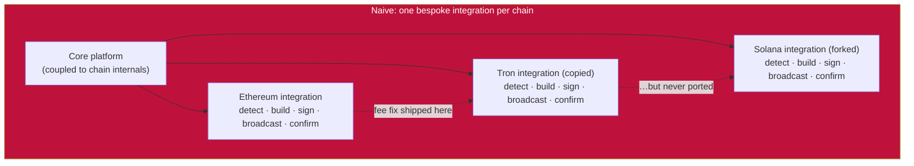
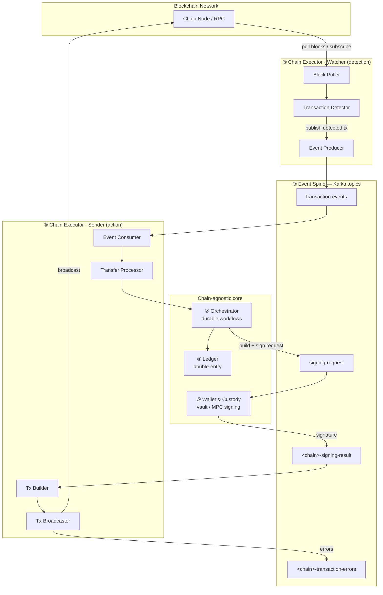
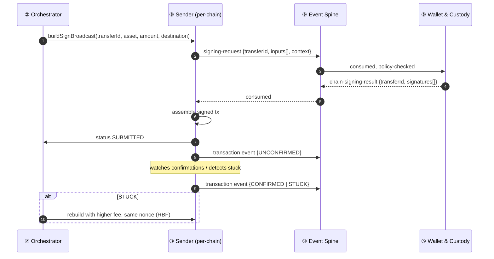

# One Pattern, Many Chains: The Watcher/Sender Split
# One Pattern, Many Chains: The Watcher/Sender Split

> **TL;DR** — Supporting N blockchains shouldn't cost N× the complexity. Split every chain
> integration into two shapes joined by one contract: a **Watcher** that watches the chain and
> detects money moving, and a **Sender** that builds, signs, and broadcasts transactions. Each
> chain gets its own module — `ethereum-`, `tron-`, `solana-`, `bitcoin-` — but they all speak
> the same language, and the core of the platform never knows which chain it's talking to. This
> post opens the Chain Executor block from the Building Blocks Map (Post 02): the pattern that
> makes "add a chain" a bounded piece of work instead of a re-architecture.
> **Who this is for:** backend engineers building the chain-integration layer of a stablecoin
> payment platform.

---

## Three Copies of the Same Bug

A payout platform launches on Ethereum. One integration, one module, one chain — the codebase is
small enough that every engineer on the team has read all of it. Payouts work. Volume grows. Then
the CEO comes back from a conference: USDT on Tron is how emerging-market corridors actually move
money. "Add Tron."

The team has never integrated a second chain before, so they do what any reasonable team does:
they copy the Ethereum module, swap the RPC client, and adjust the fee logic until the tests pass.
Three weeks later, Tron payouts are live. It works. The CEO is delighted. The pattern is set:
*each chain is a copy of the last.*

Six months later: "Add Solana." Now the divergence starts to bite. The Ethereum module and the
Tron module have drifted — a congestion fix for the fee estimator shipped to Ethereum in March;
the Tron copy never got it. Nobody remembers to port fixes, because the two modules aren't a
family. They're two unrelated codebases that happen to look alike.

The incident that finally stops the company: a batch of Tron payouts stalls under congestion. The
Ethereum module would have recovered automatically — it had a stuck-transaction path that
re-broadcast with a higher fee. The Tron copy didn't have that path; it had been forked before the
fix landed. $28,000 in USDT sits unconfirmed for nine days while ops rebuilds transactions by
hand. The postmortem asks the question the team has been avoiding: *how many integrations do we
actually maintain?*

The answer: three integrations, and also one — because all three are copies of the same five
jobs. **Detect. Build. Sign. Broadcast. Confirm.** Five jobs, repeated per chain, each copy with
its own bugs. A fix that should land once has to land five times, in three places, from memory.

Post 02 drew the map: ten blocks with walls between them, and block ③ is the **Chain Executor** —
the only block that ever touches a chain. This post opens that block. Inside it, every chain —
EVM, account, UTXO, whatever comes next — is the same two shapes: a **Watcher** that watches
the chain and detects money moving, and a **Sender** that builds, signs, and broadcasts. Same
two shapes, same contracts, every chain. The fix lands once, in the pattern, and every chain gets
it.

---

## Why One Pattern

Stablecoin supply no longer lives on one chain. As of 2026, USDC and USDT are spread across
Ethereum, Tron, Solana, BNB Chain, Base, Arbitrum, Polygon, Avalanche, and Optimism — with no
single network holding more than ~55% of total supply. Tron dominates USDT for emerging-market
corridors. Solana is the fastest-growing rail for retail and B2B flows. Base has Coinbase's
distribution behind it. A new class of purpose-built "stablechains" — Tempo, Circle Arc, Tether
Plasma — is launching with sub-second finality and stablecoin-native gas.

If your payment stack is Ethereum-only, you miss the low-fee corridors on Tron and Solana. If
you're Tron-only, you lose the MiCA-compliant USDC supply and DeFi liquidity on Ethereum. So
multi-chain isn't a nice-to-have — it's table stakes.

The trap is doing it naively: every chain gets its own bespoke integration, its own wallet logic,
its own reconciliation, its own failure modes. Three chains in, the team is drowning — exactly
where the story above ended up. The fix is a single structural pattern that every chain conforms
to, so that "add a chain" is a bounded, predictable piece of work.

This post is that pattern. It's the pattern proven in production across Ethereum, Tron, the UTXO
family (Bitcoin/Litecoin/Dogecoin), Ripple, and Solana — and it's how you'd bring up Base,
Arbitrum, Polygon, or any of the new stablechains next. It's also the single strongest lever on
the series' core metric: the **cost of adding a chain** measured in files touched outside the
chain layer (Post 02's Chain-N+1 test). With the pattern, that number is near zero. Without it,
it's a three-month project.

---

## Scope & Requirements

Before the pattern, pin down what "integrate a chain" actually means. (This is the Alex Xu Q&A
device — run it before you design.)

**Q: What does the platform need from each chain?**
A: Two things, and only two: **(1) know when money moves** (detect deposits/incoming transfers),
and **(2) move money** (build, sign, broadcast withdrawals/outgoing transfers). Everything else —
reconciliation, ledger credit, compliance, treasury — is downstream of those two primitives.

**Q: Which chains?**
A: Today: Ethereum (EVM account), Tron (account), Bitcoin/Litecoin/Dogecoin (UTXO), Ripple/XRP
(account-with-memo), Solana (account, high-throughput). Next: Base, Arbitrum, Polygon, Avalanche
(more EVM), and the stablechains (Tempo/Arc/Plasma, all EVM-compatible).

**Q: Are all chains the same shape?**
A: No. Two money models — **account-based** (Ethereum, Tron, Solana, XRP, all EVM L2s) vs
**UTXO-based** (Bitcoin family). Plus chain-specific quirks: XRP needs a destination tag/memo;
Solana needs block-state tracking for high-throughput polling; UTXO needs input selection.

**Q: What breaks if the abstraction is wrong?**
A: A new chain forces changes in the wallet, the ledger, and reconciliation. That's the failure
mode we're designing against.

### Functional requirements
- Detect incoming transactions to monitored addresses on every chain.
- Construct, sign, and broadcast outgoing transactions on every chain.
- Normalize both into a single internal representation the rest of the platform consumes.

### Non-functional requirements
- **Chain-agnostic core:** the Orchestrator, Ledger, and workflows must not know which chain a
  transfer ran on.
- **Isolated failure:** one chain's RPC lying or stalling must not affect the others.
- **Key isolation:** private keys never leave the vault; chain services never touch key material.
- **Bounded cost of a new chain:** adding chain N+1 is a new module + config, not a platform change.

---

## Mental Model: Detect vs. Act

Every chain integration is really two jobs with different shapes. **Detection** is a firehose:
the chain produces blocks faster than you can read them, and you must find, in that stream, the
few transactions that matter to you. **Action** is a one-at-a-time operation: given an intent to
send money, produce a signed transaction, broadcast it, and track it to confirmation. One is a
reader; the other is a writer. They have different failure modes, different scaling behavior, and
different latency budgets — so they should be different components.

That's the core move: **separate detection from action.** Every chain integration is two
components — a **Watcher** (detection) and a **Sender** (action) — connected by a durable event
bus, not by direct calls. And crucially, the two jobs stay *inside* the Chain Executor block:
nothing outside it ever sees a chain-specific type.



Five jobs per chain, duplicated per integration, drifting apart — that's the diagram of the story
above. The pattern replaces it with one contract and two shapes per chain, as the next section
shows. The mental model in one line: **a chain is not a black box you call, it's a stream you
read and a door you write through — and the platform needs exactly one way to read and one way
to write, per chain.**

---

## High-Level Design: One Contract, Every Chain



**Watcher responsibilities (detection):**
1. Poll the node for new blocks (or subscribe — ZMQ for UTXO, WebSocket for some chains).
2. Parse block contents; identify transactions to monitored addresses.
3. Publish each detected transaction to the shared `transaction events` topic.

**Sender responsibilities (action):**
1. Build unsigned transactions from transfer requests.
2. Request signing via the event-bus signing flow (never touches keys itself).
3. Assemble the signed transaction and broadcast it.
4. Emit chain-specific errors to a dedicated error topic for monitoring/retry.

**The chain-agnostic core:** the ② Orchestrator consumes `transaction events` and runs the money
flows as durable, resumable workflows; the ④ Ledger records everything double-entry; the ⑤ Wallet
& Custody does all signing. None of them know whether the transfer was Ethereum or Solana — the
same guarantee Post 02's map demanded of every block outside the chain layer.

Everything that crosses between the two shapes and the core rides four topic families. They're
the "doors" of this post's map — narrow, named, and stable:

| Topic family | Payload (illustrative) | Produced by | Consumed by |
|---|---|---|---|
| `transaction events` | `{chain, txHash, toAddress, amount, token, memo?}` | every Watcher | ② Orchestrator (deposit flow), Reconciliation |
| `signing-request` | `{transferId, inputs[], context}` | every Sender | ⑤ Wallet & Custody |
| `chain-signing-result` | `{transferId, signatures[]}` | ⑤ Wallet & Custody | that chain's Sender |
| `<chain>-transaction-errors` | `{transferId, stage, error, raw}` | that chain's Sender | ops, retry, recovery |

This is the entire pattern. The rest of the post is how each chain conforms to it — and where
they're forced to differ.

---

## Deep Dive: How Each Chain Fits the Pattern

Every chain implements the same Watcher/Sender split, but the *internals* differ. Here's the
matrix, then the per-chain detail.

| Chain | Money model | Watcher transport | Sender quirk | Module |
|---|---|---|---|---|
| Ethereum | Account | block + pending-tx subscription | EIP-1559, single sig | `ethereum-` |
| **Base / Arbitrum / Optimism / Polygon / Avalanche** | Account (EVM) | Same as Ethereum | Same code, different RPC + chain ID | `base-`, `arbitrum-`, … |
| Tron | Account | HTTP polling (gRPC + protobuf) | Tx hash known pre-broadcast (RPC creates tx) | `tron-` |
| Solana | Account | poller + persisted sync state | Needs DB-tracked sync state | `solana-` |
| Bitcoin / Litecoin / Dogecoin | UTXO | P2P block scanning | Input selection, 1 sig per input | `bitcoin-`, … |
| Ripple (XRP) | Account + memo | WebSocket + polling | Destination tag for deposits | `ripple-` |
| Tempo / Arc / Plasma (stablechains) | Account (EVM) | Same as Ethereum | EVM-compatible, sub-second finality | per-chain |

### EVM chains: Ethereum, and the L2s that come almost free

Ethereum is the reference implementation. The **Watcher** subscribes to new blocks and pending
transactions, detects transactions to monitored addresses, and publishes to `transaction events`.
The **Sender** builds an EIP-1559 transaction, hashes the RLP-encoded raw tx, sends the hash for
signing, and on the signature result broadcasts the raw transaction through the SDK. Always a
single input to sign (account model). It publishes failures to the chain's
`<chain>-transaction-errors` topic.

Here's the payoff of the pattern: **Base, Arbitrum, Optimism, Polygon, and Avalanche are the same
code.** They're all EVM account chains. A new one is a new module, a new RPC endpoint, and a new
chain ID in config — the Watcher/Sender logic, the signing contract, and the event schema are
unchanged. The same applies to the new **stablechains** (Tempo, Arc, Plasma): all EVM-compatible,
so they slot into the Ethereum-shaped module with chain-specific finality tuning.

This is the single strongest argument for the pattern: the marginal cost of the 6th EVM chain
approaches zero.

### Tron: account model, but the RPC creates the transaction

Tron is account-based like Ethereum, so the structure is identical — but with one inversion.
Ethereum builds the raw tx locally, then broadcasts. Tron's flow goes through the RPC first: the
RPC creates the transaction — and therefore its hash — *before* broadcast. The signing request
carries that hash; the Sender applies the returned signature; broadcast goes through the RPC's
broadcast call. Same Watcher/Sender split, same event contract, one chain-specific construction
detail. Tron matters because it dominates USDT volume in emerging-market corridors — you can't
ignore it even though it's "just another account chain."

### Solana: account model, but you must track sync state

Solana's throughput forces the Watcher to do more work. Instead of naive polling, it pairs the
poller with a sync-state component backed by PostgreSQL tables (schema migrations) that track how
far the poller has synced. Without that, a high-throughput chain will drop or double-process
blocks on restart. The Sender side stays in pattern (single-input signing, broadcast), but the
Watcher needs its own persistence for block state. Lesson: **the pattern holds, but
high-throughput chains push state into the Watcher.**

### UTXO chains: a different money model, hidden behind the same contract

Bitcoin, Litecoin, and Dogecoin are the real test of the abstraction, because UTXO is
fundamentally different from account models. A transaction doesn't debit a balance — it consumes
specific unspent outputs. Two consequences:

**1. Input selection.** Before signing, the Sender must choose which UTXOs fund the transfer.
This is the input selector, and its fee-aware variant, which selects inputs assuming worst-case
fees so the transaction isn't underfunded and rejected.

**2. Multiple signatures.** An account tx has one signer; a UTXO tx has one signature *per input*.
So the signing request carries a list of inputs — one per UTXO being spent — and the custody
service returns a signature per input. The Sender then applies each signature according to the
output's address format:

```java
for (var input : inputs) {
  if (input.addressFormat() == P2PKH) {
    tx.addSignatureP2PKH(input, address, signature);
  } else if (input.addressFormat() == P2WPKH) {
    tx.addSignatureP2WPKH(input, address, signature); // SegWit
  }
}
```

Detection also differs: the Watcher monitors the chain over P2P block scanning rather than
polling an HTTP RPC endpoint. The crucial point — *none of this leaks past the Sender.* The
`transaction events` it emits and the signing contract it uses are the same shape as Ethereum's.
UTXO's weirdness is fully contained in the bitcoin module.

### Ripple (XRP): account model plus a memo you must not lose

XRP is account-based, but exchanges and platforms typically use a single address with a
**destination tag** (memo) to attribute deposits to users. The Watcher must extract the
destination tag and carry it through the event, or deposits can't be reconciled to users. This is
a small chain-specific field that the shared event schema has to make room for — a memo/tag
field that's empty for chains that don't use it.

### The stablechains: Tempo, Arc, Plasma

The newest entrant is purpose-built L1s where stablecoins are first-class citizens. All three are
EVM-compatible, target sub-second finality, and use stablecoin-native gas (no volatile native
token for fees — Arc uses USDC for gas, Plasma offers zero-fee USDT transfers via a paymaster).
Because they're EVM, they fit the Ethereum-shaped module. The differences that matter operationally
are **finality time** (affects confirmation thresholds) and **gas model** (affects fee logic in the
Sender). Both are config, not architecture. As of early 2026 only Plasma is live on mainnet;
Tempo and Arc are testnet — so treat them as "follow the EVM module, tune finality, watch the
gas model."

---

## The Signing Flow: One Contract, Every Chain

The part of the design that most cleanly proves "chain-agnostic" is signing. Every chain uses the
same asynchronous flow over the spine, so **private keys never leave the vault** and chain
modules never see key material:



Step by step:

1. A chain's Sender builds an unsigned tx and publishes a signing request.
2. The request (transfer id, the list of inputs, and context carrying the encoded raw
   transaction and network) lands on the shared `signing-request` topic.
3. The custody service (HSM / secure-enclave backed) signs each payload.
4. A signing result (a signature-per-input map plus the round-tripped request) goes to a
   chain-specific topic, e.g. `<chain>-signing-result`.
5. The chain's Sender consumes it, assembles the signed tx, and broadcasts.

The per-chain differences are confined to how many inputs there are and how the signature is
applied: Ethereum/Tron = one input; UTXO = one per spent output with P2PKH/P2WPKH handling; the
signing payload is a tx hash (EVM/Tron) or per-input script data (UTXO). The contract — a signing
request in, a signing result out — is identical everywhere. The request itself is a plain,
unremarkable structure:

```java
public record SigningRequest(
    UUID transferId,
    List<Input> inputs,     // 1 for account chains, N for UTXO
    TxContext context) {}   // encodedRawTransaction + network

public record Input(String address, String dataToSign) {}
```

This also gives you **Replace-By-Fee for free**: a stuck tx triggers a new signing cycle with the
same nonce and a higher fee (a replace-by-fee request type), reusing the exact same flow. The
lifecycle tracks it: requested → signed → submitted, with a blocked state when a nonce is out of
order. (Post 07 dives into stuck transactions and recovery; the point here is that recovery is a
*caller* of the same contract, not a fourth integration shape.)

---

## What Breaks

- **Leaky abstraction.** The day a chain-specific field (XRP destination tag, Solana slot, UTXO
  script type) leaks into the Orchestrator or the Ledger, you've lost. Keep a generic memo/context
  field in the shared event and quarantine everything else in the chain module. Post 02's grep
  test applies here: the core must never name a chain.
- **Treating UTXO like an account chain.** Underfunded transactions from naive input selection.
  Always use a worst-case-fee selector.
- **Solana without sync state.** Restart a naive poller on a high-throughput chain and you'll
  re-process or drop blocks. Persist block-sync state.
- **One chain's RPC stalls the platform.** Isolate each chain's failure domain: dedicated error
  topics (`<chain>-transaction-errors`), per-chain circuit breakers on node calls, so a sick
  Ethereum RPC doesn't stall Tron withdrawals. This is Post 02's "independent failure" boundary,
  applied inside the Chain Executor.
- **Nonce/sequence gaps.** On account chains an out-of-order nonce blocks the queue — the blocked
  lifecycle state exists precisely for this; surface it, don't silently stall.
- **Confirmation thresholds set uniformly.** Sub-second-finality stablechains and 6-confirmation
  Bitcoin are not the same. Confirmation depth is per-chain config tied to each chain's reorg risk.
- **Copy-paste as an integration strategy.** The story at the top of this post. Every time you
  fork a chain module instead of conforming it to the pattern, you are creating a fourth copy of
  the same five bugs.

---

## How We Measure It

The targets below are the SLOs a production platform is held to:

- **Deposit detection latency:** block confirmed → detected-transaction event emitted, **< 5s (p95)**.
- **Withdrawal broadcast latency:** transfer request received → signed tx broadcast, **< 10s (p95)**.
- **Confirmation tracking accuracy:** correct final status for all transfers, **99.99%**.
- **Zero fund loss:** unreconciled on-chain vs. internal balance = **0**. This is the number that matters most.
- **Per-chain watcher sync lag:** blocks behind tip per Watcher (alert when lag > 10 blocks; Solana especially).
- **Signing round-trip time:** `signing-request` → chain `signing-result` consumed. Watch p95/p99.
- **Broadcast success / error rate** per `<chain>-transaction-errors` topic.
- **Nonce/sequence conflict rate:** stuck transactions from ordering issues, **< 0.01%**.
- **Cost of adding a chain:** days from "new chain decided" to "first deposit detected + first
  withdrawal broadcast." If it's more than a couple of weeks for an EVM chain, the abstraction leaked.

---

## Key Takeaways

- **Split every chain into a Watcher (detect) and a Sender (act), joined by a durable bus.**
  Detection and action scale and fail independently.
- **One shared event + signing contract across all chains.** The platform core — Orchestrator,
  Ledger, workflows — never knows which chain a transfer used.
- **Two money models, one abstraction.** Account chains are near-uniform; UTXO's input-selection
  and multi-signature weirdness is contained in its module.
- **EVM L2s and the new stablechains are nearly free** once Ethereum works — same code, new RPC
  and chain ID.
- **Chain differences become config** (finality, gas model, confirmation depth), not architecture.
- **This is the inside of the Chain Executor block** from Post 02's map — the boundary between
  the chain layer and everything else is what the whole pattern protects.

## FAQ

**Do I really need Kafka between the Watcher and Sender?**
You need *some* durable, decoupled buffer. Chains are unreliable, bursty, and asynchronous; a
direct RPC call couples your detection and action lifecycles and makes retries painful. Kafka (or
equivalent) is what lets a chain stall without stalling you.

**How do I add a brand-new chain?**
New module, implement the Watcher (detect → emit `transaction events`) and the Sender (consume
signing results, build + broadcast), wire the chain's RPC + chain ID into config, set
confirmation thresholds. For an EVM chain this is days; for a genuinely novel money model, longer.

**Where does the wallet/address management live?**
Deliberately out of scope here — deposit-address strategy and custody get their own posts. The
Watcher just needs the set of monitored addresses; how those addresses are derived and whose
keys they are is a separate concern.

**Should I use a node provider or run my own nodes?**
Both behind the same Watcher interface. A provider (Alchemy/Infura/QuickNode) is an RPC endpoint
swap; self-hosted is the same module pointed at your own node. The pattern doesn't care.

**What about cross-chain bridges / CCTP?**
That's a routing problem on top of this layer — you still integrate each chain with the same
Watcher/Sender pattern; the bridge is an orchestration concern above it.

## Further Reading

- [**"Designing a Payment System"**](https://www.amazon.com/System-Design-Interview-Insiders-Second/dp/1736049119) — Alex Xu (Pragmatic Engineer). The 4-step scope → design → deep-dive → wrap-up frame this series follows.
- [**"Ledger: tracking & validating money movement"**](https://stripe.dev/blog/ledger-stripe-system-for-tracking-and-validating-money-movement) — Stripe Engineering. The chain-agnostic core's counterpart: one source of truth for money.
- [**"Five Imperatives for Stablecoin Infrastructure"**](https://www.fireblocks.com/blog/stablecoin-infrastructure-five-imperatives-for-scalable-adoption) — Fireblocks. Maps stablecoin infra choices to business maturity stages.
- [**Cross-Chain Transfer Protocol docs**](https://developers.circle.com/cctp) — Circle. The routing layer above this pattern: native 1:1 USDC transfers between chains.
- [**"Transactions" — Bitcoin Developer Guide**](https://developer.bitcoin.org/devguide/transactions.html) — The UTXO model, inputs/outputs, and script types (P2PKH/P2WPKH) referenced in this post.
