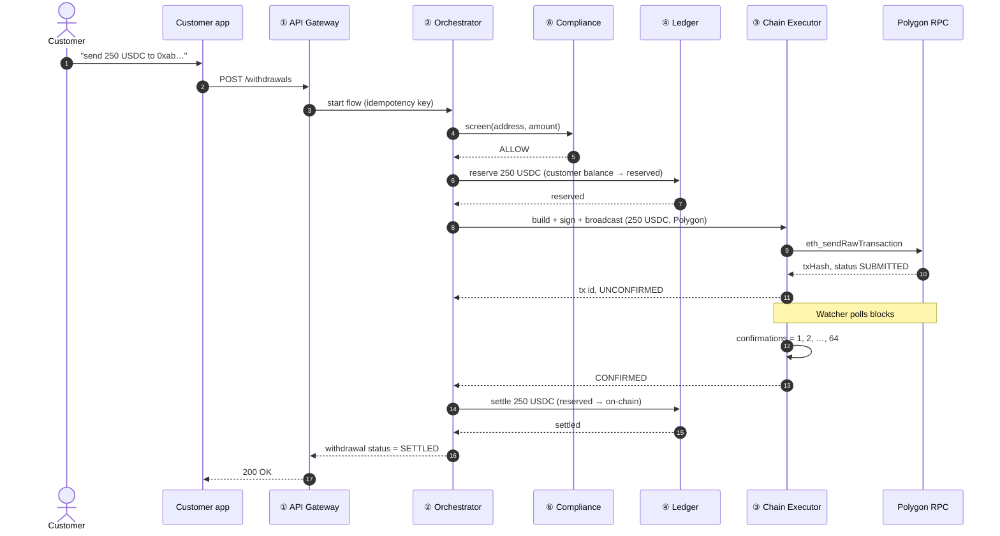

# h

```mermaid
sequenceDiagram
    autonumber
    actor Customer
    participant App as Customer app
    participant GW as ① API Gateway
    participant OR as ② Orchestrator
    participant CO as ⑥ Compliance
    participant LE as ④ Ledger
    participant CH as ③ Chain Executor
    participant CHAIN as Polygon RPC

    Customer->>App: "send 250 USDC to 0xab…"
    App->>GW: POST /withdrawals
    GW->>OR: start flow (idempotency key)
    OR->>CO: screen(address, amount)
    CO-->>OR: ALLOW
    OR->>LE: reserve 250 USDC (customer balance → reserved)
    LE-->>OR: reserved
    OR->>CH: build + sign + broadcast (250 USDC, Polygon)
    CH->>CHAIN: eth_sendRawTransaction
    CHAIN-->>CH: txHash, status SUBMITTED
    CH-->>OR: tx id, UNCONFIRMED
    Note over CH,CHAIN: Watcher polls blocks
    CH->>CH: confirmations = 1, 2, …, 64
    CH-->>OR: CONFIRMED
    OR->>LE: settle 250 USDC (reserved → on-chain)
    LE-->>OR: settled
    OR-->>GW: withdrawal status = SETTLED
    GW-->>App: 200 OK
```
# h2
text
