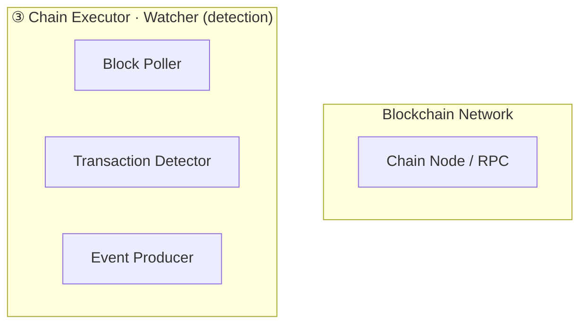

# h

```mermaid
graph TB
    subgraph id1["Blockchain Network"]
        NODE[Chain Node / RPC]
    end

    subgraph id2["③ Chain Executor · Watcher (detection)"]
        POLLER[Block Poller]
        DETECTOR[Transaction Detector]
        PRODUCER[Event Producer]
    end

```
# h2
text
