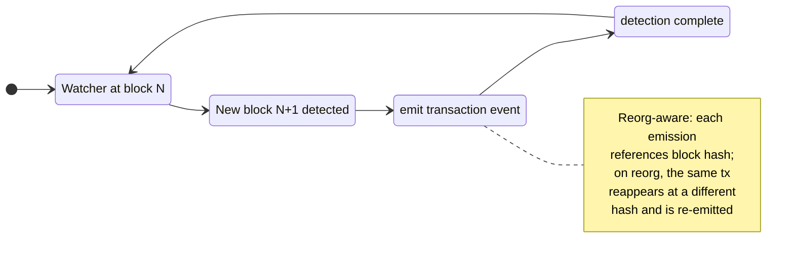

# h

```mermaid
stateDiagram-v2
    direction LR
    [*] --> SYNCED
    SYNCED: Watcher at block N
    NEW: New block N+1 detected
    EMIT: emit transaction event
    DONE: detection complete
    SYNCED --> NEW
    NEW --> EMIT
    EMIT --> DONE
    DONE --> SYNCED
    note right of EMIT
      Reorg-aware: each emission
      references block hash;
      on reorg, the same tx
      reappears at a different
      hash and is re-emitted
    end note
```
# h2
text
