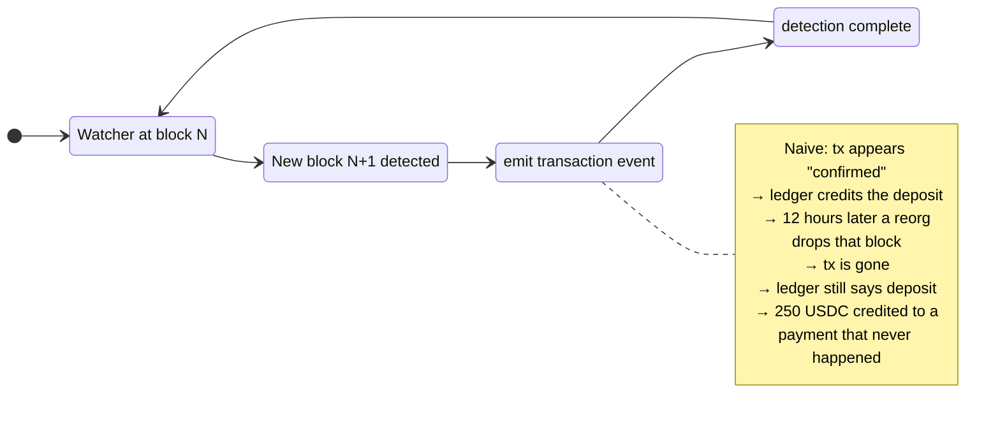

# h

```mermaid
stateDiagram-v2
    direction LR
    [*] --> SYNCED
    SYNCED: Watcher at block N
    NEW: New block N+1 detected
    EMIT: emit transaction event
    DONE: detection complete
    SYNCED --> NEW
    NEW --> EMIT
    EMIT --> DONE
    DONE --> SYNCED
    note right of EMIT
      Naive: tx appears "confirmed"
      → ledger credits the deposit
      → 12 hours later a reorg
      drops that block
      → tx is gone
      → ledger still says deposit
      → 250 USDC credited to a
      payment that never happened
    end note
```
# h2
text
