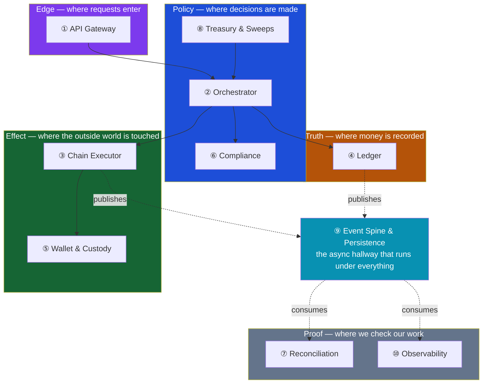
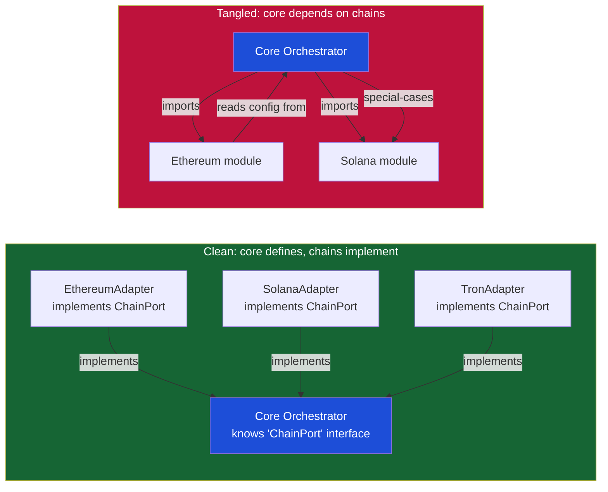
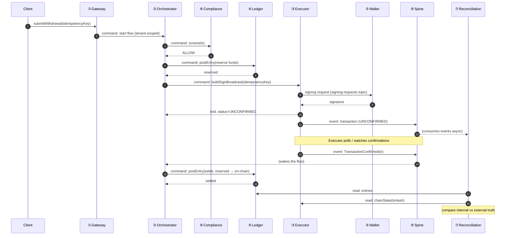

> **TL;DR** — Knowing the ten building blocks isn't enough. What makes a stablecoin platform
> maintainable is the *walls between them*: which block is allowed to talk to which, through what
> contract, and in which direction. This post draws the map — the boundaries, the contracts, and
> the one rule (money flows one way, truth lives in one place) that keeps adding chain N+1 from
> becoming a re-architecture.
> **Who this is for:** engineers about to lay out a stablecoin backend, or inheriting one where
> "add Solana support" has quietly become a three-month project.

---

## The 47-File Chain

A team ships a stablecoin payout product on Ethereum. It's a clean win. Customers top up in USDC,
the platform holds it, and pays out to beneficiaries on demand. The codebase is small, the whole
thing fits in one engineer's head, and the CEO is happy.

Then the CEO comes back from a conference. "Solana," he says. "Fees are a hundredth of a cent.
Our margins depend on it. How fast can we add it?"

The engineer opens the codebase to find out. She expects to add one new module — a Solana adapter
— and wire it in. Instead she finds Ethereum everywhere. The withdrawal service hardcodes
`gasLimit`. The ledger has a column called `nonce` that only means something on an EVM chain. The
reconciliation job parses Etherscan receipt JSON by hand. The compliance screen builds an
explorer URL by string-concatenating an address onto `etherscan.io/tx/`. The fee estimator is a
switch statement on a string called `chain`, with one branch.

Adding Solana touches **47 files across six of the ten blocks.** Three weeks in, a bug in the new
Solana fee path writes a balance directly from the chain code — bypassing the ledger's double-entry
check — and for two days the platform's books are off by $11,000 before anyone notices.

This team didn't have a knowledge problem. They knew what blocks a payment platform needs. They had
a **boundary** problem. They never drew the walls between the blocks, so the blocks grew into each
other, and a change that should have been one new module became a demolition job across the whole
system.

Post 01 named the ten building blocks and argued *why* you need each one. This post is the next
question: **how do they fit together?** Where does one block end and the next begin? What do they
say to each other? And what's the rule that keeps the whole thing from turning into the 47-file
chain?

---

## "It Worked for One Chain"

Here's the trap: a system with no boundaries *works*. It works right up until it doesn't.

When you only support one chain, hardcoding `gasLimit` in the withdrawal service costs you nothing.
There's only one chain, so the chain-specific logic and the business logic live in the same file,
and that file is small, and everything is fine. The absence of a wall is invisible when there's
only one room.

The cost shows up at the *second* chain, and compounds at the third. Every block that learned
something chain-specific now has to unlearn it. Every shortcut where one block reached into
another's internals now has to be untangled. The interest on missing boundaries is charged all at
once, the moment you need the system to grow.

This is the same dynamic that makes a "quick" microservice with a shared database painful to split
later, or a monolith with no module boundaries impossible to refactor. Stablecoin platforms are
especially exposed because the growth is *guaranteed*: no one builds for one chain forever. The
corridors demand more. USDC on Ethereum, then Base for cheaper settlement, then Solana for speed,
then Tron for a specific market, then an L2 that didn't exist when you started. Each one should be
a module. Without a map, each one is a project.

So the goal of this post is concrete: by the end, you should be able to draw the walls of your
platform on a whiteboard, name the contract that crosses each wall, and apply one test to any
change — *does this cross a boundary cleanly, or does it leak through one?*

---

## Scope & Requirements

Before drawing anything, pin down what "the map" has to deliver. Steal the Q&A device: ask the
questions, write the answers down, design to them.

**Q: What are we mapping?**
A: The ten blocks from Post 01 — API Gateway, Orchestrator, Chain Executor, Ledger, Wallet &
Custody, Compliance, Reconciliation, Treasury, Event Spine & Persistence, Observability. Not their
internals (later posts do that). Their *edges*: where one stops, what it promises the next.

**Q: What does a good boundary buy us?**
A: Three things. (1) **Local change** — adding a chain touches the chain layer, not the ledger.
(2) **Independent reasoning** — an engineer can work in Reconciliation without understanding
Solana's fee market. (3) **Independent failure** — a dead Tron node degrades Tron, not the whole
platform.

**Q: What are the non-negotiables?**
A:
- **One source of truth for money.** Balances live in exactly one place. Everything else is a
  projection.
- **One writer to the chains.** Exactly one block ever broadcasts a transaction. If two blocks can
  talk to a chain, you will double-send. (See Post 01's $47,000 retry.)
- **No block reaches into another's storage.** Blocks talk through contracts, never by reading each
  other's tables.
- **Compliance is on the path, not beside it.** Money cannot move without passing a gate.

**Q: What's explicitly out of scope here?**
A: How any single block works internally. The ledger's schema, the executor's signing flow, the
reconciliation algorithm — each gets its own post. This post is the *topology*, not the furniture.

---

## Mental Model: Rooms, Doors, and One-Way Traffic

A payment platform is a building. Each block is a **room** with a single job. Between rooms are
**doors** — narrow, named openings through which specific things may pass. And there's a traffic
rule: **money flows one direction, and the truth about money lives in one room.**

Read the diagram in layers, top to bottom. A **solid** arrow is a synchronous command, and it only
ever points down; a **dotted** arrow is an asynchronous event — published to the spine by the blocks
that record or move money, and consumed by Proof. (Proof also *reads* both truths directly to do its
job; that's drawn in the contract table below and left off this map on purpose, so the one-way flow
stays legible.)

- **Edge** takes a request from the outside world and makes it legitimate (authenticated,
  idempotent, tenant-scoped). It knows nothing about chains or money.
- **Policy** decides what should happen. The Orchestrator drives a flow; Compliance votes yes or no
  before money moves; Treasury decides when scattered funds should be consolidated and kicks off a
  sweep. Policy *requests* things; it never *records* money itself.
- **Truth** is the Ledger. The only room where a balance actually changes. Everything downstream is
  an effect of a ledger entry; everything upstream is a request for one.
- **Effect** touches the outside world — signs with a key and broadcasts to a chain. These blocks
  have side effects you can't undo, which is exactly why they sit *below* the policy that triggers
  them, never above it.
- **Proof** checks that the building matches reality. Reconciliation compares the Ledger to the
  chains; Observability watches all of it. They read, they alert, they never move money.
- The **Event Spine** runs under all of it — the hallway through which rooms announce what they
  did, asynchronously, so Proof doesn't have to stand in the doorway waiting.

The traffic rule is the whole game: **requests flow down, effects flow down, truth is written once
in the middle, and proof reads from the middle and the bottom.** No room reaches *up*. The Ledger
never calls the Orchestrator. The Chain Executor never decides policy. If you find an arrow
pointing the wrong way, you've found a future 47-file chain.

---

## High-Level Design: The Contracts on Every Door

A boundary without a contract is just a comment. The contract is what makes it real: the exact
shape of what may cross the door, and the guarantee that comes with it. Every door in the building
is one of three kinds:

- A **command** — a synchronous request that asks another block to do something and waits for an
  answer. *"Screen this transaction." "Sign this payload." "Post this entry."*
- An **event** — an asynchronous announcement that something happened, published to the spine.
  *"A transfer was detected." "A transaction confirmed." "A balance changed."*
- A **read** — a query against another block's public view, never its internal tables. *"What's the
  on-chain balance of this address?"*

Here's the contract for every door that matters:

| From → To | Door | Kind | Shape (illustrative) | Guarantee |
|-----------|------|------|----------------------|-----------|
| Gateway → Orchestrator | `submitWithdrawal` | command | `{tenantId, idempotencyKey, asset, amount, destination}` | Accepted-for-processing, not done. Returns a flow id. |
| Orchestrator → Compliance | `screen` | command | `{tenantId, asset, amount, addresses}` | Synchronous verdict: `ALLOW` / `BLOCK` / `REVIEW`. No verdict, no movement. |
| Orchestrator → Ledger | `postEntry` | command | `{flowId, debit, credit, amount, asset}` | Atomic double-entry. Either both legs land or neither does. |
| Orchestrator → Executor | `buildSignBroadcast` | command | `{tenantId, chain, token, to, amount}` | Returns a tx id + status from a fixed lifecycle: `DETECTED → UNCONFIRMED → CONFIRMED`, with `STUCK` and `FAILED` branches. **At-most-once broadcast per idempotency key.** |
| Executor → Wallet | `sign` | command | `{keyRef, unsignedTx}` | Signature, or a policy denial. The key never leaves the vault. (Drawn sync for clarity; often async over the signing-requests topic — see the key-management post.) |
| Executor → Spine | `TransactionDetected` | event | `{chain, txHash, toAddress, amount, token}` | A transfer seen in the mempool or a block; status `DETECTED`. Triggers the deposit flow. |
| Executor → Spine | `TransactionConfirmed` / `TransactionStuck` | event | `{chain, txHash, status, confirmations}` | Status moves to `CONFIRMED` or `STUCK`. At-least-once delivery; consumers must be idempotent. |
| Orchestrator → Spine | `TransferStateChanged` | event | `{flowId, tenantIds, newState}` | The audit trail of a flow's journey; wakes anything waiting on the flow. |
| Ledger → Spine | `AssetBalanceChanged` | event | `{accountId, asset, newBalance, entryId}` | The audit stream; Reconciliation and reporting consume it. |
| Reconciliation → Ledger | `entries` | read | query over the public ledger view | The internal truth. |
| Reconciliation → Executor | `chainState` | read | `{chain, txHash}` or `{chain, address}` | The external truth. Compared, never trusted blindly. |

These events don't float free — they ride a small, fixed set of topic families on the spine:
**transaction events** (every detected, confirmed, and stuck transaction — partitioned by
transaction hash, so one transaction's whole life lands on one partition, in order), **block
events** (the chain head and reorg signals), **stuck transaction events** (the trigger for
recovery), and **signing requests** (how signing asks reach the vault — on their own topic, so a
signature can be queued, policy-checked, and audited before it happens). And none of them are
published directly: each block writes the event to a **transactional outbox** in the same database
transaction as the state change, and a relay carries it to the topic afterward. That's what makes
"at-least-once" honest — the event can't be lost when the write succeeded, and can't be invented
when the write failed.

Two contracts in this table carry the entire safety of the platform, so pull them out and stare at
them:

1. **`postEntry` is atomic.** A balance never changes by one leg. This is what makes the Ledger the
   source of truth — you can replay every entry and reconstruct every balance.
2. **`buildSignBroadcast` is at-most-once per idempotency key.** The Executor will never broadcast
   the same logical transfer twice, even if the Orchestrator retries it ten times after a timeout.
   This single guarantee is the fix for Post 01's double-send. It only works if the Orchestrator
   *uses* the contract correctly — retries the *intent*, never re-builds a fresh transaction.

Notice what's absent: there is no door from the Executor to the Ledger, and no door from the Ledger
to the Executor. The block that touches chains and the block that records money **do not speak
directly.** They meet only through the Orchestrator (which coordinates) and the Spine (which
announces). That silence is deliberate. It's the wall that kept the 47-file chain's $11,000 bug
from being possible — if the Executor has no door to the Ledger, it cannot write a balance around
the double-entry rule.

### The Ownership Rule: One Writer Per Thing

Contracts define *how* blocks talk. The ownership rule defines *who's allowed to*. For every piece
of state in the system, exactly one block may write it:

| State | Only writer | Everyone else |
|-------|-------------|---------------|
| Internal balances | Ledger | Requests a change via `postEntry` |
| On-chain transactions | Chain Executor | Requests a send via `buildSignBroadcast` |
| Private keys / signatures | Wallet & Custody | Requests a signature via `sign` |
| Compliance verdicts | Compliance | Asks via `screen`, obeys the answer |
| Flow state (where a withdrawal is) | Orchestrator | Reads via the API / events |
| Reconciliation findings | Reconciliation | Alerts on them; never "fixes" the ledger |

If you ever write a line where the Chain Executor updates a balance, or the Orchestrator signs a
transaction directly, or Reconciliation edits a ledger entry to "make it match" — you have broken
the ownership rule. Stop. You are building the 47-file chain. The fix is never to reach across;
it's to add a contract.

---

## Deep Dive: The Hard Parts

Drawing rooms is easy. Keeping the walls standing under deadline pressure is the hard part. Three
things do the real work.

### 1. The dependency rule: chain-specific code points inward

The single most violated boundary in a stablecoin platform is the one between "chain-specific" and
"everything else." It's violated because it's convenient: you're writing the withdrawal flow, you
need the fee, the fee lives in chain-land, so you import the chain module. One import. Harmless.

It isn't harmless. That import is how `gasLimit` ends up in the withdrawal service and `nonce` ends
up in the ledger schema. The rule that prevents it:

> **The core of your platform must never import anything chain-specific. Chain-specific code
> implements an interface the core defines — the arrow always points inward.**

On the left, the Orchestrator depends on an abstraction — call it `ChainPort` — with methods like
`estimateFee`, `buildTransfer`, `confirmationsForFinality`. Each chain provides an adapter. To add
Solana, you write `SolanaAdapter implements ChainPort` and register it. The Orchestrator is
unchanged. The Ledger is unchanged. Reconciliation is unchanged. **One new file, plus config.**

On the right, the Orchestrator imports the chain modules directly and special-cases them. Now
"add Solana" means editing the Orchestrator, and the Ledger, and Reconciliation — because all of
them grew a dependency on chain internals. This is the picture of the 47-file chain.

The test is brutal and simple: **grep your core for the word `solana` (or `ethereum`, or `tron`).**
If the core mentions a specific chain by name, the boundary is broken. The core should only ever
say "a chain," never "which chain."

### 2. Contracts are versioned, and events are at-least-once

Two contract facts bite teams in production.

**Commands can change shape; you must version them.** The day you add a field to `buildSignBroadcast`
— say, a `maxFee` the Orchestrator can cap — you have two versions of the contract alive at once if
any caller is mid-deploy. Version your commands (`v1`, `v2`), keep the old one working until every
caller has moved, and never make a breaking change in place. Money systems deploy continuously; a
contract that assumes a frozen world will corrupt a transfer during a rollout.

**Events are at-least-once, so every consumer is idempotent.** The Spine will, occasionally, deliver
`TransactionConfirmed` twice. That's not a bug — it's the price of a durable, decoupled event bus.
The contract says *at least once*; the consumer's job is to make "twice" indistinguishable from
"once."
Reconciliation processes an event keyed by `(chain, txHash)` and simply no-ops the second time.
This is the same idempotency discipline as the command layer, moved to the async world. Skip it and
your event consumers will double-count the same money the command layer worked so hard to
double-send-prevent.

The pairing is the point: **commands give you at-most-once (never do it twice), events give you
at-least-once (you might hear it twice), and idempotency keys are how both sides meet in the
middle.** Get this pairing wrong and no amount of clean boundaries will save your books.

### 3. Walking the map: a withdrawal, door by door

The map only proves itself when money actually moves. Trace a withdrawal and watch it cross every
boundary through a contract — never through a back door.

Every arrow here is a contract from the table. Notice the shape of it:

- The Orchestrator **coordinates** but never touches a key or a chain or a balance directly. It asks
  Compliance, asks the Ledger, asks the Executor. It is a conductor, not a player.
- The Executor **signs and broadcasts and watches**, then *announces* via the Spine. It does not
  update the Ledger when the tx confirms — it publishes `TransactionConfirmed`, and the Orchestrator,
  woken by the event, posts the settling entry. The Executor has no door to the Ledger. The wall holds.
- Reconciliation **reads both truths** — the Ledger's entries and the Executor's view of chain
  state — and compares them. It is downstream of everything and upstream of nothing. It proves the
  withdrawal really happened, independently of the flow that sent it.

If you can trace both the withdrawal *and* the deposit this way — every hop a named contract, no
hop skipping a layer — your map is real. If you can't, the place where your pencil wants to draw a
shortcut is exactly where a wall is missing.

---

## What Breaks

Boundaries rot quietly. These are the five failures to watch for, in roughly the order they appear.

**1. The God Orchestrator.** The Orchestrator is the natural place for "just a little" logic to
accumulate, because it already talks to everyone. Soon it computes fees, formats explorer URLs, and
holds a balance cache "for speed." It has become every block at once. Symptom: the Orchestrator
file is the one touched by every change. Fix: if the Orchestrator is doing a block's job, move the
job to the block and leave a contract call behind.

**2. The shared database.** Two blocks read and write the same table because "it's just one
Postgres." Now they're coupled at the schema level, and a migration for one breaks the other, and
neither can evolve independently. Symptom: a block queries a table it doesn't own. Fix: blocks
communicate through commands, events, and *public read views* — never through another block's
tables. If Reconciliation needs ledger data, it reads the Ledger's public view, not its `entries`
table.

**3. The leaky chain abstraction.** A chain type escapes the chain layer — an enum value, a fee
field, an address format — and shows up in the core. Symptom: the grep test fails; the core says
`solana` somewhere. Fix: push the detail back behind `ChainPort`. The core deals in `Asset` and
`ChainId`, never in `gasLimit` or `lamports`.

**4. The synchronous chain of doom.** Every door is a blocking call, so a withdrawal holds a thread
open across Gateway → Orchestrator → Compliance → Ledger → Executor → Wallet. One slow chain stalls
the whole request, and a Tron RPC hiccup takes down Ethereum payouts with it. Symptom: latency on
one chain raises latency on all of them. Fix: the Orchestrator runs flows as durable, resumable
workflows (a saga / workflow engine), and the blocks announce progress through the Spine. Sync
contracts are for quick verdicts (`screen`); slow realities (confirmation) are events.

**5. The circular dependency.** The Ledger calls the Orchestrator to "notify" it, while the
Orchestrator calls the Ledger to post entries. Now neither can be deployed or tested alone, and a
failure loops between them. Symptom: you can't start one block without the other running. Fix: the
arrow only ever points one way. If the Ledger needs to tell the Orchestrator something, it publishes
an event to the Spine. The Ledger never knows who's listening.

The common thread: every one of these is a *shortcut that saved a day and cost a quarter.* The map
exists so the shortcut isn't tempting — so the contract is easier to write than the violation.

---

## How We Measure It

A map is only good if you can test it. Four checks, run continuously, not once:

- **The Chain-N+1 test.** Adding a new chain must be *one adapter implementing `ChainPort`, plus
  config* — measured in files touched outside the chain layer. Target: **zero.** If adding a chain
  edits the Ledger, the boundary has failed. This is the single most predictive metric in the
  platform.
- **The grep test.** The core (everything outside the chain layer) must not name a specific chain.
  Automate it as a lint rule. A red build here is cheaper than a red quarter later.
- **Contract test coverage.** Every door in the contract table has a consumer-driven contract test:
  the caller asserts the shape it depends on, the provider asserts it still satisfies it. Breaking
  a contract fails CI, not production.
- **Coupling fan-out.** Count how many other blocks each block calls. The Orchestrator is allowed a
  high fan-out (it's the conductor). The Ledger and the Wallet should have a fan-out near zero —
  they are *asked*, they don't *ask*. A Ledger that calls five things is a Ledger that has stopped
  being the source of truth and started being a participant.

Tie these back to the series bar: **99.999% explainability of money movement.** You can only
explain every penny if exactly one block records pennies (Ledger), exactly one block moves them
on-chain (Executor), and a third block proves the two agree (Reconciliation). Blur those three and
explainability collapses — not because the math is hard, but because no one owns the answer.

---

## Key Takeaways

- **The blocks are the easy part; the walls are the platform.** Ten blocks with no boundaries
  become the 47-file chain. Maintainability lives in the edges, not the nodes.
- **Money flows one way; truth lives in one place.** Requests and effects flow down through Policy
  to the Ledger; Proof reads from the Ledger and the chains. Nothing reaches up.
- **One writer per thing.** Only the Ledger writes balances, only the Executor broadcasts, only the
  Wallet signs. Everyone else requests through a contract.
- **The core never names a chain.** Chain-specific code implements an interface the core defines —
  the arrow points inward. Adding chain N+1 is one adapter plus config, or your boundary is broken.
- **Commands are at-most-once, events are at-least-once, idempotency keys meet in the middle.** This
  pairing is what keeps the books clean across the sync/async split.
- **The Executor and the Ledger never speak directly.** They meet only through the Orchestrator and
  the Spine. That silence is a safety property, not an accident.

---

## FAQ

**Is this a microservices architecture? Do I need ten services?**
No. These are *logical* blocks, not deployment units. Early on, several blocks can live in one
well-modularized monolith — the boundaries are enforced by module rules and contract tests, not by
network calls. The map tells you where the seams are so you *can* split a block into a service
later without rewriting it. The worst outcome is ten services that share a database and call each
other synchronously: all the cost of distribution, none of the isolation.

**Why can't the Orchestrator just update the Ledger directly? It already coordinates everything.**
Because then two things can change a balance: the Ledger's own double-entry logic and the
Orchestrator's shortcut. The moment money has two writers, you can no longer replay the ledger and
reconstruct every balance — the source of truth has a leak. The Orchestrator *requests* entries;
the Ledger *decides* whether they're valid (balanced, idempotent, within limits). Keeping that
authority in one place is what makes reconciliation possible.

**How do I keep Compliance synchronous without making every payment wait on a screening vendor?**
`screen` is a fast, bounded call with a timeout and a fail-closed default: no verdict, no movement.
The slow parts of compliance (deep wallet clustering, manual review) run as a *post-transaction*
gate on the Spine, where a `REVIEW` verdict can freeze a credit before it's spendable. Pre-flight
screening answers "may this move?"; post-flight screening answers "should we keep it?" Both are on
the path — just at different speeds. (Compliance gets its own post later in the series.)

**What about reads? My dashboard needs balances from the Ledger and statuses from the Orchestrator.**
Reads cross boundaries too, but through *public views*, not internal tables. The Ledger exposes a
read model of balances; the Orchestrator exposes a read model of flow status; the API Gateway
composes them for the client. The rule is "don't read another block's storage," not "don't read
another block's data." The distinction — a stable, owned projection versus someone else's internal
table — is the whole difference between a contract and a coupling.

**This feels like a lot of ceremony for a startup that just needs to ship.**
The ceremony is the cheap part; the 47-file chain is the expensive part. You don't need ten
services, a Kafka cluster, and a workflow engine on day one. You need the *rule*: one writer per
thing, the core never names a chain, blocks talk through contracts. Those rules cost nothing to
hold in a monolith and everything to retrofit once the blocks have grown together. Draw the walls
while the rooms are still empty.

---

## Further Reading

- [**"Designing a Payment System"**](https://www.amazon.com/System-Design-Interview-Insiders-Second/dp/1736049119) — Alex Xu. The 4-step scope → design → deep-dive → wrap-up frame this series follows.
- [**"Building Microservices"**](https://samnewman.io/books/building_microservices_2nd_edition/) — Sam Newman. The best treatment of boundaries, contracts, and "how to split things without making it worse."
- [**"Clean Architecture"**](https://blog.cleancoder.com/uncle-bob/2012/08/13/the-clean-architecture.html) — Robert C. Martin. The dependency rule: source dependencies point inward, toward policy, away from detail.
- [**"Bounded Contexts"**](https://martinfowler.com/bliki/BoundedContext.html) — Martin Fowler. Why the same word ("balance") means different things in different rooms, and why that's healthy.
- [**"Ledger: tracking & validating money movement"**](https://stripe.dev/blog/ledger-stripe-system-for-tracking-and-validating-money-movement) — Stripe Engineering. One source of truth for money, with everything else a projection.
- [**"Introducing Coinbase Payments"**](https://www.coinbase.com/payments) — Coinbase. A modular, layered on-chain payment stack — the shape of the map in production.
