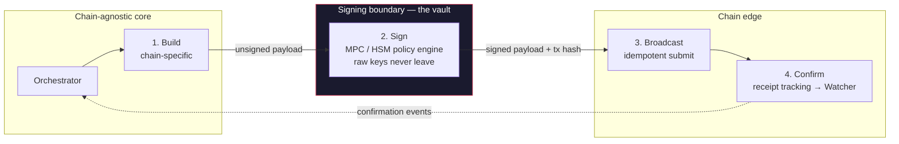
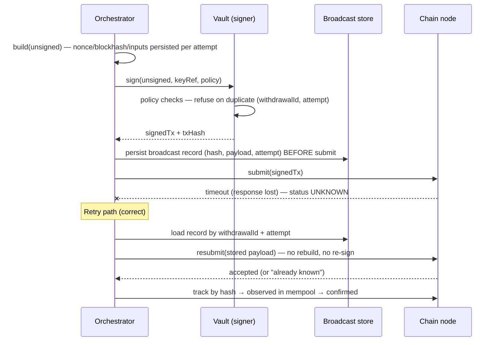
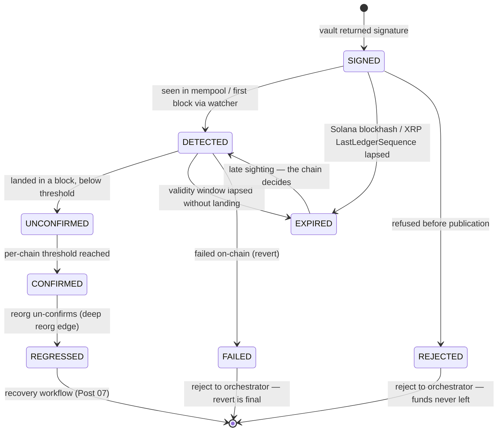

> **TL;DR** — Inbound money is detected; outbound money is *sent* — and sending is where platforms
> lose money fastest. A Sender is a four-stage pipeline — **build → sign → broadcast → confirm** —
> with exactly one signing boundary, and everything after that boundary must be idempotent. The
> chain diversity lives in two stages (build and confirm); signing, broadcasting, and receipt
> tracking are one contract every chain module implements. Get the pipeline right and a retry can
> never double-spend. Get it wrong and a single timeout turns one withdrawal into two.
> **Who this is for:** backend engineers building the Sender half of the chain layer — the part
> of the system that turns an approved withdrawal into a confirmed on-chain transaction.

---

## The Withdrawal That Left Twice

A payments platform ships withdrawals on Ethereum. The flow is an orchestrated workflow: reserve
the funds in the ledger, screen the destination, build the transaction, sign it, broadcast it,
wait for confirmations, settle the ledger. Each step is an activity with a timeout and a retry —
standard durable-execution hygiene. The broadcast activity gets a 30-second timeout with three
retries. It ships. It works.

The incident lands on a Friday afternoon. A business customer initiates a 250,000 USDC payout to
a supplier. The workflow builds the transaction — nonce 42, a generous priority fee because the
treasury desk wants it landed before the weekend — and signs it. The broadcast activity submits
the signed transaction to the node over JSON-RPC. The node accepts it into the mempool, and then
the HTTP response stalls — a proxy between the platform and the node holds the connection just
past the 30-second timeout. The activity fails. The workflow does what durable workflows do: it
retries.

Here is the detail that decides everything: **the retry re-runs the whole activity — build, then
sign, then broadcast.** The build step dutifully fetches a fresh nonce. Because the first
transaction carried a generous priority fee, it landed within two blocks. The fresh nonce comes
back as 43. The platform builds a second, completely valid transaction — same destination, same
amount, nonce 43 — signs it, and broadcasts it. Both transactions confirm. The supplier receives
250,000 USDC twice. The ledger shows one withdrawal.

The postmortem finds no bug in any single component. The node behaved correctly. The retry
behaved correctly. The nonce fetch behaved correctly. The failure is structural: the platform
treated *broadcasting* as part of *building*. When the retry fired, it rebuilt from scratch — new
nonce, new signature, new transaction — instead of resubmitting the transaction it had already
signed. Rebuilding is a fresh decision; resubmitting is a retry. The platform made a fresh
decision when it meant to retry.

Every design in this post exists to make that confusion structurally impossible. A withdrawal is
a pipeline with one signing boundary. Before the boundary, chain-specific construction. At the
boundary, a signature from a service that never exposes keys. After the boundary, an idempotent
machine whose only job is: get *this exact transaction* confirmed, or know precisely why it
can't. Post 03 split every chain into a Watcher and a Sender and left the Sender as one line —
*"Sender signs and broadcasts."* This post opens that line.

---

## Scope & Requirements

Before the design, pin down what "sending money" has to deliver — same Q&A device as Post 04.

**Q: What are we sending?**
A: Any outbound transfer from a platform-managed address — native coin or stablecoin token,
across the five transaction models this series covers: EVM accounts (Ethereum and every L1/L2 and
stablechain that speaks EVM), Tron, Solana, UTXO chains (Bitcoin, Litecoin, Dogecoin), and XRP.
Token standards ride on the models: ERC-20 on EVM, TRC-20 on Tron, SPL on Solana.

**Q: What does "sent" mean?**
A: Four distinct facts, in order: the transaction is **built** (a valid, unsigned payload for the
target chain), **signed** (authorized by the custody layer), **broadcast** (accepted by at least
one node and trackable by hash), and **confirmed** (embedded in the chain to the platform's
finality bar). Each fact has its own record and its own failure modes. Conflating them —
treating "broadcast call returned 200" as "confirmed" — is how platforms discover losses weeks
later.

**Q: What are the non-negotiables?**
A: Four.
1. **Idempotent sends.** A withdrawal can produce at most one on-chain transaction per attempt,
   no matter how many retries, restarts, or timeouts occur.
2. **No raw keys outside the signing boundary.** Application servers build and track
   transactions; they never hold, see, or cache private key material.
3. **Chain containment.** Adding a chain must not touch the orchestrator, the ledger, or the
   broadcast machinery — the Chain-N+1 test from Post 02 applies to sending exactly as it applies
   to detection.
4. **Full auditability.** Every withdrawal must yield a complete artifact trail: what was built,
   what was signed (hash), when it was broadcast, where it was observed, and which block
   confirmed it.

**Q: What's explicitly out of scope here?**
A: Fee strategy and gas economics (Post 06), stuck-transaction recovery and RBF (Post 07), the
full withdrawal orchestration with screening and reserves (Post 09), and the internals of MPC
signing or key custody (Post 12). This post covers the pipeline; those posts cover the deep dives
it defers to.

**Q: Back-of-envelope?**
A: A mid-size platform broadcasts tens of thousands of withdrawals a day across 5–10 chains, with
peak bursts at treasury cutoff times. Build-plus-sign must stay under a couple of seconds at p95
so human approval flows feel instant; broadcast-to-first-observation should be under five seconds
on healthy chains. And one invariant that isn't a target so much as a law: **zero double-sends.**
Not "few." Zero.

---

## Mental Model: A Pipeline with One Vault

The whole Sender reduces to one picture: four stages in a line, and a wall around the second one.



Read the diagram left to right and three properties jump out.

**Chain diversity lives in exactly two stages.** Build is chain-specific — an EVM transaction is
not a Solana transaction is not a UTXO transaction, and pretending otherwise produces the worst
abstractions in the industry. Confirm is chain-specific too, because every chain defines finality
differently (Post 04's confirmation thresholds). Signing, broadcasting, and receipt tracking are
chain-agnostic: they operate on *a payload, a hash, and a status* — shapes every chain can supply.

**The vault has one door.** The only things crossing the signing boundary are an unsigned payload
going in and a signed payload plus its hash coming out. Key material, policy state, and ceremony
details stay inside. The rest of the platform treats the vault as a pure function:
`sign(unsignedTx) → signedTx`. Whether that function is an HSM, an MPC quorum, or a cloud custody
API is a deployment decision the pipeline doesn't care about (and Post 12 dissects).

**Everything right of the vault is keyed by the transaction hash.** Once the signature exists, the
transaction's identity is fixed. Broadcasting it again is a no-op on the network — nodes dedupe by
hash. Tracking it is a lookup by hash. Confirming it is Post 04's detection machinery applied to a
hash the platform already knows. This is why the pipeline is idempotent *by construction* — and
why the incident that opened this post was a build-stage retry masquerading as a broadcast-stage
retry.

---

## One Contract for Every Chain

Post 03's claim was that every chain module speaks one contract. For the Sender, that contract is
small enough to fit on an index card:

```java
public interface ChainSender {
    /** Chain-specific: assemble the unsigned payload (fee fields, nonce/blockhash/inputs). */
    UnsignedTransaction build(SendRequest request, ChainContext context);

    /** Delegates to the vault — the module never touches key material itself. */
    SignedTransaction sign(UnsignedTransaction unsigned, KeyRef key, SignPolicy policy);

    /** Idempotent submit. Returns the broadcast record: hash, node, timestamp, acceptance. */
    BroadcastRecord broadcast(SignedTransaction signed, BroadcastOptions options);

    /** Chain-specific: receipt lookup + confirmation depth (feeds Post 04's thresholds). */
    ReceiptStatus track(TransactionRef ref);
}
```

`SendRequest` is chain-agnostic — amount, asset, destination, idempotency key, metadata. The
orchestrator speaks only `SendRequest` and `BroadcastRecord`; it has no idea whether the
destination is an EVM address, a base58 account, or a UTXO script. That's the Chain-N+1 test
applied to sending: adding Monad or MegaETH or the next stablechain means a new module that
implements these four methods — zero changes to the orchestrator, the ledger, or the broadcast
machinery.

The five models differ in what `build` must assemble and what `track` must understand. Everything
else is shared. The next two sections walk the models; the one after them walks the boundary.

---

## Building the Transaction, Model by Model

Building is where the models diverge hardest — and where most sending bugs are born, because each
model's replay protection works differently. Get replay protection wrong and "retry" becomes
"repay."

### EVM: nonce, gas fields, calldata

An EVM transaction is an account-model message: from-address implied by the signing key, explicit
`to`, `value` (native) and/or `data` (contract call — for ERC-20 transfers, the `transfer(to,
amount)` calldata), a `nonce` that doubles as replay protection, and the EIP-1559 fee fields.

```java
public UnsignedTransaction build(SendRequest req, ChainContext ctx) {
    long nonce = nonceManager.next(req.sourceAddress(), ctx.chainId());   // see Post 06
    var call = Erc20Calldata.transfer(req.destination(), req.amount());   // token = calldata
    return UnsignedTransaction.evmBuilder()
        .chainId(ctx.chainId())
        .to(req.asset().contractAddress())        // token contract, not the recipient
        .nonce(nonce)
        .maxFeePerGas(ctx.feeEstimator().maxFee())      // Post 06 owns the strategy
        .maxPriorityFeePerGas(ctx.feeEstimator().tip())
        .gasLimit(ctx.gasTable().estimate(req.asset())) // token transfer ≠ native transfer
        .data(call)
        .build();
}
```

Two properties matter for the pipeline. First, **the nonce is the replay guard**: two distinct
signed transactions with the same nonce compete, and at most one can ever land — the chain itself
enforces "one spend per nonce." Two distinct transactions with *different* nonces are two
independent, both-valid spends — which is exactly how the opening incident doubled a payout.
Second, **the transaction hash is the keccak-256 of the signed, RLP-encoded transaction** — fully
computable offline. The platform knows the exact hash before it ever meets a node, which is what
makes broadcast idempotency trivial: persist the hash, then submit.

### Solana: blockhash, instructions, account metas

Solana has no nonce. Replay protection comes from a **recent blockhash** embedded in the
transaction: the network only accepts transactions referencing a blockhash from roughly the last
150 blocks (~2 minutes). A transaction is a header (signers, the blockhash) plus a list of
**instructions** — each naming a program, the accounts it touches (each flagged signer/writable),
and instruction data. For an SPL token transfer: an instruction into the Token program with the
source token account, destination token account, and owner authority as account metas.

```java
public UnsignedTransaction build(SendRequest req, ChainContext ctx) {
    var blockhash = ctx.latestConfirmedBlockhash();          // ~2 min validity window
    var ix = SplTokenInstruction.transfer(
        req.sourceTokenAccount(), req.destinationTokenAccount(),
        req.ownerAuthority(), req.amount());
    return UnsignedTransaction.solanaBuilder()
        .recentBlockhash(blockhash)
        .addInstruction(ix)
        .feePayer(req.sourceOwner())
        .priorityFee(ctx.computeBudget().priorityMicroLamports())  // ComputeBudget ix
        .build();
}
```

The operational consequence is the inverse of EVM's: **an expired Solana transaction cannot land
at all** — expiry is a safety property, not a failure. Retrying an expired transaction with a
*fresh* blockhash produces a genuinely new, independently valid transaction. So Solana's rule is
strict: within one attempt, always resubmit the *same signed payload* (same blockhash) until it
expires; only then may a new attempt exist — and each attempt is a separately authorized decision
(see the state machine below). Durable nonce accounts exist to decouple validity from the
blockhash clock for offline flows; they're a treasury tool, not a default.

### UTXO: inputs, change, per-input signatures

Bitcoin-style chains spend **outputs**, not balances. Building means: select unspent outputs
covering amount plus fee, construct one output to the recipient and one change output back to the
platform, and remember that fees are implicit — inputs minus outputs, no fee field exists.

| Build concern | What the module decides | Why it bites |
|---|---|---|
| Input selection | Which UTXOs fund the send | Selecting different UTXOs on a rebuild produces a *different, independently valid* transaction — the UTXO version of the double-build. Selection must be persisted per attempt, never redone on retry. |
| Change output | Where change returns (fresh address or reuse) | Change-address hygiene is both a privacy and a reconciliation property; the watcher must recognize change outputs or the platform misreads its own balance. |
| Dust threshold | Minimum output size | Outputs below the network dust limit are rejected — a fee-calculation bug surfaces as a build failure, not a fee error. |
| Signatures | One signature *per input*, each over (most of) the whole transaction (SIGHASH_ALL) | Signing is not one operation but N; the txid exists only after all inputs are signed. SegWit fixed the old malleability problem — the txid is stable once signed. |

The pipeline consequence: on UTXO chains the transaction hash is known only *after* signing (the
signatures are inside the transaction). The idempotency key still works — persist after sign,
before broadcast — but the "know the hash early" convenience EVM and Solana offer arrives one step
later.

### Tron: energy, visible addresses, txID-before-signature

Tron is EVM-adjacent but operationally distinct. There is no gas auction; transactions consume
**bandwidth** and, for TRC-20 transfers, **energy**, paid by staked TRX or burned from the
sender's balance. Replay protection is structural: each transaction embeds a block reference and
timestamp, and the network rejects duplicate txIDs — there is no nonce to manage at all.

| Build concern | What the module decides | Why it bites |
|---|---|---|
| Fee model | Stake-and-pay vs burn-TRX | Under-provisioned energy silently burns TRX from the treasury hot wallet — a cost leak, not an error. |
| Address encoding | `visible=true` (base58 `T…`) vs hex in contract params | The classic TRC-20 bug: building contract calls with the wrong encoding signs fine and fails on-chain, or worse, sends to a malformed address. |
| Signing | Sign the txID — SHA-256 of the raw transaction | The txID exists *before* signing, so Tron gets EVM's "hash known early" property. |
| Expiry | `ref_block_bytes`/`ref_block_hash` pin validity to a recent block | A stalled transaction dies on its own; expiry is a safety property like Solana's. |

### XRP: sequence, destination tags, LastLedgerSequence

The XRP Ledger is the simplest sending model in the set: accounts have a **sequence number**
(incremented per transaction, EVM-nonce-like replay protection), fees are tiny fixed drops, and
transactions carry an explicit **LastLedgerSequence** — "valid only for the next N ledgers" —
which gives every send a built-in expiry. One extra field matters operationally: the
**destination tag**, a numeric memo exchanges use to route deposits. When the platform withdraws
to an exchange hot wallet, omitting the destination tag doesn't fail the transaction — it strands
the funds at the destination until support untangles it. The build step must treat a missing tag
on a known-exchange destination as a validation error, not a warning.

### One Table, Five Models

The models line up neatly along the three properties the pipeline cares about:

| Model | Replay guard | Expiry | Hash known | Double-build risk |
|---|---|---|---|---|
| EVM | Nonce | None — a signed tx is valid forever | Before broadcast (offline computable) | Different nonce ⇒ two valid spends |
| Solana | Blockhash freshness | ~2 min window | After signing (the signature is the ID) | Fresh blockhash ⇒ two valid spends |
| UTXO | Inputs unspent | None | After signing (sigs inside tx) | Different inputs ⇒ two valid spends |
| Tron | txID uniqueness + block ref | Block-ref window | Before signing (txID = hash of raw tx) | Low — network rejects duplicate txIDs |
| XRP | Sequence number | LastLedgerSequence | After signing | Different sequence ⇒ two valid spends |

Every row says the same thing in different syntax: **a rebuild is a fresh decision.** The
pipeline's job is to ensure that within a single attempt, the platform can only ever resubmit,
never rebuild.

---

## The Signing Boundary: No Keys Past This Point

Signing is a contract, not a place. The module hands the vault an unsigned payload, a key
reference (a derivation path or key ID — never the key), and a policy context; the vault returns
a signed payload and the transaction hash. Three rules make the boundary safe.

**Rule 1: The vault checks policy before it signs.** The signer is the last line of defense that
can still say no. Policy checks belong here: is this key authorized for this chain and this
amount band? Has this withdrawal been approved through the platform's authorization flow? Is the
rate of outbound signing within bounds? A signature that needed no policy check is a signature
the platform will eventually regret. (The policy engine's design is Post 12's territory; the
pipeline only requires that the vault *can* refuse.)

**Rule 2: Sign exactly what will be broadcast — hash-checked.** The vault signs the exact bytes it
received and returns the hash alongside the signature. The broadcast stage verifies
`hash(signedPayload) == returnedHash` before submission. If a byte differs between what was
signed and what is broadcast, the pipeline aborts — this is the defense against a corrupted or
compromised serialization layer between build and broadcast.

**Rule 3: One signature per attempt number.** Every withdrawal attempt carries an attempt number,
and the vault records `(withdrawalId, attempt)` for every signature it produces. A second signing
request for the same withdrawal and attempt is refused; a new attempt requires a new
authorization. This rule converts the opening incident from "possible" to "structurally
impossible": the retry in that story re-signed for the *same attempt* — under Rule 3 the vault
declines, and the orchestrator is forced down the correct path of resubmitting the already-signed
payload.

Whether the vault is an HSM signing inside a tamper boundary or an MPC quorum co-signing across
parties is invisible to the pipeline — `sign(unsignedTx) → signedTx` either way. The boundary is
the abstraction; the cryptography is an implementation detail behind it.

One implementation note from production systems: the vault call is usually a *message*, not a
method call. The build stage publishes a signing request — the unsigned payload, a key reference,
per-input payloads to sign, an idempotency token — onto the platform's event spine, and a signing
result arrives later, routed to the right chain module to assemble and submit the signed
transaction. Async signing is what makes MPC quorums, approval flows, and HSM queues possible
without blocking workflow threads; the pipeline's state machine simply parks at SIGNED until the
result arrives. And because the request carries per-input payloads, the same contract serves both
models that sign one blob (EVM, Solana, Tron, XRP) and the model that signs N times — UTXO, one
signature per input.

---

## Broadcast: Idempotent or It Doesn't Count

Broadcasting is the least technically interesting stage and the most operationally dangerous one,
because it's where retries live. The rules are few and absolute:

1. **Persist before you submit.** The signed payload and its hash are written to the broadcast
   record — durably, transactionally with the attempt's state — *before* any node is called. If
   the process dies mid-broadcast, recovery knows exactly which transaction might be out there.
2. **Submit is resubmit.** `broadcast()` on an existing record resubmits the stored payload to a
   node. It never constructs anything. Nodes dedupe by hash, so resubmission is free and
   side-effect-free.
3. **A timeout is not a failure.** A broadcast call that times out leaves the transaction's status
   as **UNKNOWN, not FAILED** — the node may have accepted it. The next step is always *track by
   hash* (ask the network whether it exists), never *rebuild and retry*. The opening incident was
   rule 3 violated: the platform treated UNKNOWN as FAILED and rebuilt.
4. **Broadcast wide, trust little.** Submitting to two or three independent node endpoints costs
   nothing and removes single-node propagation risk; the broadcast record logs which nodes
   accepted. One sick node behind a circuit breaker (Post 04's pattern, applied outbound) must
   never stall a withdrawal.

The per-model submit calls are mechanical — `eth_sendRawTransaction` and its JSON-RPC kin,
`/wallet/broadcasthex` on Tron, `sendTransaction` on Solana (with `skipPreflight=false` kept on
for withdrawals, so structural errors fail fast), `sendrawtransaction` on UTXO, `submit` on XRP.
What matters is the sequence around them:



Every arrow after the vault is keyed by the hash. The retry does zero cryptography and makes zero
decisions — which is precisely what makes it safe to retry.

One refinement that production systems converge on: classify the exceptions a submit can throw,
and give each class a *recoverer*. A node rejecting the payload as structurally invalid is a real
failure — surface it. A node answering "already known" or "duplicate transaction" is a success
wearing an error costume — the recoverer loads the existing record and the pipeline moves on.
Ambiguous transport failures leave the record in limbo and route to tracking. The broadcast step
then becomes three-valued — accepted, rejected, unknown — and never pretends unknown is rejected.

---

## After Broadcast: Receipt Tracking and the Handoff

Broadcast acceptance is a promise, not a settlement. The final stage turns the promise into a
receipt — and hands the transaction to the machinery Post 04 already built.

Each broadcast record runs a small state machine:



The states carry the audit trail: every transition timestamped, every node interaction recorded,
every state change emitted as an event on the platform's event spine. Three edges deserve special
attention:

**EXPIRED is a guess, not a verdict.** When a validity window lapses — Solana's blockhash, XRP's
LastLedgerSequence — the pipeline *assumes* the transaction cannot land and marks the attempt
EXPIRED. But expiry is a client-side inference: a transaction submitted just before the window
closed may still land, and a late sighting flips EXPIRED back to DETECTED. The chain decides, not
the platform. This asymmetry cuts both ways and the state machine encodes it honestly: EXPIRED is
never terminal until the watcher stops seeing the transaction, and a *new* attempt is only
authorized once the platform is confident the old one is dead. Treat "expired, therefore rebuild
now" as a double-build waiting to happen.

**REGRESSED exists because Post 04 says it must.** A confirmed transaction can be un-confirmed by
a deep reorg; the confirmation threshold is a probability dial, not a wall. When the watcher
reports the regression, the record flips CONFIRMED → REGRESSED and routes to the recovery workflow
— re-detection, re-broadcast decisions, and when to escalate to a human. That machinery is Post
07's deep dive; the state machine's only obligation here is that the edge *exists*.

**CONFIRMED reuses Post 04's numbers, verbatim.** The Sender does not invent confirmation
thresholds — it inherits the detection layer's: BTC 6 blocks, ETH 12, Solana finalized (~32
slots), Tron solidified, XRP validated, L2s sequencer-depth plus L1 anchor. One set of numbers,
owned by one layer, applied identically to deposits the platform receives and withdrawals it
sends. Divergent thresholds for inbound and outbound is a classic reconciliation trap — the same
transaction "confirmed" for the withdrawal engine and "pending" for the deposit engine is an
incident waiting for a quiet weekend.

And with CONFIRMED, the handoff completes: the orchestrator settles the ledger, the withdrawal
workflow finishes, and the transaction's afterlife — reconciliation, reporting, audit — belongs to
other building blocks. The Sender's job ended the moment confirmation became a fact the whole
platform can share.

---

## What Can Go Wrong

**Rebuild disguised as retry.** The opening incident — and the most expensive class of sending
bug. Any code path that re-fetches a nonce, blockhash, or UTXO set for the same attempt is a
potential double-spend. Defense: attempt-scoped persistence of every build input, plus vault Rule
3 (one signature per attempt) as the backstop.

**Nonce gaps and stuck transactions.** If attempt A consumes nonce 42 and attempt B was built for
nonce 43 but never broadcast, every subsequent transaction waits behind the gap. Detection,
gap-filling, and fee-based replacement (RBF on EVM/UTXO) is a state machine of its own — Post 07.

**UNKNOWN treated as FAILED.** The root sin behind most double-sends. Timeouts, 502s, and
connection resets all mean *the network may already have your transaction.* The only legal next
step is tracking by hash.

**Expired mistaken for dead — and rebuilt while still live.** On Solana and XRP, expiry is a
client-side guess: the window closed, so the platform *assumes* the transaction can't land. The
danger is acting on that assumption too fast — rebuilding under the same attempt while the late
transaction still lands. Correct handling keeps EXPIRED non-terminal, waits for the watcher to
settle the question, and only then authorizes a new attempt with a fresh signature.

**Signer outage mid-pipeline.** Withdrawals pile up in SIGNED-pending while the vault is down.
The correct behavior is queueing with visibility (dashboards, alerts on signer latency and
availability), never falling back to "local signing for now." A fallback key path is a custody
model nobody approved.

**Node accepted but the network didn't see it.** A transaction stuck in one node's mempool while
peers never receive it — rare, real, and invisible without multi-node broadcast and watcher
cross-checks. If OBSERVED doesn't arrive within the chain's expected window, alert and consider
resubmission to different endpoints (same payload — still idempotent).

**Reorg after CONFIRMED.** Probabilistic finality doing its job. The REGRESSED edge and Post 07's
recovery workflow are the answer; the Sender's contribution is honest state, fast detection, and a
ledger that never settled on anything less than the confirmed threshold.

---

## How We Measure It

The pipeline's health is a handful of numbers, and one of them is a law:

| Metric | Target | Why |
|---|---|---|
| Double-sends (same withdrawal, two landed txs) | **0 — invariant, not target** | Each occurrence is a direct treasury loss and a trust event. Alert on any candidate (two signatures, two hashes for one withdrawal) even when the chain catches one. |
| Build + sign latency (p95) | < 2 s | Human approval flows and treasury cutoffs feel every extra second. |
| Sign → first broadcast (p95) | < 5 s | A signed transaction sitting un-broadcast is untracked risk. |
| Broadcast success rate | > 99.5% | Below that, node health or build validation is degrading; investigate, don't just retry harder. |
| Receipt coverage | 100% of broadcast txs have a receipt record within 60 s | A broadcast with no tracking is a transaction the platform has lost sight of. |
| Signer availability | 99.95% | The vault is on the critical path of every withdrawal; its outage is a platform outage for sends. |
| EXPIRED attempts | trended, alert on spikes | Spikes mean build is using stale blockhashes or the pipeline is stalling between sign and submit. |

The invariant deserves emphasis: double-sends are measured as *candidates*, not just outcomes. If
the vault ever produces two signatures for one `(withdrawalId, attempt)`, or the broadcast store
ever holds two hashes for one withdrawal attempt, that's an alert at 3 a.m. even if the network
only landed one of them — the structure failed, and the network's mercy isn't a control.

---

## Key Takeaways

1. **A Sender is a pipeline with one signing boundary.** Build and confirm are chain-specific;
   sign, broadcast, and receipt tracking are one shared contract. That's the Post 03 pattern
   applied to outbound money.
2. **A rebuild is a fresh decision; a retry is a resubmit.** Every double-spend in the wild traces
   to confusing the two. Persist build inputs and signed payloads per attempt, and make retries
   hash-keyed resubmissions.
3. **A timeout means UNKNOWN, never FAILED.** The legal next step after a lost broadcast response
   is tracking by hash, not rebuilding.
4. **The vault signs policy, not just bytes.** One signature per `(withdrawalId, attempt)`, policy
   checked before signing, hash returned and verified — the boundary makes double-sends
   structurally impossible, not merely unlikely.
5. **Confirmation is the Watcher's job.** The Sender hands every broadcast hash to Post 04's
   machinery and reuses its thresholds verbatim — one definition of "confirmed" for the whole
   platform.

---

## FAQ

**Why not just use a wallet library that does build-sign-broadcast in one call?**
Because the one-call shape is exactly the shape that double-spends on retry. Libraries optimize
for "send a transaction"; platforms need "send *this withdrawal* at most once, with an audit
trail, through a policy-gated signer, across five chain models." The pipeline exists because the
unit of work is the withdrawal, not the transaction — and the withdrawal's idempotency key,
attempt numbers, and receipt record all live outside any single library call.

**On EVM, if two signed transactions share a nonce, can't only one land?**
Correct — same-nonce pairs are a race where at most one wins (higher fee typically replaces).
The dangerous pair has *different* nonces: the first transaction lands, the retry re-fetches, and
the second transaction is fully valid too. The opening incident is that case. The vault's
one-signature-per-attempt rule stops it before nonces are even consulted.

**Why is Solana the model people double-spend on most often?**
Because its safety property (the blockhash window) makes naive retries *look* broken: the
transaction "expires," an engineer adds a retry-with-fresh-blockhash, and now every timeout mints
a new independently valid transaction. The discipline: resubmit the same signed payload until it
expires; treat expiry as a *suspicion*, not a verdict — the transaction may still land — and only
authorize a new attempt once the watcher confirms the old one is dead.

**Should we broadcast to multiple nodes simultaneously?**
Yes — submission is idempotent, so broadcasting one payload to two or three independent endpoints
buys propagation insurance for free. Log which nodes accepted. What you must never do is build or
sign per node; the payload is one, the signatures are one, the fan-out is pure transport.

**What happens when the signer is down?**
Withdrawals queue at the signing boundary with full visibility — metrics, alerts, and an honest
"signing degraded" status on the operations dashboard. The signed-payload store means nothing in
flight is lost. What never happens: a fallback to application-held keys. The boundary is the
boundary precisely because it has no emergency exit.

**Where do fees fit into all this?**
Fees are decided in the build stage — the `maxFeePerGas`/tip on EVM, the priority-fee instruction
on Solana, the sat/vB rate on UTXO — and they're the deep dive of Post 06: estimation under
congestion, EIP-1559 mechanics, Tron's energy economics, and why fee strategy is the reason
nonces exist as a management problem at all. This post treats the fee estimator as a dependency;
Post 06 opens it.

---

## Further Reading

- [**Ethereum Execution API specification**](https://ethereum.github.io/execution-apis/) — `eth_sendRawTransaction`, transaction envelopes, and the EIP-1559 fields your EVM builder lives on.
- [**EIP-1559: Fee market change**](https://eips.ethereum.org/EIPS/eip-1559) — `maxFeePerGas` vs `maxPriorityFeePerGas`, and why "gas price" became two numbers.
- [**Solana docs: Anatomy of a Transaction**](https://solana.com/docs) — blockhash validity, instructions, account metas, and the 1,232-byte size ceiling.
- [**Solana docs: Durable Nonces**](https://solana.com/docs) — decoupling transaction validity from the blockhash clock for offline signing flows.
- [**Bitcoin Developer Guide: Transactions**](https://developer.bitcoin.org/devguide/transactions.html) — input selection, change, SIGHASH flags, and dust thresholds.
- [**BIP-125: Opt-in Full Replace-by-Fee**](https://github.com/bitcoin/bips/blob/master/bip-0125.mediawiki) — the sequence-number mechanics that let a stuck UTXO transaction be replaced (preview of Post 07).
- [**Tron developer documentation**](https://developers.tron.network/) — bandwidth/energy, TRC-20 contract calls, and the `visible` address-encoding trap.
- [**XRPL docs: Transaction Basics**](https://xrpl.org/docs.html) — sequence numbers, LastLedgerSequence, destination tags, and fee-in-drops.
- [**Post 04 of this series: Block Scanning & Transaction Detection**](https://puneethkumarck.github.io/blog/block-scanning-transaction-detection/) — the confirmation thresholds and watcher machinery the Sender hands off to.
- [**Post 03 of this series: One Pattern, Many Chains**](https://puneethkumarck.github.io/blog/multi-chain-watcher-sender-pattern/) — the Watcher/Sender split and the one-signing-contract promise this post cashes in.