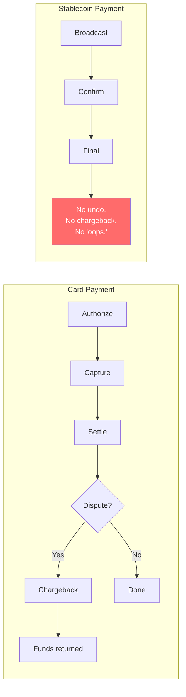
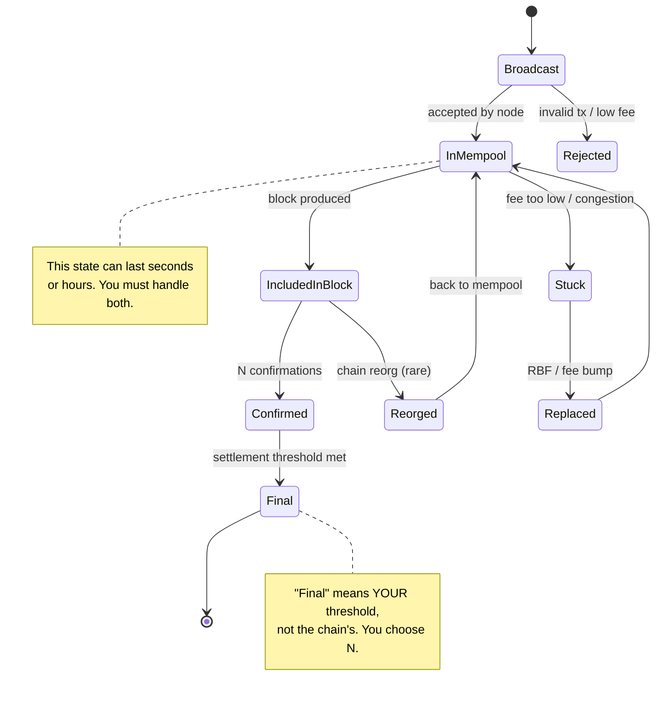
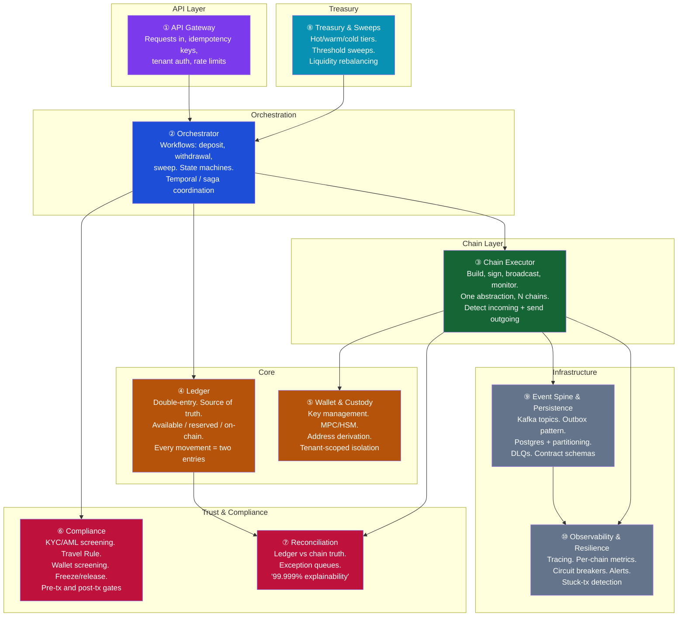
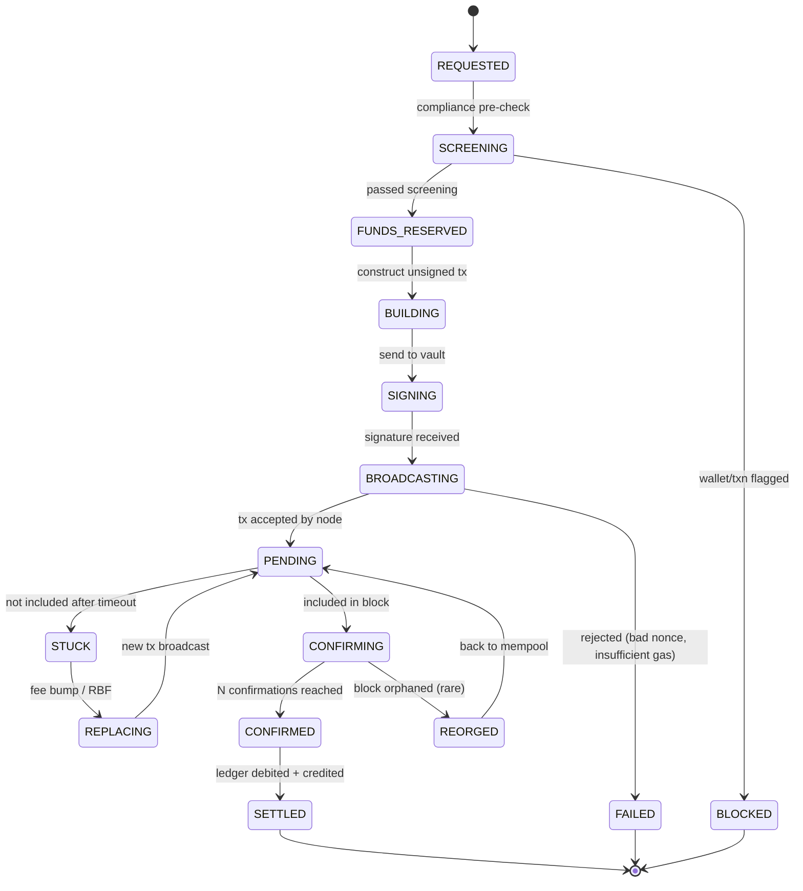

> **TL;DR** — You cannot bolt stablecoin payments onto a traditional payment system. Irreversible
> settlement, probabilistic finality, no PSP, keys-as-accounts, and decentralized counterparties
> break every assumption a card-rail or ACH stack is built on. This post names the five properties
> that force the break, maps the ten building blocks you'll need instead, and previews the full
> series.
> **Who this is for:** backend engineers who've been told "just add a crypto rail" and suspect
> it's not that simple. (It's not.)

---

## The $47,000 Retry

A fintech launches stablecoin payouts for gig workers in three countries. The engineer wiring it up
has spent four years building card-payment integrations. The flow looks familiar: call the API,
wait for a response, retry on timeout. Standard stuff.

A payout to a contractor in Lagos times out. The HTTP call hangs for thirty seconds, the gateway
returns a 504. The engineer's retry logic fires. The second attempt succeeds.

Both transactions hit the chain.

On a card network, the PSP would have caught the duplicate. Idempotency keys, network-level
deduplication, the acquirer's reconciliation batch — three layers of "you already did this."
None of that exists here. There is no PSP. There is no acquirer. There is a blockchain, and it
does exactly what you told it to do, twice.

$47,000 in USDC, sent to the same address, thirty seconds apart. The contractor got paid twice.
The company's hot wallet is short $23,500. There is no chargeback. There is no "void" button.
The money is on Solana, confirmed, final, gone.

This isn't a crypto problem. It's an **assumption** problem. The engineer built on the right
mental model — payments have retries, timeouts, idempotency — but applied it to a system where
the rules are fundamentally different.

This series is about those different rules, and the building blocks you need once you accept them.

---

## "Just Add a Crypto Rail"

Every payment platform eventually gets the same request: "Can we support stablecoins?" The
instinct is to treat it as a new rail — slot it into the existing architecture and ship it
in a sprint. This instinct is reasonable. It is also wrong. Stablecoins are conceptually
simpler than a cross-border card transaction, but their *properties* propagate through every
layer of your stack in ways a traditional payment system can't absorb. Here are five of them.

---

## Five Properties That Break Your Payment Stack

### 1. Settlement is irreversible



On a card network, settlement is *reversible for weeks*. Chargebacks, disputes, regulatory
freezes — the money isn't truly "done" until the dispute window closes. Your entire risk model
is built on this: you can undo a mistake.

On a blockchain, a confirmed transaction is **permanent**. There is no issuer to call, no
network rule that returns funds, no 60-day dispute window. If you send USDC to the wrong
address, the only recovery is asking the recipient nicely. If your system double-sends, both
sends are real.

This single property changes how you design everything: idempotency isn't a nice-to-have, it's
existential. Confirmation isn't a status update, it's a point of no return. Your state machine
needs a `POINT_OF_NO_RETURN` state that card payments simply don't have.

### 2. Finality is probabilistic, not binary

A card authorization returns `APPROVED` or `DECLINED`. Binary. Instant. Done.

A blockchain transaction enters a **liminal state** the moment you broadcast it. It sits in a
mempool. A block producer picks it up (or doesn't). The block is confirmed (or orphaned). On
Ethereum, you might wait for 12 seconds and 3 confirmations. On Bitcoin, 10 minutes and 6
confirmations. On Solana, 400 milliseconds and a "confirmed" status that can *still* be rolled
back in rare cases.



Your system must model this gradient. Not `PENDING → SETTLED`. More like
`BROADCAST → IN_MEMPOOL → INCLUDED → CONFIRMED(n) → FINAL`. And each chain defines `n`
differently. And "included" can become "reorged" on some chains. And "stuck" is a state you
must detect and recover from, not just wait out.

A traditional payment stack has no concept of "the transaction happened but might un-happen."
You're building one.

### 3. You are your own PSP

Here's what a traditional payment flow looks like:


The green boxes are **someone else's problem**. The PSP handles retries, idempotency, fraud
detection, 3DS authentication, multi-currency conversion. The card network handles routing,
interchange, settlement netting. The issuer handles authorization, credit limits, disputes.

You call one API. The PSP abstracts the entire financial system.

Now here's the stablecoin equivalent:


There is no PSP. There is no card network. There is no issuer. There is your code, a JSON-RPC
call, and a decentralized network that does not care about your uptime SLA.

Everything the green boxes used to do is now your problem:
- **Idempotency?** You track it.
- **Retries with backoff?** You build them.
- **Fee estimation?** You model it per chain.
- **Transaction monitoring?** You watch the mempool.
- **Settlement confirmation?** You count blocks.
- **Dispute resolution?** There isn't any. See property #1.

This is the biggest architectural shock. You're not integrating a payment provider. You're
*building* one.

### 4. Keys are the account

In traditional finance, a "compromised account" means a bad actor got a password or a session
token. The bank freezes the account, issues new credentials, and the money is still there.

In stablecoin land, the private key **is** the account. Whoever holds the key controls the
funds. There is no "freeze" at the protocol level (stablecoin issuers can freeze
at the contract level, but that's an exception, not a feature you design around). There is no
"reset password." If a key leaks, the money can be moved before you finish reading the alert.

This means key management isn't a security checkbox — it's **the** security model. Every
architectural decision in your signing pipeline, your withdrawal flow, your custody model,
exists to answer one question: *who can move money, and how do we make that as narrow as
possible?*

You'll need:
- Keys that never leave a secure boundary (HSM, MPC, or secure enclave)
- A signing pipeline that's asynchronous, auditable, and policy-gated
- Tenant-scoped key isolation if you serve multiple customers
- A key ceremony for generation that would make a bank auditor nod approvingly

None of this exists in a traditional payment stack. You're building a vault, not a login page.

### 5. The network is the counterparty

When you integrate with a PSP, your counterparty is a company with an SLA, a status page, and
a support email. When they're down, you get a 503 and a timeline.

When you integrate with a blockchain, your counterparty is **a decentralized network that owes
you nothing.**

- Ethereum's gas fee can spike 100x in an hour because someone is minting NFTs.
- A Solana validator can go rogue and produce a conflicting block.
- A Bitcoin node can serve you stale data if you're not careful about which node you trust.
- Tron's RPC can return a transaction hash for a transaction that *hasn't been broadcast yet.*
- An L2 sequencer can go down and stall all transactions until it recovers.

You need circuit breakers, per-chain health checks, multi-node redundancy, and a deep
acceptance that "the chain said X" doesn't always mean "X is true." You verify. You reconcile.
You assume the network will lie to you, and you design for it.

---

## The Ten Building Blocks

Once you accept these five properties, a new architecture emerges. Not "your existing payment
stack plus a crypto adapter" — a purpose-built system with ten blocks, each solving a problem
that traditional payments either don't have or delegate to someone else.



Here's the one-liner for each:

| # | Block | One-line job | Traditional equivalent |
|---|-------|-------------|----------------------|
| ① | **API Gateway** | Accept requests, enforce idempotency, authenticate tenants | Your existing API layer (this one transfers) |
| ② | **Orchestrator** | Drive multi-step flows (deposit, withdrawal, sweep) through state machines | Workflow engine — but with blockchain-specific states |
| ③ | **Chain Executor** | Talk to N blockchains through one interface. Detect incoming. Send outgoing. | **No equivalent.** This is the PSP you now own. |
| ④ | **Ledger** | Double-entry record of every balance change. The source of truth. | General ledger — but with on-chain reconciliation |
| ⑤ | **Wallet & Custody** | Hold keys, derive addresses, enforce signing policy | **No equivalent.** Keys ARE the account. |
| ⑥ | **Compliance** | Screen every transaction before and after it moves | AML vendor integration — but wired into the flow synchronously |
| ⑦ | **Reconciliation** | Prove that your ledger matches chain reality, to the penny | Bank reconciliation — but across N heterogeneous chains |
| ⑧ | **Treasury & Sweeps** | Consolidate scattered deposits, manage liquidity tiers | Treasury ops — but with gas economics and dust |
| ⑨ | **Event Spine & Persistence** | Durable event bus, transactional outbox, partitioned storage | Kafka + Postgres — but partitioned by tenant and chain |
| ⑩ | **Observability & Resilience** | See everything, alert on anomalies, degrade gracefully per chain | Standard SRE — but with per-chain failure domains |

Notice: blocks ③ and ⑤ have **no traditional equivalent**. They exist because of properties #3
(you are your own PSP) and #4 (keys are the account). These two blocks alone justify the
separate stack.

---

## The State Machine Tells the Story

If you want one artifact that captures *why* stablecoin payments are different, it's the state
machine. Compare:

**Traditional card payment:**

```
AUTHORIZED → CAPTURED → SETTLED
                ↘ VOIDED
SETTLED → REFUNDED (within dispute window)
```

Five states. The PSP handles the transitions. You call two APIs.

**Stablecoin withdrawal:**



**Fifteen states.** Three failure branches. Two loops (stuck → replace, reorged → pending).
And you own every transition.

A card-payment engineer looks at this and asks: "Where's the part where you just call the PSP
and it handles the middle?" That part doesn't exist. You *are* the middle.

---

## What "Done" Looks Like

"Done" is not "we can send USDC on Solana." Any script can do that in twenty lines.

"Done" is a system where:

| Property | What it means | The building block |
|----------|--------------|-------------------|
| **Every penny explainable** | At any moment, you can reconcile your ledger to chain state across all chains, and explain any discrepancy | ④ Ledger + ⑦ Reconciliation |
| **Every key isolated** | No single human or service can unilaterally move funds. Keys never leave the vault. Signing is policy-gated and audited | ⑤ Wallet & Custody |
| **Every chain abstracted** | Adding chain N+1 is a module + config, not a re-architecture. The core doesn't know which chain a transfer used | ③ Chain Executor |
| **Every failure handled** | Stuck transactions recover. Reorgs roll back cleanly. A dead chain node doesn't stall the platform | ⑩ Observability & Resilience |
| **Every movement compliant** | Screening happens *before* money moves and *after* it arrives. Alerts freeze, humans review, audit trails persist | ⑥ Compliance |
| **Every tenant isolated** | Customer A's keys, balances, and compliance rules are invisible to Customer B. By construction, not by convention | ① Gateway + ⑤ Custody |

If you can check all six boxes, you haven't "added a crypto rail." You've built a payment
platform. That's what this series teaches you to do.

---

## How We Measure It

The bar for a stablecoin payment platform isn't uptime — it's **explainability**. At any moment,
you must be able to answer: "Does our ledger match chain reality, to the penny?" If you can't
answer that question in under a minute, you're not done. This series returns to that metric
repeatedly: **99.999% explainability of money movement**, across all chains, all tenants, all
time. Every building block in the diagram above exists to close the gap between "we think it
balanced" and "we can prove it."

---

## Key Takeaways

- **Stablecoins aren't a new rail on your existing payment stack.** Five properties — irreversible
  settlement, probabilistic finality, no PSP, keys-as-accounts, and a decentralized counterparty —
  force a purpose-built architecture.
- **You are your own PSP.** Everything a payment provider used to handle (idempotency, retries,
  fee estimation, confirmation tracking, reconciliation) is now your code.
- **The state machine is 3× longer** than a card payment's, with failure modes (stuck, reorged,
  replaced) that don't exist in traditional finance.
- **Ten building blocks** cover the full system. Two of them (chain executor, wallet/custody) have
  no traditional equivalent at all.
- **"Done" means six properties:** explainable, isolated, abstracted, resilient, compliant,
  tenant-scoped. Not "we can send USDC."

---

## FAQ

**Can't I just use a managed provider and skip building this?**
You can, and for many businesses you should. But you're still *evaluating* these building blocks —
you just let someone else implement them. This series helps you understand what you're buying,
what you're delegating, and where the provider's abstraction might not fit your use case. And if
you're building for scale, multi-tenancy, or custom compliance, you'll end up owning several of
these blocks regardless.

**Is this series chain-specific?**
No. The concepts are chain-agnostic. The reference stack is Java, Spring, Kafka, Temporal, and
Postgres, but every pattern translates to Go, Rust, Node, or whatever you run. Not every post
includes code; when code appears, it uses this stack. Chain-specific details (EVM vs UTXO vs
Solana) get their own posts in Part I.

**Do I need to understand blockchain basics first?**
You need to know what a transaction is, what a block is, and what "confirmation" means. You don't
need to understand Merkle trees, zk-SNARKs, or consensus mechanisms. This series is about the
*payment engineering* on top of blockchains, not the blockchains themselves.

**How long is each post?**
3,000–5,000 words. One concept, one diagram-heavy design section, one code reference, one "what
breaks" section. Readable in a coffee break, referenceable for a quarter.

**Will this cover DeFi, yield, or trading?**
Post 16 covers trade execution and FX as a building block (crypto-to-crypto, crypto-to-fiat).
DeFi yield strategies are out of scope — that's a different series. This series is about
*payments*: moving stablecoins between parties reliably, compliantly, and at scale.

---

## Further Reading

- [**"Designing a Payment System"**](https://www.amazon.com/System-Design-Interview-Insiders-Second/dp/1736049119) — Alex Xu (Pragmatic Engineer). The canonical 4-step system-design frame.
- [**"Ledger: tracking & validating money movement"**](https://stripe.dev/blog/ledger-stripe-system-for-tracking-and-validating-money-movement) — Stripe Engineering. How Stripe models balances as a state machine.
- [**"Five Imperatives for Stablecoin Infrastructure"**](https://www.fireblocks.com/blog/stablecoin-infrastructure-five-imperatives-for-scalable-adoption) — Fireblocks. Maps infra choices to business maturity stages.
- [**"Introducing Coinbase Payments"**](https://www.coinbase.com/payments) — Coinbase. Modular layered stack for on-chain payments.
- [**"Payments System Architecture"**](https://www.cockroachlabs.com/solutions/usecases/payments/) — CockroachDB. Non-negotiable correctness in distributed payment systems.
- [**"Circle Payment Network"**](https://www.circle.com/cpn) — Circle. Stablecoin-native payment rails for cross-border settlement.
- [**"PayPal USD (PYUSD)"**](https://www.paypal.com/us/digital-wallet/manage-money/crypto) — PayPal. A stablecoin issued on Ethereum and Solana, integrated into a consumer payment platform.
